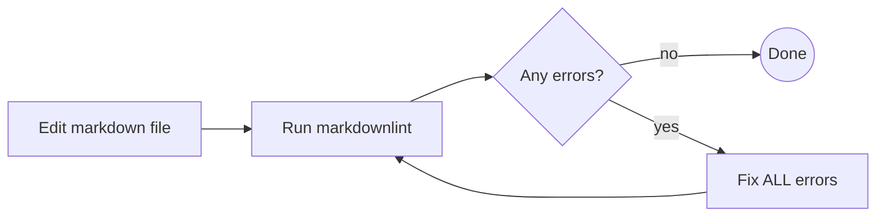

# Markdown Quality

## Overview

**Every markdown file edit requires markdownlint validation.**
No exceptions for "simple" changes.

## The Iron Law

```text
ALWAYS run markdownlint after editing ANY markdown file
ALWAYS iterate until ALL errors are fixed
```

## Workflow



**After EVERY markdown edit:**

1. Run `markdownlint <file>`
2. If errors exist, fix ALL of them (including pre-existing)
3. Run markdownlint again
4. Repeat until zero errors

## Common Errors and Fixes

| Rule | Problem | Fix |
| ---- | ------- | --- |
| MD009 | Trailing spaces at end of line | Remove trailing whitespace |
| MD022 | Heading not surrounded by blank lines | Add a blank line before and after every heading |
| MD031 | Fenced code block not surrounded by blank lines | Add a blank line before and after every code fence |
| MD032 | List not surrounded by blank lines | Add a blank line before and after every list |
| MD034 | Bare URL used instead of link syntax | Wrap URL: `<https://example.com>` or `[text](url)` |
| MD047 | File does not end with a single newline | Ensure exactly one newline at end of file |

**Lint-clean but poor readability:**

- Inconsistent list markers (mixing `-`, `*`, `+`) -- pick one and stick with it
- Nesting deeper than 3 levels -- restructure with headings or separate sections
- Mixed heading styles (`# ATX` vs `Setext`) -- use ATX (`#`) exclusively
- Code blocks without a language identifier -- always specify (e.g., ` ```bash `)

## No-Exception Policy

| Excuse | Reality |
| ------ | ------- |
| "Just a quick typo fix" | Typo fixes introduce trailing spaces and line-length issues. Run linter. |
| "No structural changes" | Linting checks whitespace, blank lines, and bare URLs -- not just structure. |
| "File already passed before" | Files regress with every edit. Verify current state. |
| "Overhead is disproportionate" | Linting takes 1-2 seconds. Debugging a broken file takes minutes. |

## When NOT to Use

- Reading markdown files (no edits)
- Non-markdown file formats

## Common Mistakes

**Mistake:** Fixing only new errors, leaving pre-existing ones
**Fix:** Fix ALL errors reported by markdownlint

**Mistake:** Announcing intent to run markdownlint but not doing it
**Fix:** Always execute the command and share results
