# Architecture Diagrams

Architecture diagrams visualize system components, their relationships,
and infrastructure layout.

## Basic Syntax

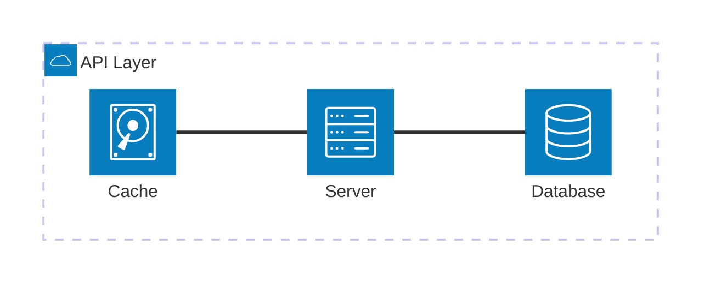

## Groups

Groups organize related services:

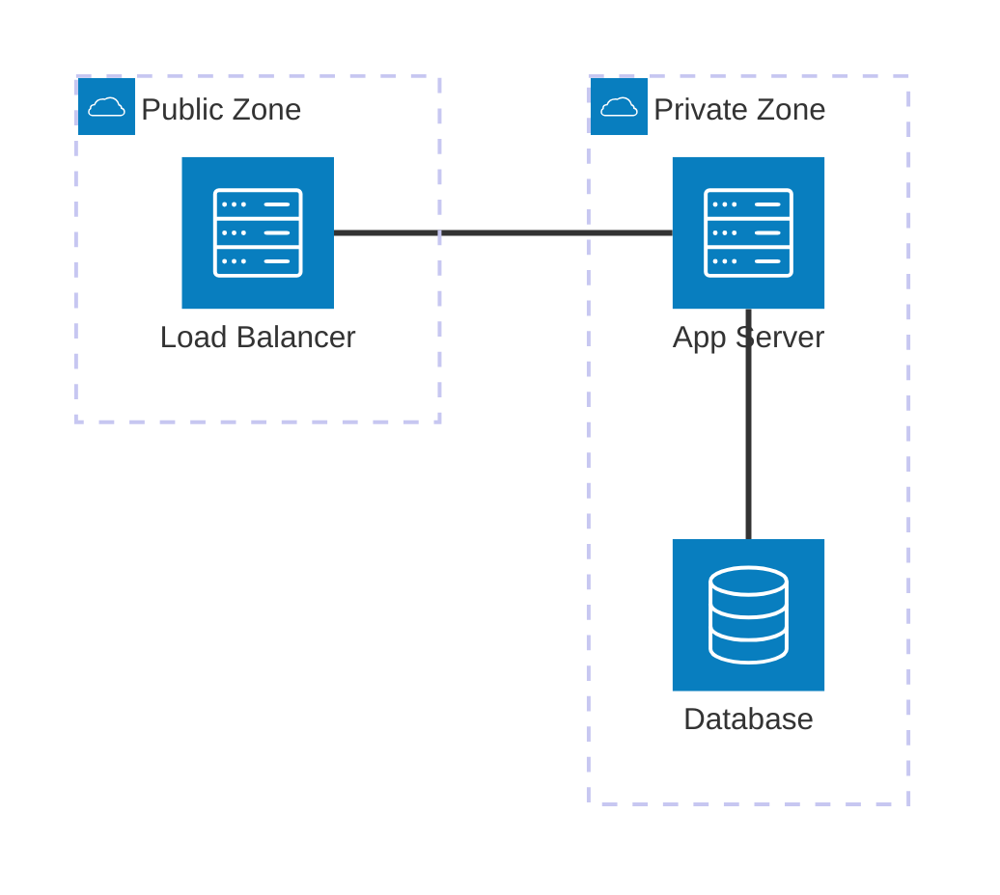

### Group Syntax

```text
group {id}({icon})[{title}]
group {id}({icon})[{title}] in {parent_id}
```

### Nested Groups

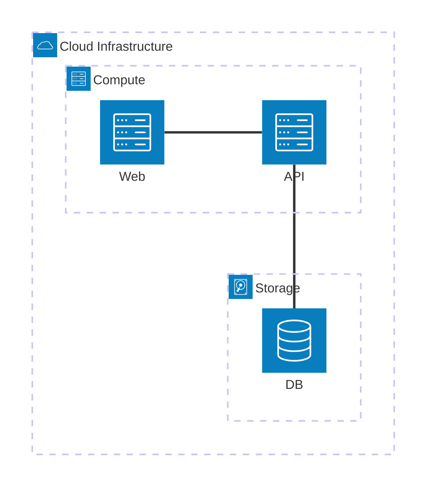

## Services

Services represent individual components:

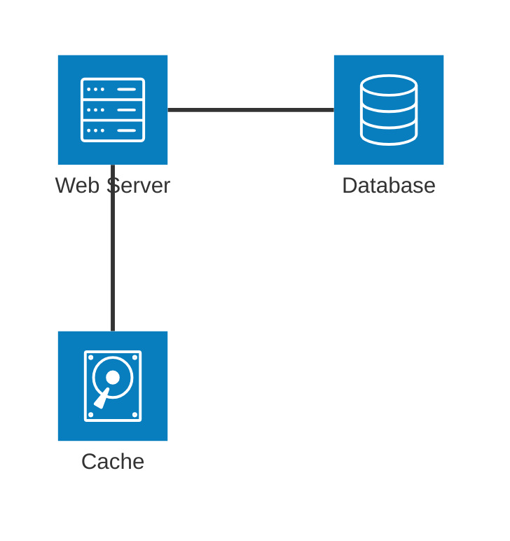

### Service Syntax

```text
service {id}({icon})[{title}]
service {id}({icon})[{title}] in {group_id}
```

## Built-in Icons

- `cloud` - Cloud symbol
- `database` - Database cylinder
- `disk` - Disk/storage
- `internet` - Globe/internet
- `server` - Server box

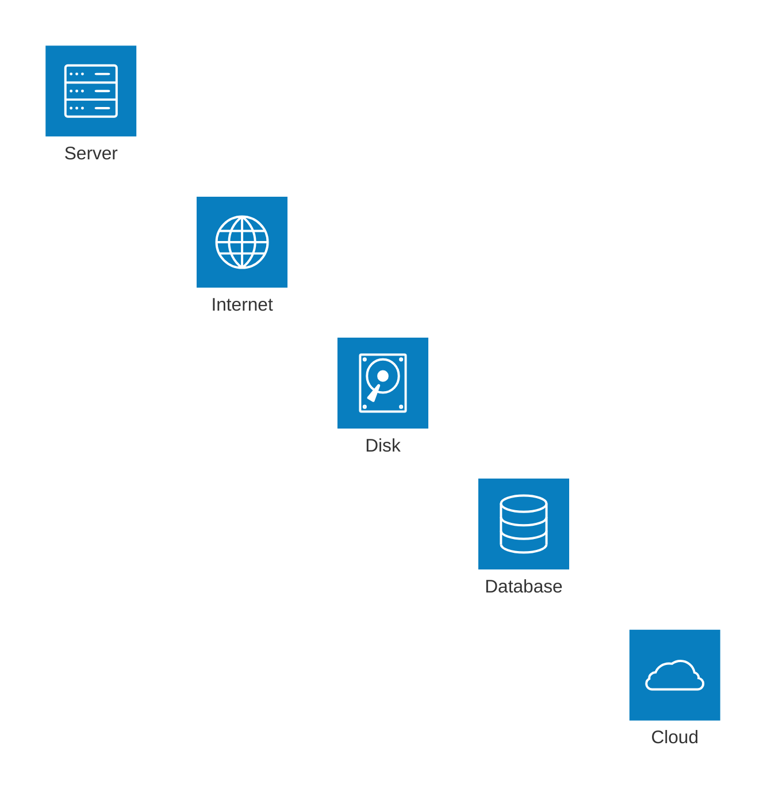

## Custom Icons (Iconify)

Access 200,000+ icons from iconify.design:

```mermaid
architecture-beta
    service aws(logos:aws)[AWS]
    service gcp(logos:google-cloud)[GCP]
    service k8s(logos:kubernetes)[K8s]
    service docker(logos:docker-icon)[Docker]
```

Format: `{collection}:{icon-name}`

Common collections:

- `logos` - Brand/technology logos
- `mdi` - Material Design Icons
- `fa6-solid` - Font Awesome solid
- `fa6-brands` - Font Awesome brands

## Junctions

Junctions act as connection points for multiple edges:

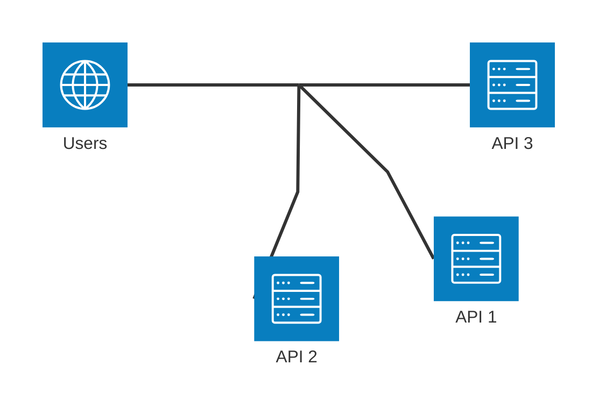

### Junction Syntax

```text
junction {id}
junction {id} in {group_id}
```

## Edges (Connections)

### Edge Syntax

```text
{serviceId}:{direction} {arrow} {direction}:{serviceId}
```

Directions:

- `T` - Top
- `B` - Bottom
- `L` - Left
- `R` - Right

### Arrow Types

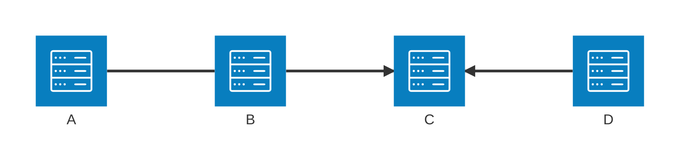

- `--` - Bidirectional line
- `-->` - Arrow pointing right
- `<--` - Arrow pointing left
- `<-->` - Bidirectional arrows

### Group-to-Group Edges

Use `{group}` modifier:

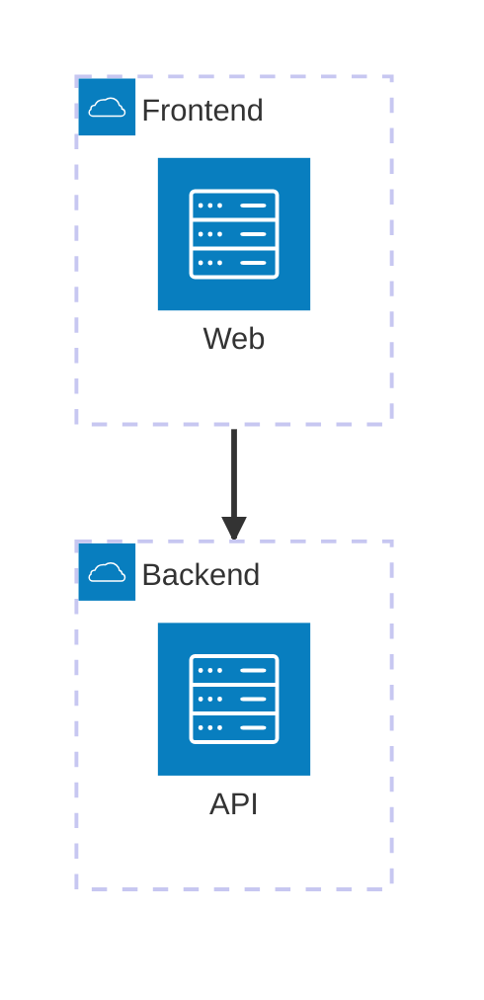

## Complete Examples

### Web Application Architecture

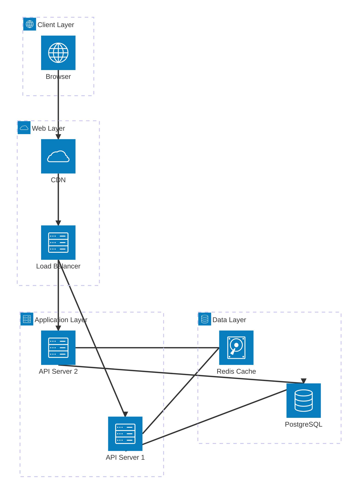

### Microservices Architecture

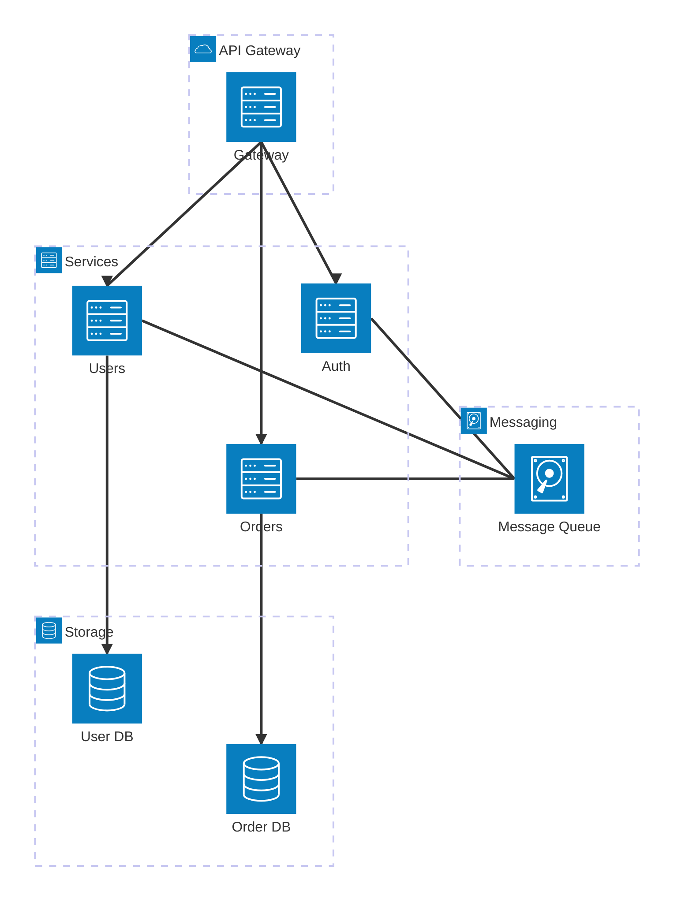

### Cloud Infrastructure

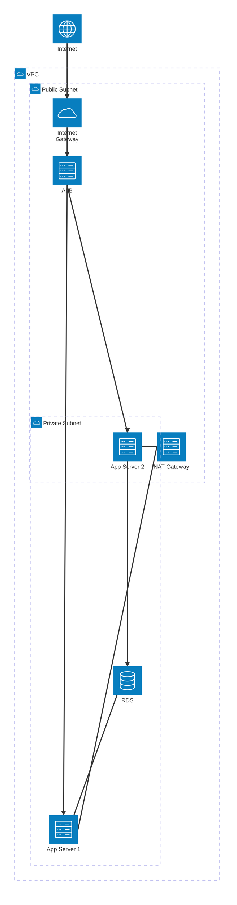

### Data Pipeline

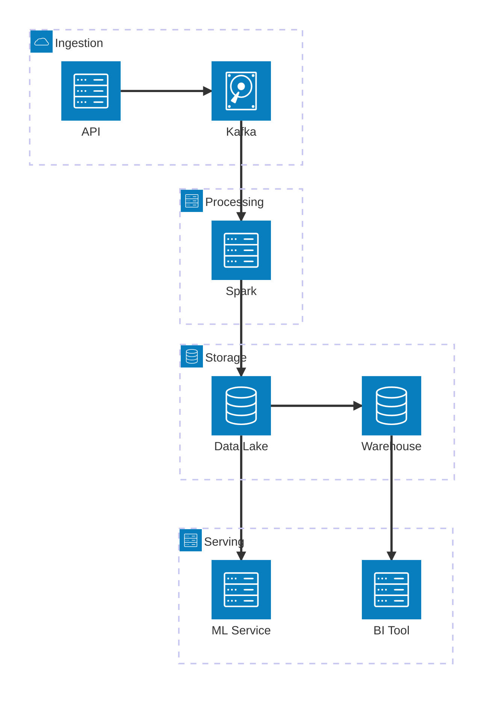

## Best Practices

1. Use groups to organize related components
2. Choose appropriate icons for service types
3. Use consistent edge directions (usually top-to-bottom or left-to-right)
4. Label services with clear, concise names
5. Use junctions to simplify complex connections
6. Keep diagrams focused on one aspect of architecture
7. Use nested groups for complex systems
8. Add directional arrows to show data flow

## Limitations

- Beta feature (syntax may change)
- Limited built-in icons (use Iconify for more)
- No automatic layout optimization
- Cannot style individual components
- No annotations or notes
- Limited text on edges
