# Block Diagrams

Block diagrams provide precise control over layout and positioning,
unlike flowcharts which use automatic layout.

## Basic Syntax

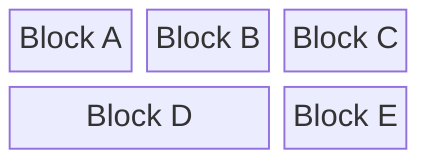

## Columns

Define the number of columns for the layout:

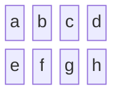

Blocks fill left-to-right, wrapping to next row.

## Block Definitions

### Simple Blocks

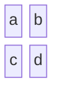

### Blocks with Labels

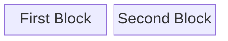

### Block Spanning

Span multiple columns with `:n`:

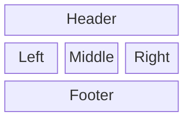

## Block Shapes

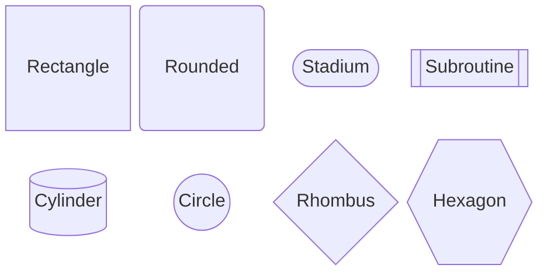

### All Shape Syntax

- `["text"]` - Rectangle (default)
- `("text")` - Rounded rectangle
- `(["text"])` - Stadium/pill shape
- `[["text"]]` - Subroutine
- `[("text")]` - Cylinder/database
- `(("text"))` - Circle
- `{"text"}` - Rhombus/diamond
- `{{"text"}}` - Hexagon
- `[/"text"/]` - Parallelogram
- `[\"text"\]` - Parallelogram (alt)
- `[/"text"\]` - Trapezoid
- `[\"text"/]` - Trapezoid (alt)
- `))text((` - Cloud
- `)text(` - Bang

## Space Blocks

Create empty space in the layout:

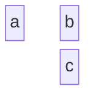

### Multiple Spaces

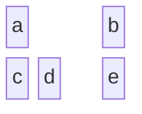

## Composite Blocks

Nest blocks within blocks:

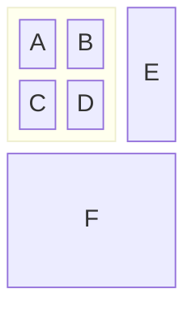

### Deep Nesting

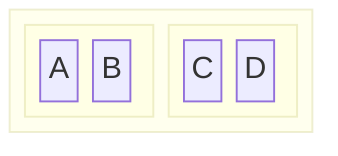

## Connections

### Basic Arrows

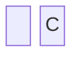

### Connection Types

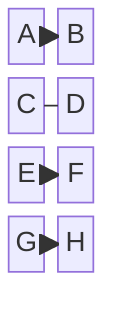

### Labels on Connections

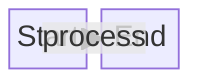

## Complete Examples

### System Architecture

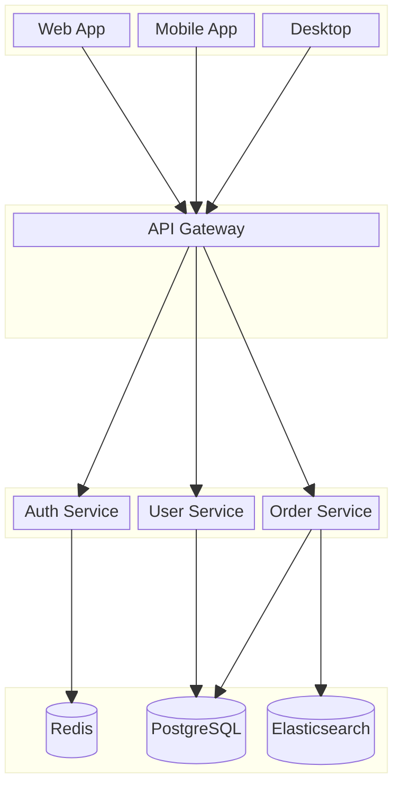

### Dashboard Layout

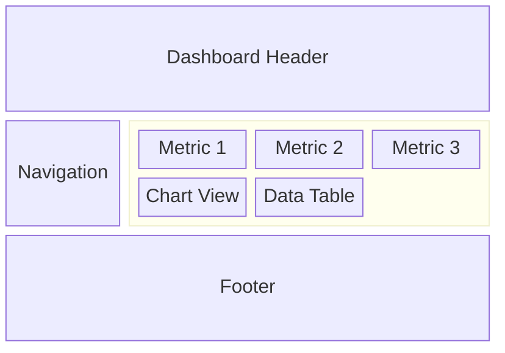

### Network Topology

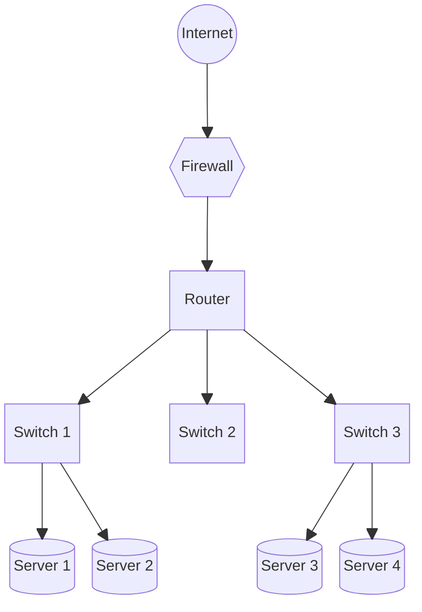

### Org Chart

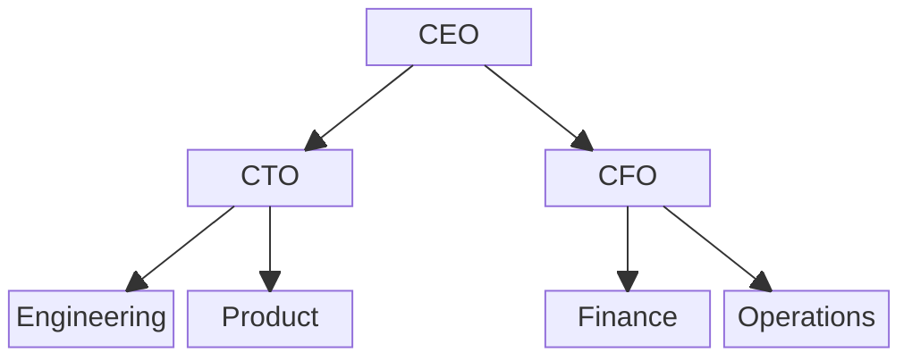

### Process Flow

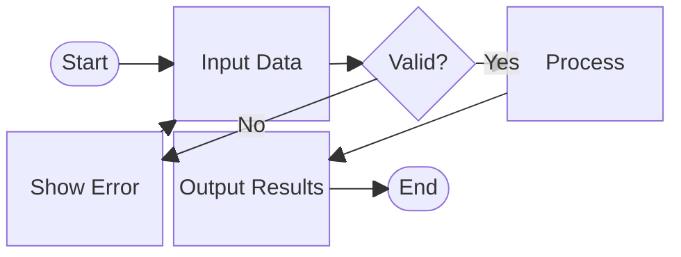

## Styling

### Class-Based Styling

```mermaid
block-beta
    columns 2
    a["Success"]:::success
    b["Warning"]:::warning
    c["Error"]:::error
    d["Info"]:::info

    classDef success fill:#d4edda,stroke:#28a745
    classDef warning fill:#fff3cd,stroke:#ffc107
    classDef error fill:#f8d7da,stroke:#dc3545
    classDef info fill:#d1ecf1,stroke:#17a2b8
```

### Inline Styling

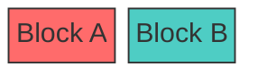

## Best Practices

1. Plan your column count based on layout needs
2. Use spanning for headers and footers
3. Use space blocks for alignment
4. Group related elements in composite blocks
5. Keep nesting to 2-3 levels maximum
6. Use consistent shapes for similar elements
7. Add labels to connections when needed
8. Style blocks to indicate status or type

## Comparison: Block vs Flowchart

| Feature | Block Diagram | Flowchart |
| --- | --- | --- |
| Layout | Manual (columns) | Automatic |
| Positioning | Precise control | Algorithm-driven |
| Complex layouts | Better | Limited |
| Quick diagrams | More verbose | Simpler |
| Responsiveness | Fixed | Adapts |

## When to Use Block Diagrams

Good for:

- Dashboard/UI mockups
- Fixed-layout documentation
- Org charts with specific positioning
- System architecture with precise layout
- Grid-based visualizations

Avoid when:

- Simple flowcharts suffice
- Layout flexibility is needed
- Automatic arrangement is preferred
