# Git Graph Diagrams

Git graphs visualize Git repository history showing branches, commits,
merges, and tags.

## Basic Syntax

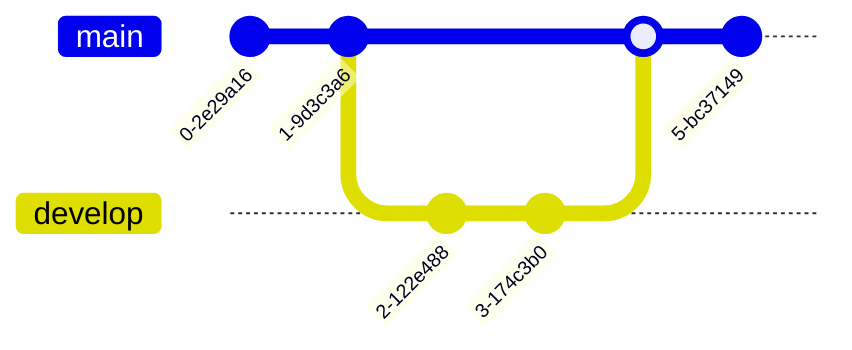

## Orientation

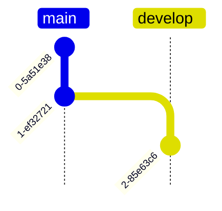

Options:

- `LR:` - Left to right (default)
- `TB:` - Top to bottom
- `BT:` - Bottom to top

## Commits

### Basic Commit

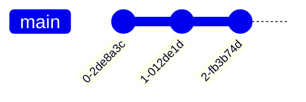

### Commit with ID

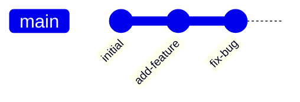

### Commit with Tag

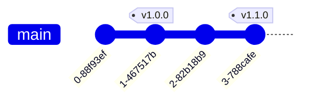

### Commit Types

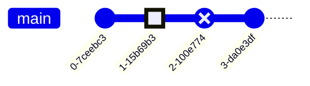

Types:

- `NORMAL` - Solid circle (default)
- `REVERSE` - Crossed solid circle
- `HIGHLIGHT` - Filled rectangle

### Full Commit Syntax

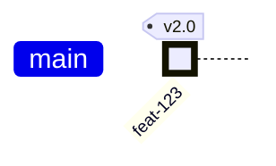

## Branches

### Creating Branches

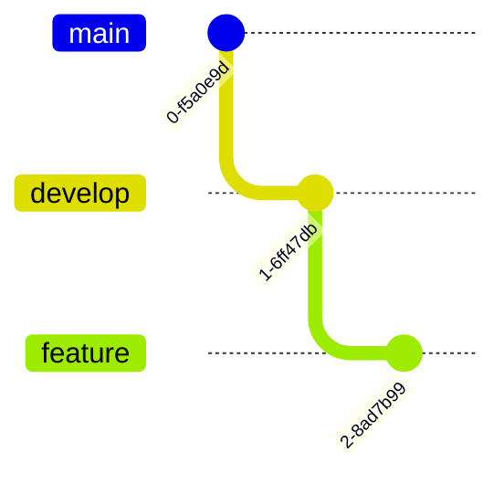

### Branch with Special Characters

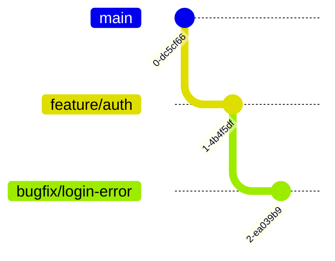

### Branch Order

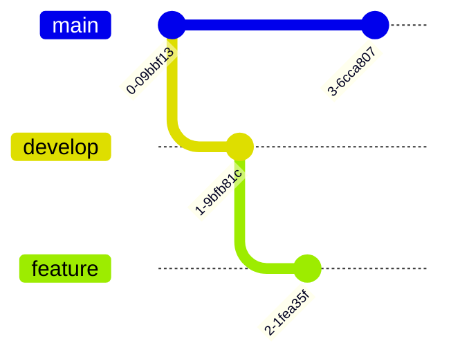

Lower order numbers appear closer to main.

## Checkout/Switch

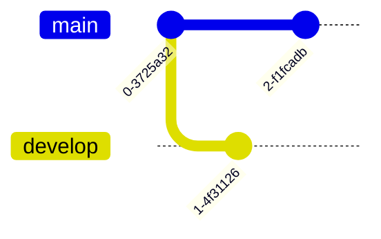

`switch` and `checkout` are interchangeable.

## Merge

### Basic Merge

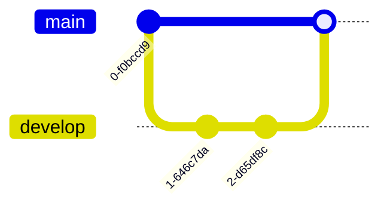

### Merge with Options

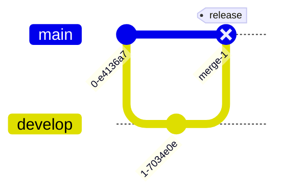

## Cherry-pick

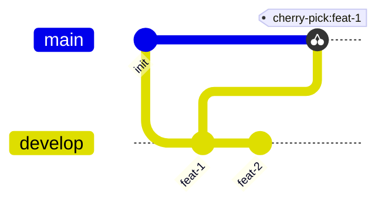

### Cherry-pick with Parent

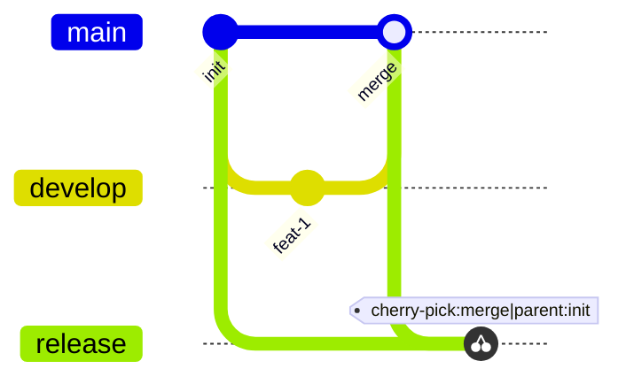

## Configuration

### Via Frontmatter

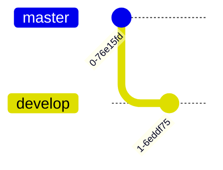

### Via Init Directive

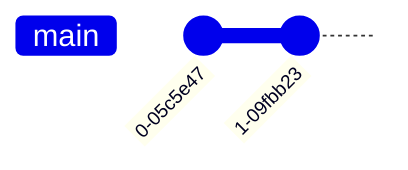

### Configuration Options

| Option | Default | Description |
| --- | --- | --- |
| `showBranches` | true | Show branch labels |
| `showCommitLabel` | true | Show commit IDs |
| `mainBranchName` | "main" | Name of main branch |
| `mainBranchOrder` | 0 | Position of main branch |
| `parallelCommits` | false | Align commits on same row |
| `rotateCommitLabel` | true | Rotate commit labels |

## Complete Examples

### Feature Branch Workflow

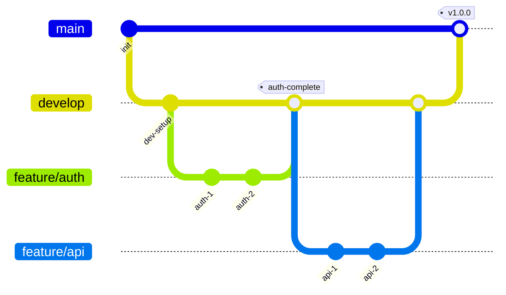

### Hotfix Workflow

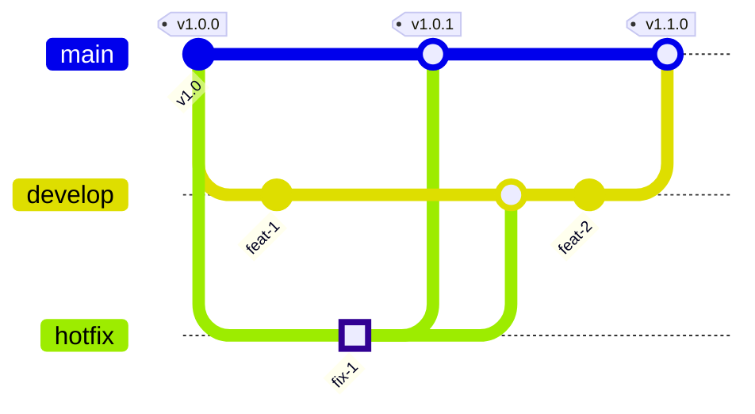

### Release Branch Workflow

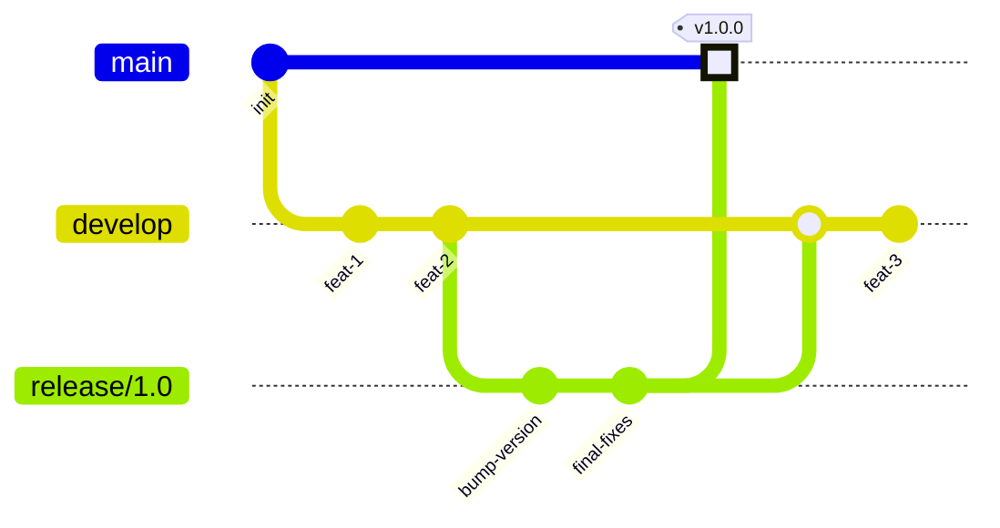

### Parallel Development

```mermaid
%%{init: {'gitGraph': {'parallelCommits': true}}}%%
gitGraph
    commit
    branch team-a order: 1
    branch team-b order: 2

    checkout team-a
    commit id: "a-1"
    checkout team-b
    commit id: "b-1"

    checkout team-a
    commit id: "a-2"
    checkout team-b
    commit id: "b-2"

    checkout main
    merge team-a
    merge team-b tag: "merged"
```

## Styling

### Theme Variables

```mermaid
%%{init: {'theme': 'base', 'themeVariables': {
    'git0': '#ff6b6b',
    'git1': '#4ecdc4',
    'git2': '#45b7d1',
    'git3': '#96ceb4',
    'gitBranchLabel0': '#ffffff',
    'gitBranchLabel1': '#ffffff',
    'commitLabelColor': '#ffffff',
    'commitLabelBackground': '#333333'
}}}%%
gitGraph
    commit
    branch develop
    commit
    branch feature
    commit
```

Available variables:

- `git0` through `git7` - Branch colors
- `gitBranchLabel0` through `gitBranchLabel7` - Branch label colors
- `commitLabelColor` - Commit label text color
- `commitLabelBackground` - Commit label background
- `tagLabelColor` - Tag text color
- `tagLabelBackground` - Tag background
- `tagLabelBorder` - Tag border color

## Best Practices

1. Use meaningful commit IDs that reference tickets or features
2. Add tags for releases and important milestones
3. Use HIGHLIGHT type for significant commits
4. Order branches logically (main first, then develop, then features)
5. Keep diagrams focused - show relevant history, not every commit
6. Use parallel commits mode when showing concurrent work
7. Name branches descriptively
