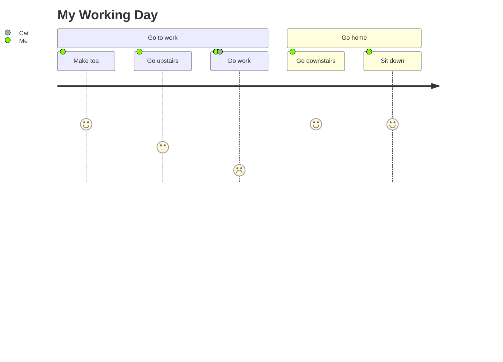
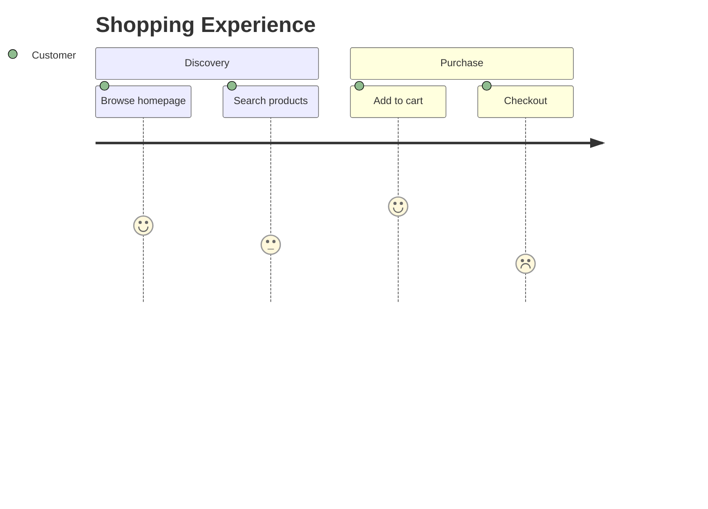
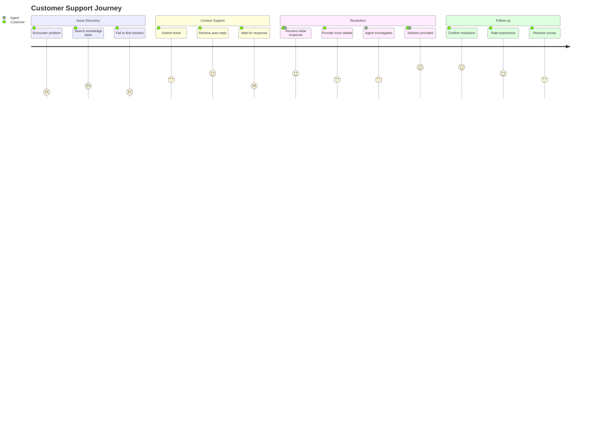
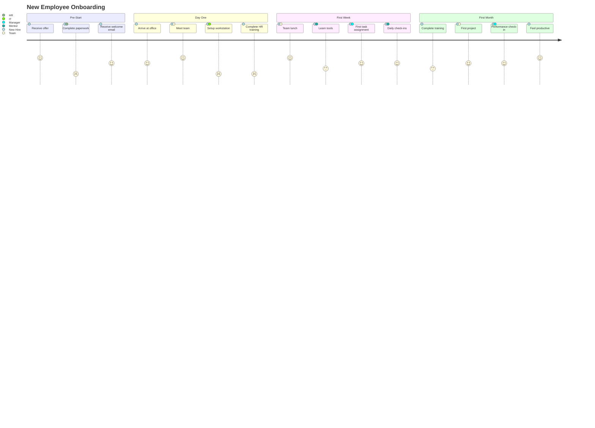
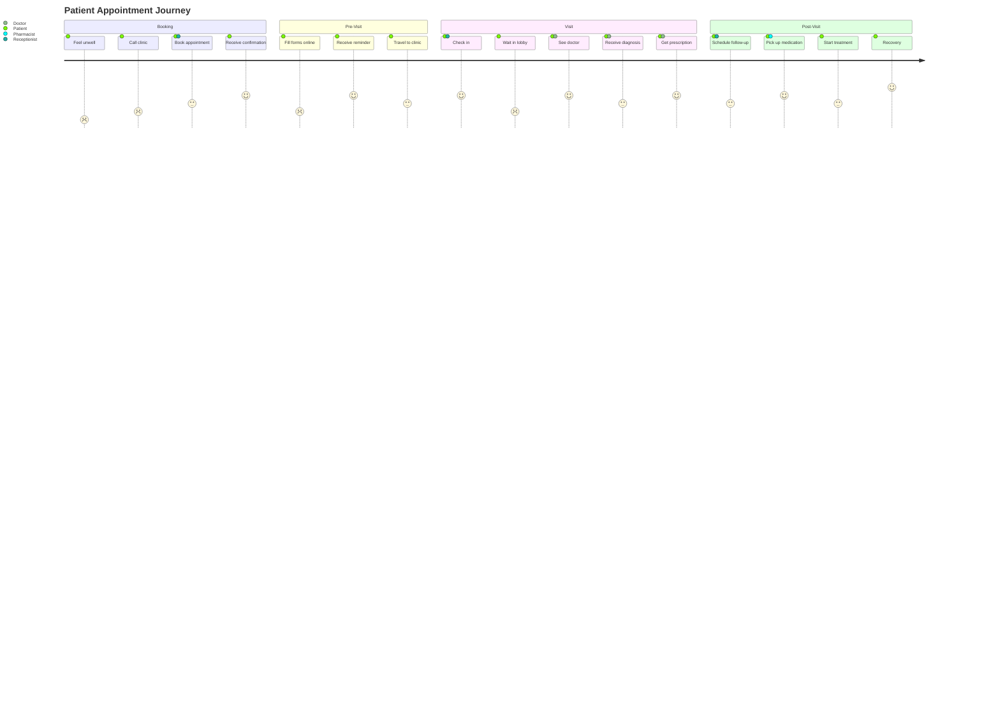
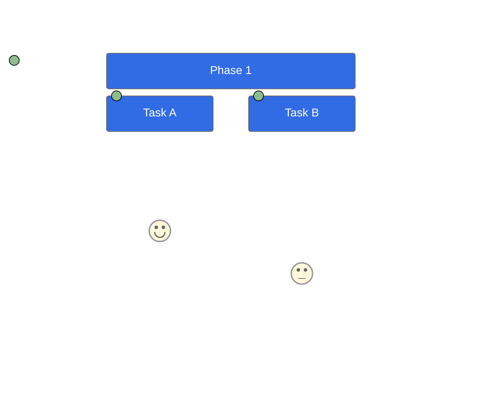

# User Journey Diagrams

User journey diagrams illustrate the steps users take to complete tasks,
showing satisfaction levels and actors involved.

## Basic Syntax



## Structure

### Title


### Sections

Sections group related tasks:



### Tasks

Task syntax:

```text
Task name: score: actor1, actor2
```

- **Task name** - Description of the step
- **Score** - Satisfaction level (1-5)
  - 5 = Very positive (green)
  - 4 = Positive
  - 3 = Neutral (yellow)
  - 2 = Negative
  - 1 = Very negative (red)
- **Actors** - Comma-separated list of participants

## Complete Examples

### E-commerce User Journey


### SaaS Onboarding


### Support Ticket Journey



### Mobile App First Use


### Employee Onboarding



### Healthcare Patient Journey



## Styling

### Theme Configuration



## Best Practices

1. Use descriptive task names
2. Be honest with satisfaction scores
3. Include all relevant actors
4. Group logical steps into sections
5. Keep journeys focused on one persona/goal
6. Use consistent scoring criteria
7. Include both positive and negative moments
8. Identify pain points (low scores) for improvement

## Interpreting Results

- **Consecutive low scores** - Major pain point requiring attention
- **Score drops** - Friction points in the journey
- **Multiple actors** - Handoff points (often problematic)
- **Long sections** - May need to be broken down

## When to Use User Journeys

Good for:

- Mapping customer experiences
- Identifying pain points
- Planning service improvements
- Onboarding documentation
- Stakeholder communication
- UX research visualization

Avoid when:

- Need to show system architecture (use architecture diagram)
- Mapping complex workflows (use flowchart)
- Showing data flow (use sequence diagram)
