# Quadrant Charts

Quadrant charts divide data into four sections using two axes, useful for
prioritization matrices and analysis.

## Basic Syntax

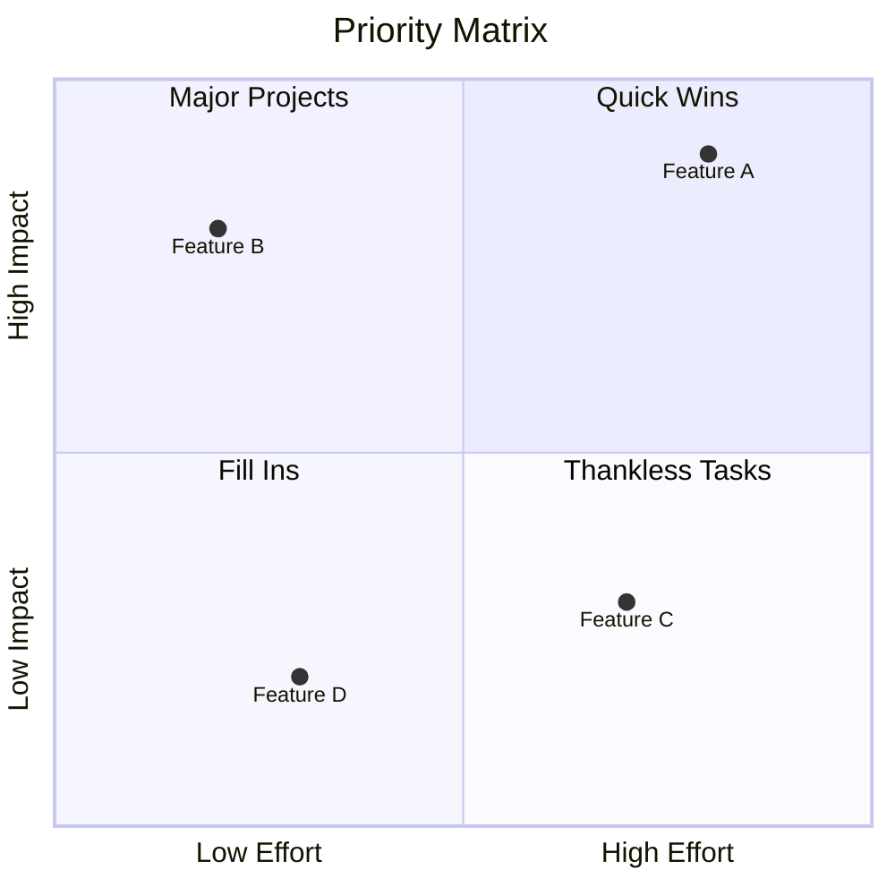
```mermaid
quadrantChart
    title Priority Matrix
    x-axis Low Effort --> High Effort
    y-axis Low Impact --> High Impact
    quadrant-1 Quick Wins
    quadrant-2 Major Projects
    quadrant-3 Fill Ins
    quadrant-4 Thankless Tasks
    Feature A: [0.8, 0.9]
    Feature B: [0.2, 0.8]
    Feature C: [0.7, 0.3]
    Feature D: [0.3, 0.2]
```

## Configuration

### Title

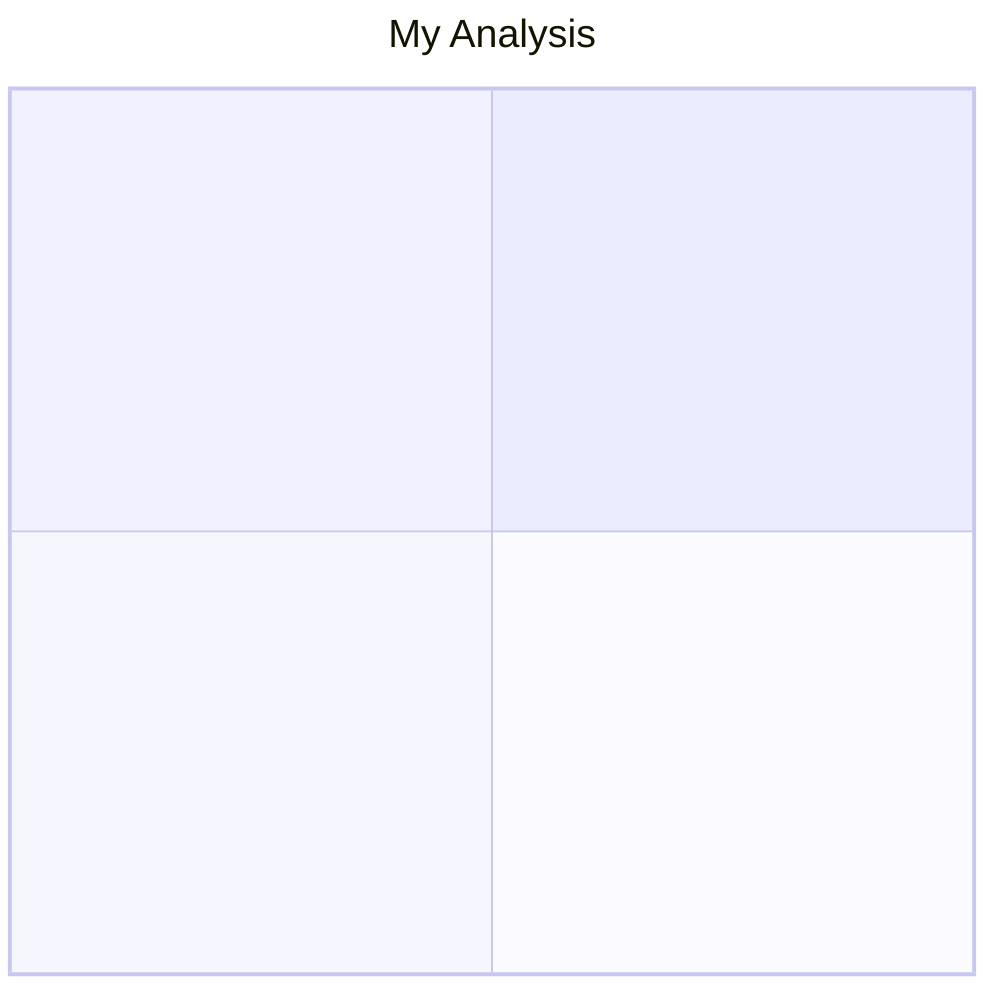
```mermaid
quadrantChart
    title My Analysis
```

### Axes

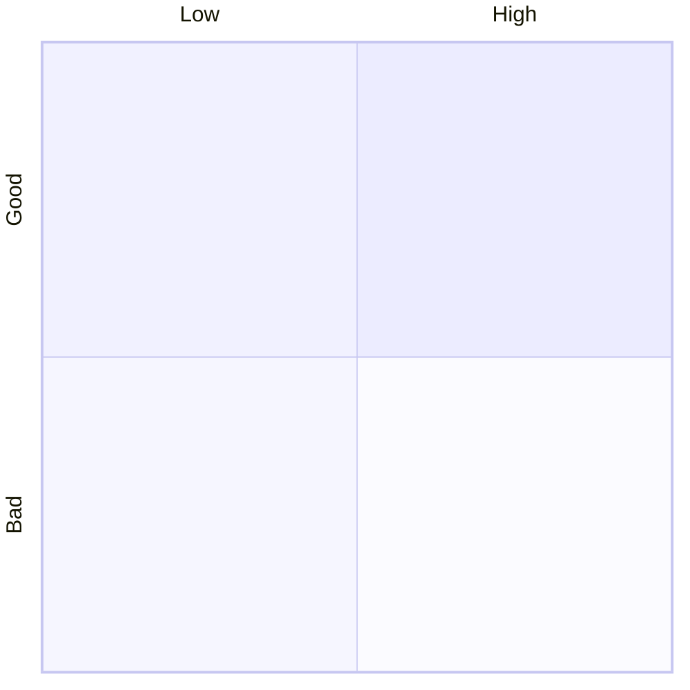
```mermaid
quadrantChart
    x-axis Low --> High
    y-axis Bad --> Good
```

Single label (left/bottom only):

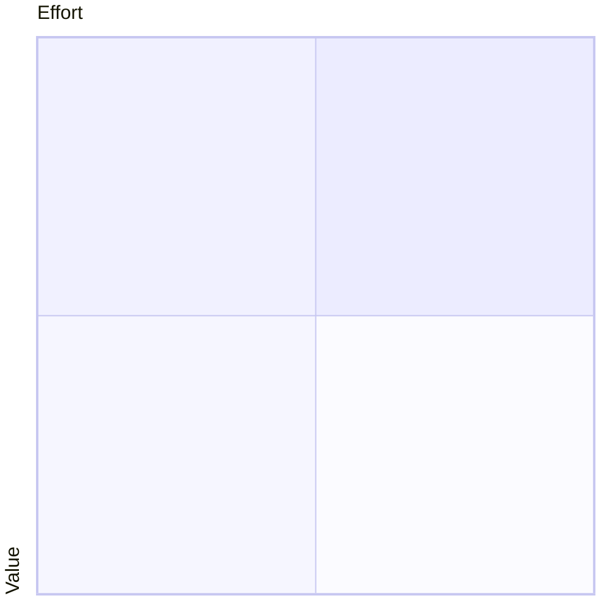
```mermaid
quadrantChart
    x-axis Effort
    y-axis Value
```

### Quadrant Labels

Quadrants are numbered:

- `quadrant-1` - Top right
- `quadrant-2` - Top left
- `quadrant-3` - Bottom left
- `quadrant-4` - Bottom right

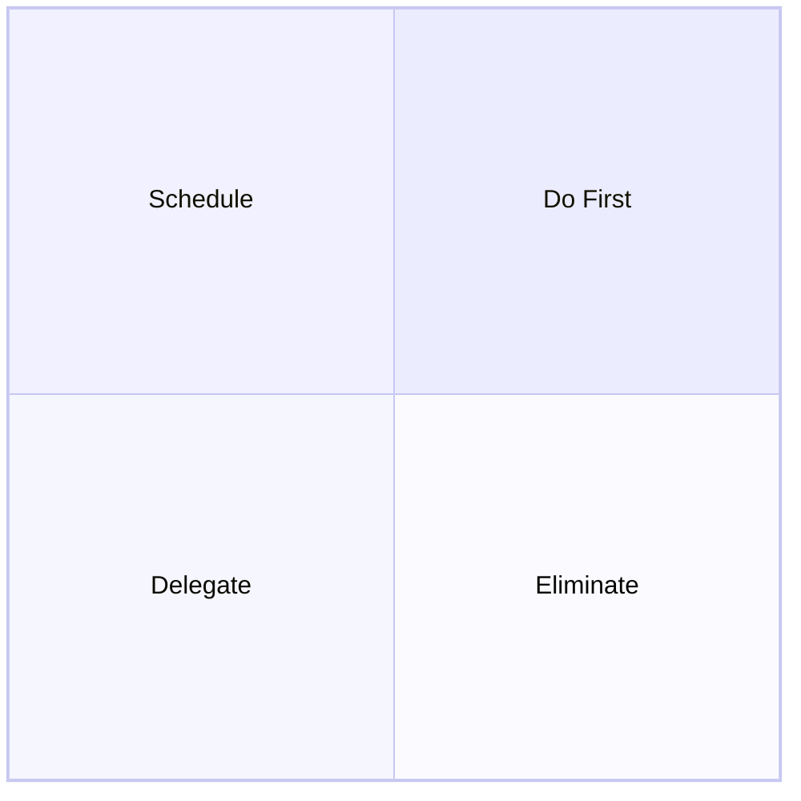
```mermaid
quadrantChart
    quadrant-1 Do First
    quadrant-2 Schedule
    quadrant-3 Delegate
    quadrant-4 Eliminate
```

## Data Points

### Basic Points

```mermaid
quadrantChart
    Point Name: [x, y]
```

Values range from 0 to 1 on both axes:

- `[0, 0]` - Bottom left corner
- `[1, 1]` - Top right corner
- `[0.5, 0.5]` - Center

### Point Styling

Inline styling:

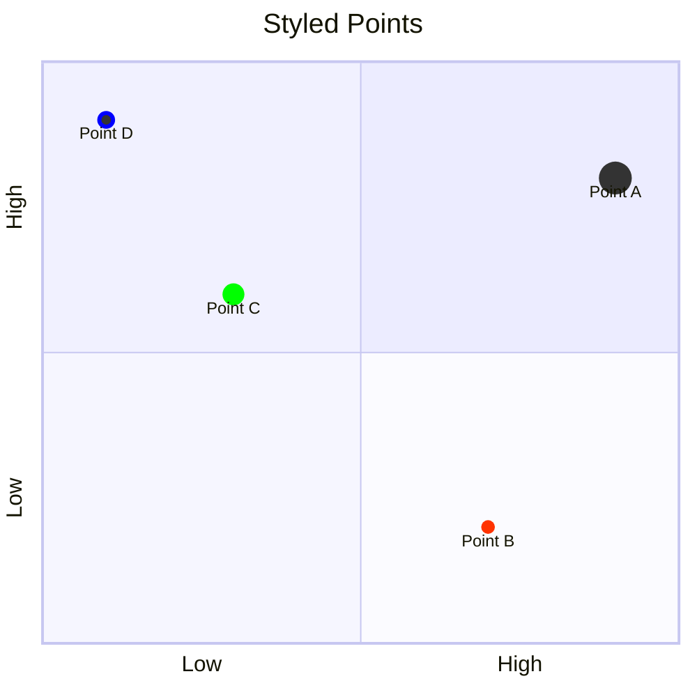
```mermaid
quadrantChart
    title Styled Points
    x-axis Low --> High
    y-axis Low --> High
    Point A: [0.9, 0.8] radius: 12
    Point B: [0.7, 0.2] color: #ff3300
    Point C: [0.3, 0.6] radius: 8, color: #00ff00
    Point D: [0.1, 0.9] stroke-color: #0000ff, stroke-width: 3px
```

Styling options:

- `radius` - Point size in pixels
- `color` - Fill color (hex)
- `stroke-color` - Border color
- `stroke-width` - Border width

### Class-Based Styling

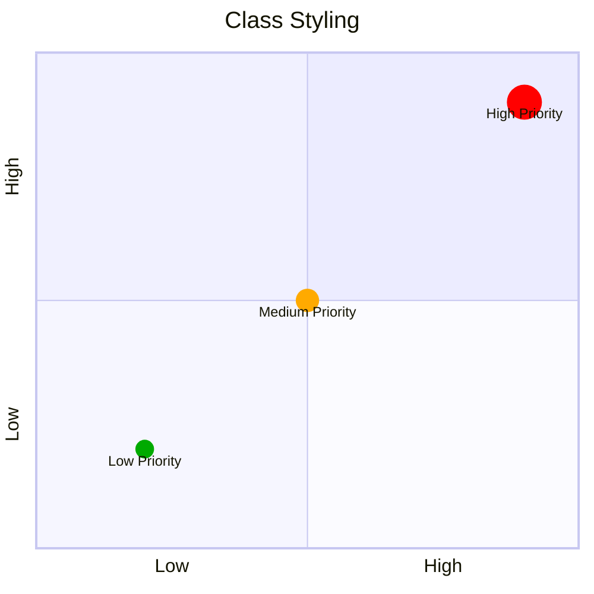
```mermaid
quadrantChart
    title Class Styling
    x-axis Low --> High
    y-axis Low --> High

    High Priority:::critical: [0.9, 0.9]
    Medium Priority:::warning: [0.5, 0.5]
    Low Priority:::normal: [0.2, 0.2]

    classDef critical color: #ff0000, radius: 15
    classDef warning color: #ffaa00, radius: 10
    classDef normal color: #00aa00, radius: 8
```

## Complete Examples

### Eisenhower Matrix

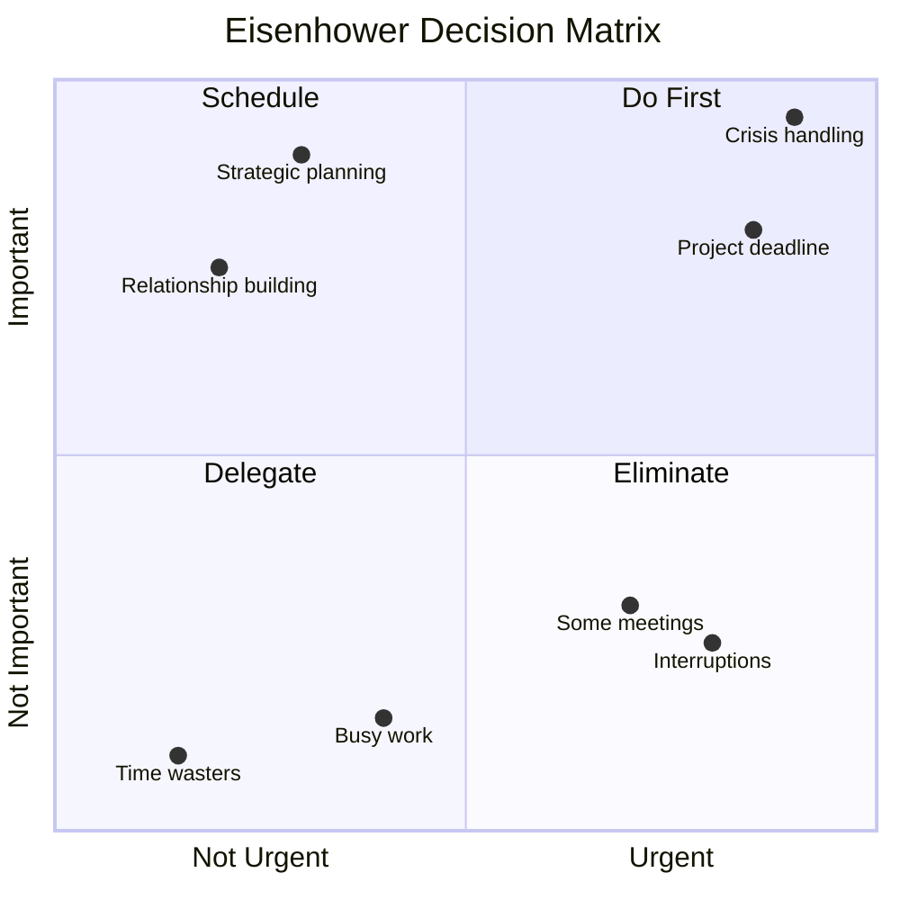
```mermaid
quadrantChart
    title Eisenhower Decision Matrix
    x-axis Not Urgent --> Urgent
    y-axis Not Important --> Important
    quadrant-1 Do First
    quadrant-2 Schedule
    quadrant-3 Delegate
    quadrant-4 Eliminate

    Crisis handling: [0.9, 0.95]
    Project deadline: [0.85, 0.8]
    Strategic planning: [0.3, 0.9]
    Relationship building: [0.2, 0.75]
    Some meetings: [0.7, 0.3]
    Interruptions: [0.8, 0.25]
    Busy work: [0.4, 0.15]
    Time wasters: [0.15, 0.1]
```

### Product Feature Prioritization

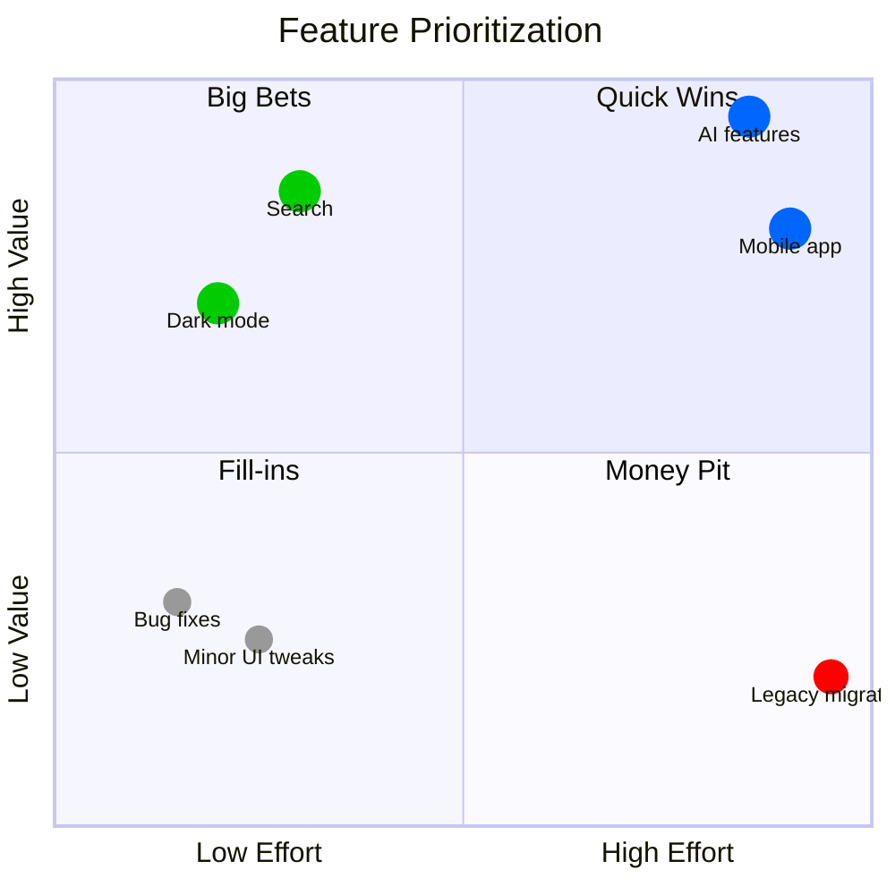
```mermaid
quadrantChart
    title Feature Prioritization
    x-axis Low Effort --> High Effort
    y-axis Low Value --> High Value
    quadrant-1 Quick Wins
    quadrant-2 Big Bets
    quadrant-3 Fill-ins
    quadrant-4 Money Pit

    Dark mode:::quick: [0.2, 0.7]
    Search:::quick: [0.3, 0.85]
    AI features:::big: [0.85, 0.95]
    Mobile app:::big: [0.9, 0.8]
    Bug fixes:::fill: [0.15, 0.3]
    Minor UI tweaks:::fill: [0.25, 0.25]
    Legacy migration:::avoid: [0.95, 0.2]

    classDef quick color: #00cc00, radius: 12
    classDef big color: #0066ff, radius: 12
    classDef fill color: #999999, radius: 8
    classDef avoid color: #ff0000, radius: 10
```

### Risk Assessment

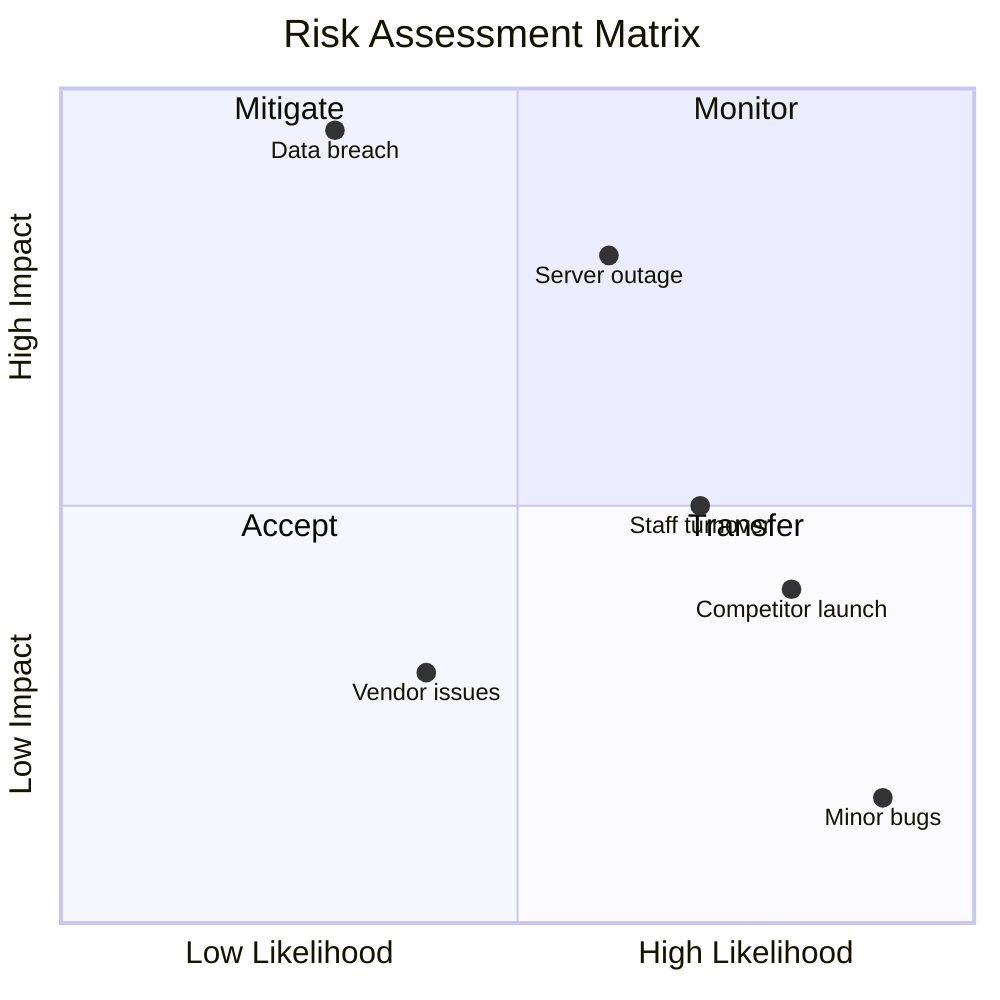
```mermaid
quadrantChart
    title Risk Assessment Matrix
    x-axis Low Likelihood --> High Likelihood
    y-axis Low Impact --> High Impact
    quadrant-1 Monitor
    quadrant-2 Mitigate
    quadrant-3 Accept
    quadrant-4 Transfer

    Data breach: [0.3, 0.95]
    Server outage: [0.6, 0.8]
    Staff turnover: [0.7, 0.5]
    Competitor launch: [0.8, 0.4]
    Minor bugs: [0.9, 0.15]
    Vendor issues: [0.4, 0.3]
```

### Team Skills Matrix

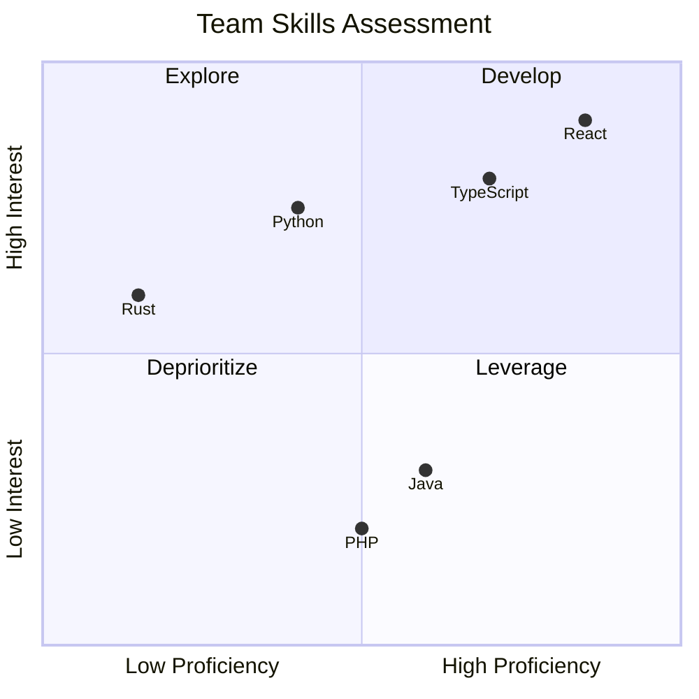
```mermaid
quadrantChart
    title Team Skills Assessment
    x-axis Low Proficiency --> High Proficiency
    y-axis Low Interest --> High Interest
    quadrant-1 Develop
    quadrant-2 Explore
    quadrant-3 Deprioritize
    quadrant-4 Leverage

    React: [0.85, 0.9]
    TypeScript: [0.7, 0.8]
    Python: [0.4, 0.75]
    Rust: [0.15, 0.6]
    Java: [0.6, 0.3]
    PHP: [0.5, 0.2]
```

## Theme Configuration

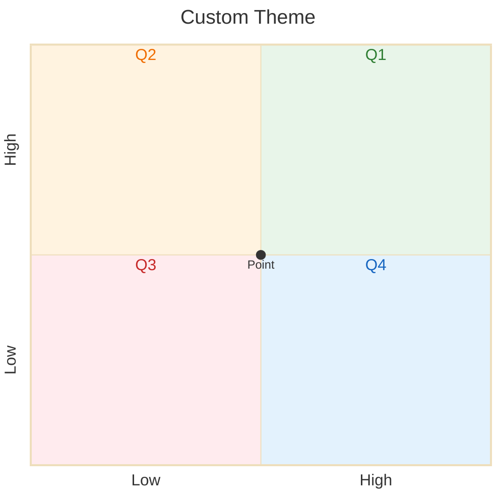
```mermaid
%%{init: {'theme': 'base', 'themeVariables': {
    'quadrant1Fill': '#e8f5e9',
    'quadrant2Fill': '#fff3e0',
    'quadrant3Fill': '#ffebee',
    'quadrant4Fill': '#e3f2fd',
    'quadrant1TextFill': '#2e7d32',
    'quadrant2TextFill': '#ef6c00',
    'quadrant3TextFill': '#c62828',
    'quadrant4TextFill': '#1565c0',
    'quadrantPointFill': '#333333',
    'quadrantPointTextFill': '#333333'
}}}%%
quadrantChart
    title Custom Theme
    x-axis Low --> High
    y-axis Low --> High
    quadrant-1 Q1
    quadrant-2 Q2
    quadrant-3 Q3
    quadrant-4 Q4
    Point: [0.5, 0.5]
```

### Available Theme Variables

- `quadrant1Fill` through `quadrant4Fill` - Quadrant background colors
- `quadrant1TextFill` through `quadrant4TextFill` - Quadrant label colors
- `quadrantPointFill` - Default point color
- `quadrantPointTextFill` - Point label color
- `quadrantXAxisTextFill` - X-axis text color
- `quadrantYAxisTextFill` - Y-axis text color
- `quadrantTitleFill` - Title color
- `quadrantInternalBorderStrokeFill` - Internal border color
- `quadrantExternalBorderStrokeFill` - External border color

## Configuration Options

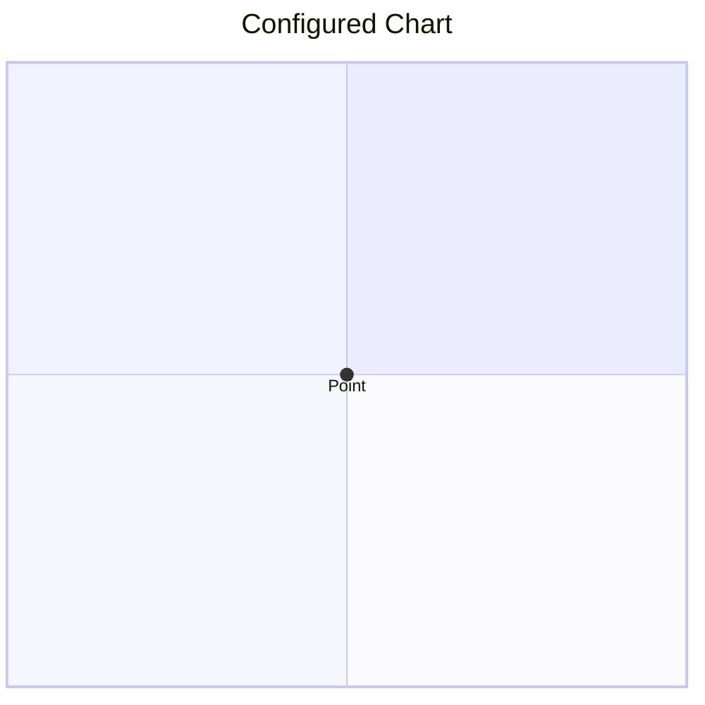
```mermaid
%%{init: {'quadrantChart': {
    'chartWidth': 500,
    'chartHeight': 500,
    'titlePadding': 10,
    'titleFontSize': 20,
    'quadrantPadding': 5,
    'pointRadius': 5,
    'pointTextPadding': 3,
    'pointLabelFontSize': 12,
    'xAxisLabelPadding': 5,
    'xAxisLabelFontSize': 16,
    'yAxisLabelPadding': 5,
    'yAxisLabelFontSize': 16
}}}%%
quadrantChart
    title Configured Chart
    Point: [0.5, 0.5]
```

## Best Practices

1. Use clear, descriptive axis labels
2. Name quadrants to indicate the action or category
3. Position points accurately based on data
4. Use styling to highlight important points
5. Keep point labels concise
6. Use color coding consistently
7. Consider your audience when choosing quadrant names

## Common Use Cases

- **Eisenhower Matrix** - Task prioritization (Urgent/Important)
- **Value/Effort Matrix** - Feature prioritization
- **Risk Matrix** - Impact/Likelihood assessment
- **Skill Matrix** - Proficiency/Interest mapping
- **BCG Matrix** - Market share/Growth analysis
- **SWOT Positioning** - Strength/Opportunity mapping
