# State Diagrams

State diagrams describe system behavior by showing states and transitions.

## Basic Syntax

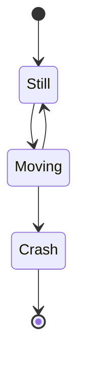

## States

### Simple States

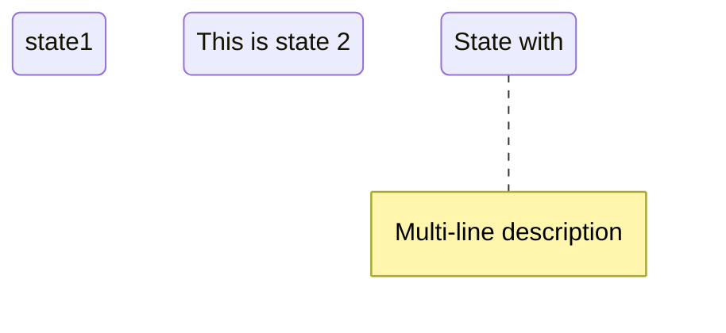

### Start and End States

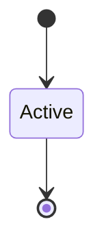

## Transitions

### Basic Transitions

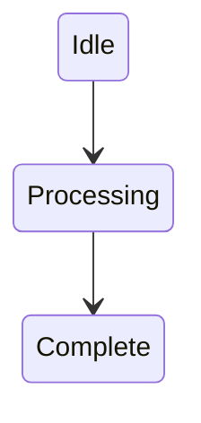

### Labeled Transitions

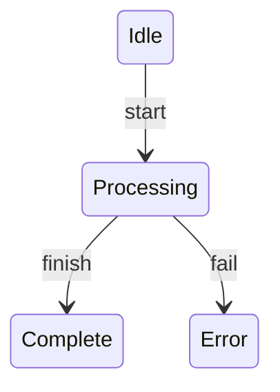

## Composite States

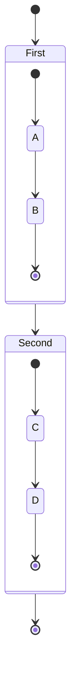

### Nested Composite States

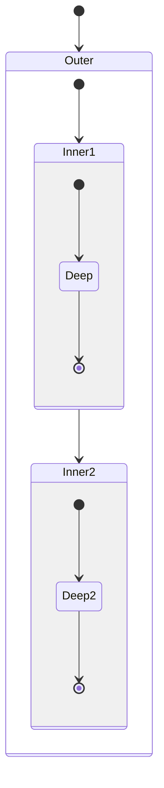

## Choice (Branching)

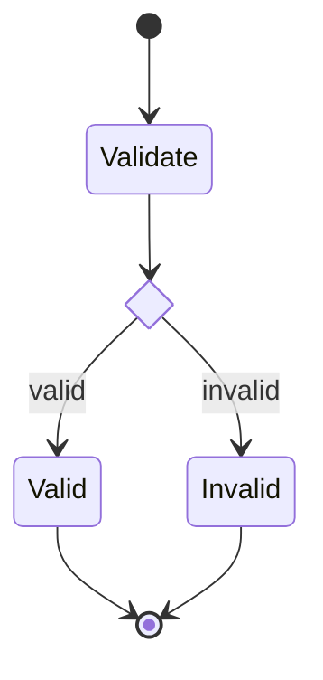

## Forks and Joins

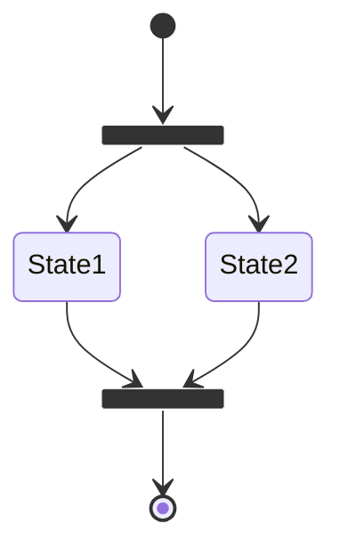

## Notes

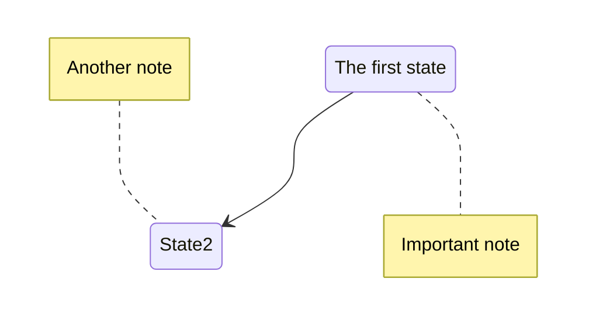

## Concurrency

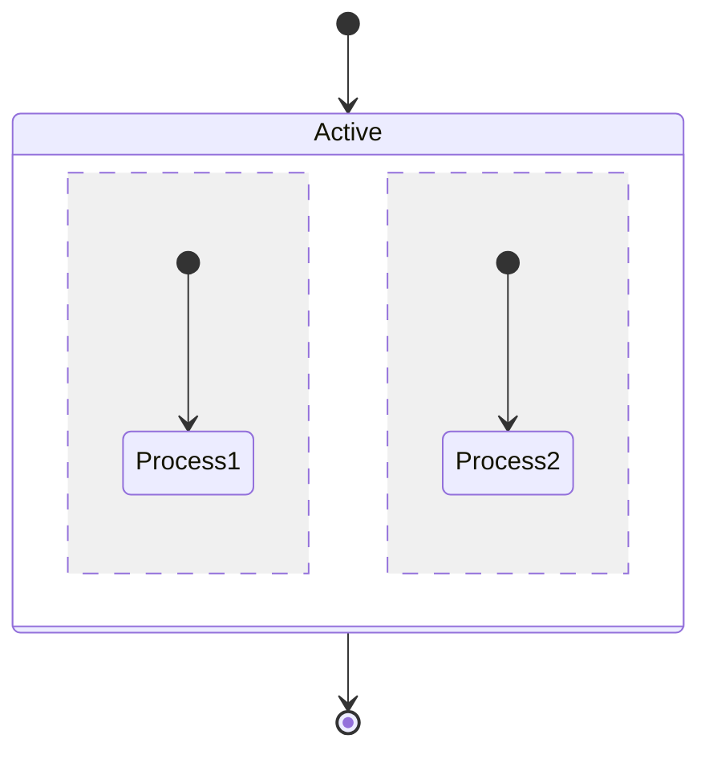

The `--` separator creates parallel regions.

## Direction

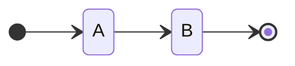

Options: `TB` (default), `BT`, `LR`, `RL`

## Styling

### Class Definitions

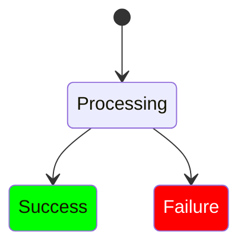

### Inline Styling

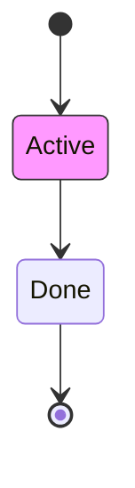

## Complete Examples

### Order Processing

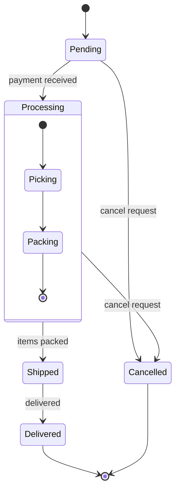

### Traffic Light

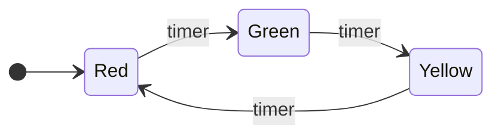

### User Authentication

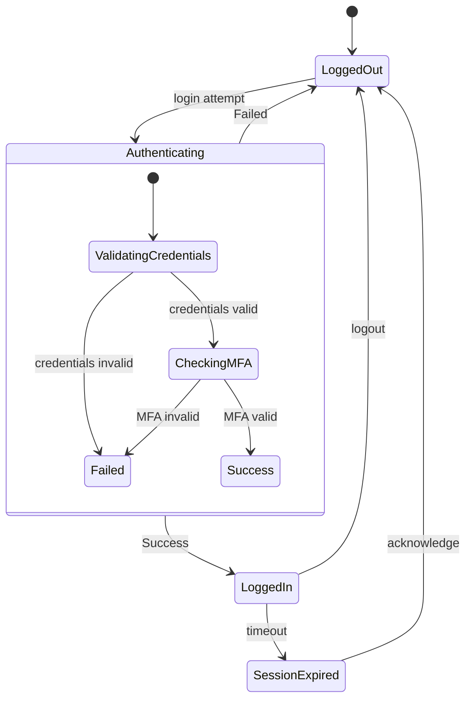

### Document Workflow

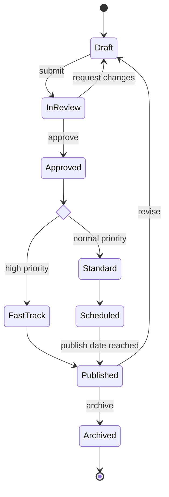

## Best Practices

1. Always include start `[*]` and end `[*]` states where appropriate
2. Use descriptive state names
3. Label transitions with trigger events
4. Use composite states to group related states
5. Use choice nodes for conditional branching
6. Add notes to explain complex states
7. Keep diagrams focused on one aspect of the system

## v1 vs v2 Syntax

Use `stateDiagram-v2` for:

- Better rendering
- Direction support
- Fork/join states
- Choice states
- Concurrent regions
- Better styling support

The original `stateDiagram` is deprecated.
