# Styling and Configuration

Comprehensive guide to styling and configuring Mermaid diagrams.

## Configuration Methods

### 1. Init Directive

Inline configuration at the start of a diagram:

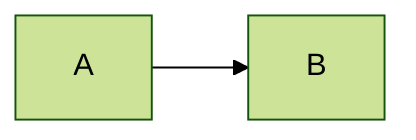

### 2. Frontmatter (YAML)

YAML block at the start:


### 3. JavaScript Configuration

For programmatic use:

```javascript
mermaid.initialize({
  theme: 'dark',
  flowchart: {
    curve: 'basis'
  }
});
```

## Themes

### Built-in Themes

```mermaid
%%{init: {'theme': 'default'}}%%
```

Available themes:

- `default` - Standard theme
- `dark` - Dark mode
- `forest` - Green tones
- `neutral` - Grayscale
- `base` - Minimal, for customization

### Theme Variables

Customize with `themeVariables`:

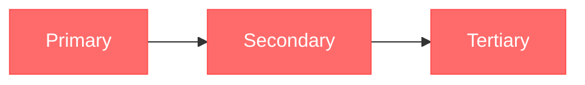

### Common Theme Variables

| Variable | Description |
| --- | --- |
| `primaryColor` | Main node color |
| `primaryTextColor` | Text on primary |
| `primaryBorderColor` | Primary borders |
| `secondaryColor` | Secondary elements |
| `tertiaryColor` | Tertiary elements |
| `lineColor` | Connection lines |
| `textColor` | General text |
| `mainBkg` | Background color |
| `nodeBorder` | Node borders |
| `clusterBkg` | Subgraph background |
| `clusterBorder` | Subgraph borders |
| `titleColor` | Title text |
| `edgeLabelBackground` | Edge label background |

## Flowchart-Specific Styling

### Node Classes

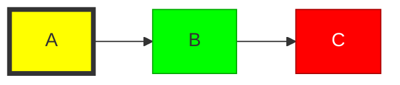

### Default Class

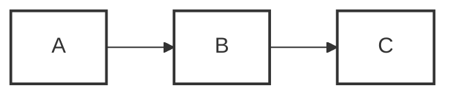

### Apply Classes

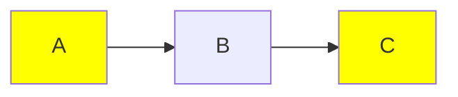

### Link Styling

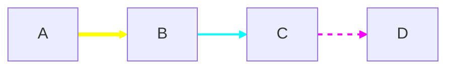

### Link Style Properties

- `stroke` - Line color
- `stroke-width` - Line thickness
- `stroke-dasharray` - Dash pattern (e.g., `5 5`)
- `fill` - Fill color (for arrow heads)

### Subgraph Styling

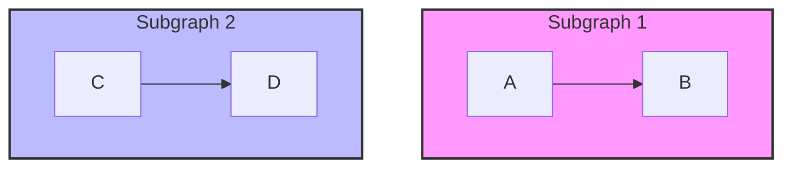

## Sequence Diagram Styling

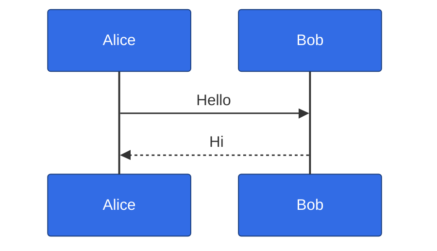

## Class Diagram Styling

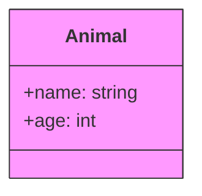

## State Diagram Styling

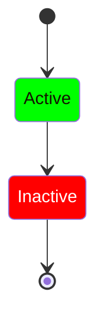

## Pie Chart Styling

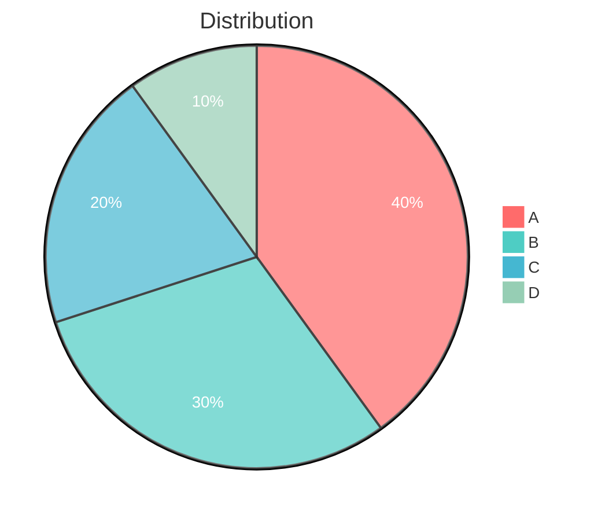

## Git Graph Styling

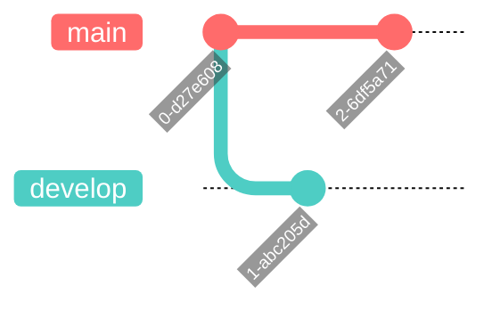

## Gantt Chart Styling

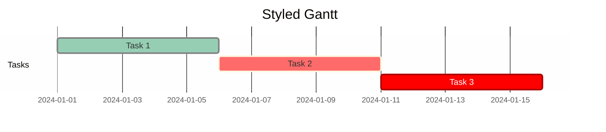

## Flowchart Configuration

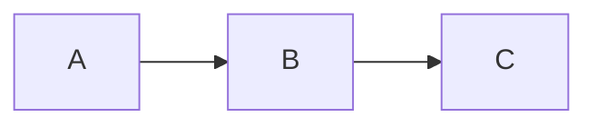

### Curve Options

- `basis` - Smooth curves
- `linear` - Straight lines
- `cardinal` - Cardinal splines
- `monotoneX` - Monotonic in x
- `monotoneY` - Monotonic in y
- `natural` - Natural splines
- `step` - Step function
- `stepAfter` - Step after point
- `stepBefore` - Step before point

## Font Configuration

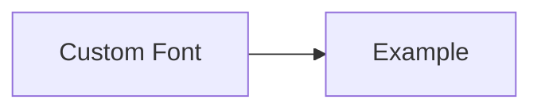

## Security Configuration

```javascript
mermaid.initialize({
  securityLevel: 'strict', // strict, loose, antiscript, sandbox
  startOnLoad: true
});
```

Security levels:

- `strict` - Tags encoded, click disabled
- `loose` - Tags allowed, click enabled
- `antiscript` - Script tags disabled
- `sandbox` - Iframe sandbox mode

## Accessibility

### ARIA Labels

Add descriptions for screen readers:

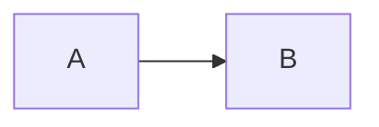

### Title and Description

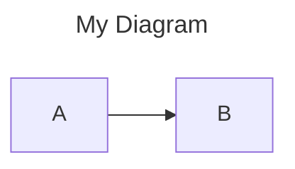

## Best Practices

1. **Consistency** - Use the same theme across related diagrams
2. **Contrast** - Ensure sufficient contrast for readability
3. **Semantics** - Use colors meaningfully (red for errors, green for success)
4. **Simplicity** - Don't over-style; clarity comes first
5. **Accessibility** - Test with colorblind-friendly palettes
6. **Documentation** - Comment your style choices

## Common Issues

### Styles Not Applying

- Check syntax (no trailing commas in JSON)
- Ensure `%%{init:` is at the very start
- Verify theme variable names are correct

### Colors Not Showing

- Use valid hex colors (`#ff6b6b`)
- Check for typos in variable names
- Some variables require specific diagram types

### Font Issues

- Use web-safe fonts or ensure font is loaded
- Check `fontFamily` is quoted if contains spaces
