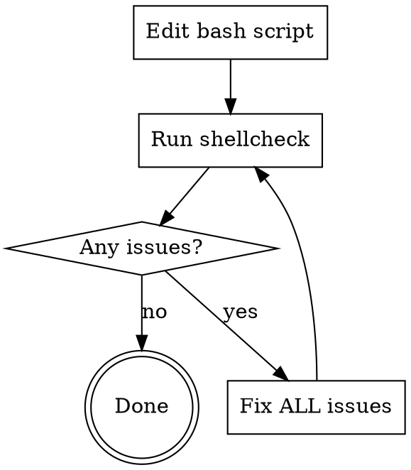

# Bash Script Quality

## Overview

**Every bash script edit requires shellcheck validation.**
No exceptions for "simple" changes.

## The Iron Law

```text
ALWAYS run shellcheck after editing ANY bash script
ALWAYS iterate until ALL errors and warnings are fixed
```

## Workflow



**After EVERY bash script edit:**

1. Run `shellcheck <file>`
2. If errors exist, fix ALL of them (including pre-existing)
3. Run shellcheck again
4. Repeat until zero errors

## Red Flags - STOP and Run Shellcheck

These thoughts mean you're rationalizing:

- "Just adding a comment"
- "Only changed a string"
- "Too simple to need validation"
- "File already worked before"
- "Shellcheck is too strict"
- "Only changed one line"
- "I'll run it after all edits"

**All of these mean: Run shellcheck anyway. No exceptions.**

## Common Rationalizations

| Excuse | Reality |
| ------ | ------- |
| "Just a comment" | Comments before shebang break scripts (SC1128). |
| "Simple string change" | Unquoted variables, word splitting issues. Takes 2 seconds. |
| "Script was working" | Working != correct. Shellcheck catches latent bugs. |
| "Too strict" | Shellcheck warnings prevent real bugs. Fix or disable with directive. |
| "I know bash" | Even experts miss quoting issues, SC2086. Verify. |
| "I'll batch it" | Each edit can introduce errors. Verify incrementally. |

## When NOT to Use

- Reading bash scripts (no edits)
- Non-bash file formats
- Files with explicit `# shellcheck disable` for valid reasons

## Common Mistakes

**Mistake:** Adding comments/text before the shebang
**Fix:** Shebang must be line 1. Comments go after.

**Mistake:** Running shellcheck only at the end of multiple edits
**Fix:** Run after EVERY edit - errors compound and obscure root cause

**Mistake:** Ignoring warnings (only fixing errors)
**Fix:** Fix ALL issues - warnings indicate real problems

## Quick Reference

```bash
# Basic check
shellcheck script.sh

# Check with severity
shellcheck --severity=warning script.sh

# Disable specific check (in script)
# shellcheck disable=SC2086
```
