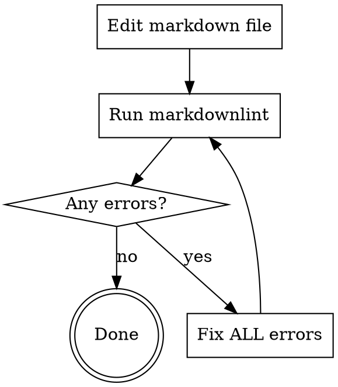

# Markdown Quality

## Overview

**Every markdown file edit requires markdownlint validation.**
No exceptions for "simple" changes.

## The Iron Law

```text
ALWAYS run markdownlint after editing ANY markdown file
ALWAYS iterate until ALL errors are fixed
```

## Workflow



**After EVERY markdown edit:**

1. Run `markdownlint <file>`
2. If errors exist, fix ALL of them (including pre-existing)
3. Run markdownlint again
4. Repeat until zero errors

## Red Flags - STOP and Run Markdownlint

These thoughts mean you're rationalizing:

- "Just a quick typo fix"
- "No structural changes"
- "Too simple to need validation"
- "File already passed linting before"
- "Running linter is overkill"
- "Only changed one line"
- "Overhead would be disproportionate"

**All of these mean: Run markdownlint anyway. No exceptions.**

## Common Rationalizations

| Excuse | Reality |
| ------ | ------- |
| "Simple typo fix" | Can introduce spaces, length issues. Takes 2 seconds. |
| "No structural changes" | Linting checks length, whitespace, blank lines. |
| "Trust existing state" | Files regress. Verify current state. |
| "Overhead" | Takes 1-2 seconds. Debugging takes minutes. |
| "Only for structural" | Validation is for ALL changes. No exceptions. |
| "Valid reasons" | Markdownlint defines standards. Fix or configure. |

## When NOT to Use

- Reading markdown files (no edits)
- Non-markdown file formats

## Common Mistakes

**Mistake:** Running markdownlint only on new files, not edits
**Fix:** Run after EVERY edit, no matter how small

**Mistake:** Fixing only new errors, leaving pre-existing ones
**Fix:** Fix ALL errors reported by markdownlint

**Mistake:** Announcing intent to run markdownlint but not doing it
**Fix:** Always execute the command and share results
