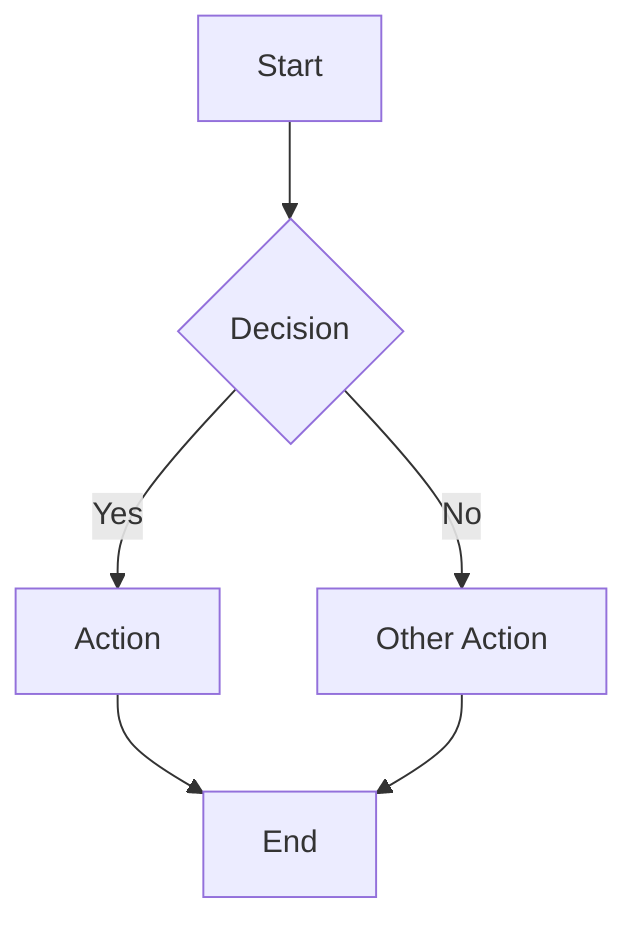
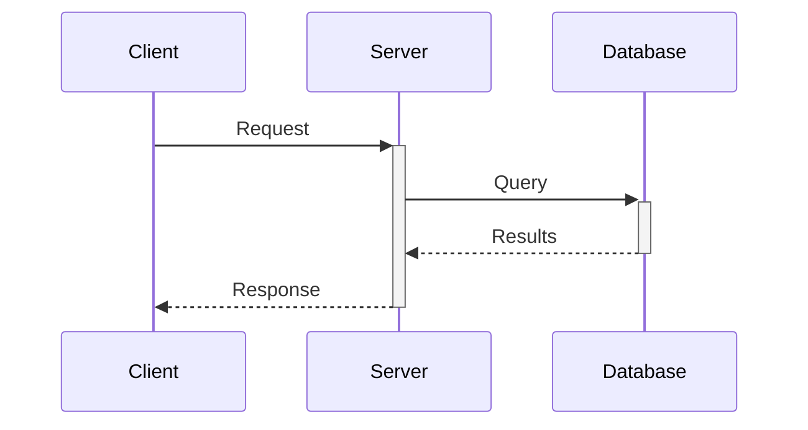
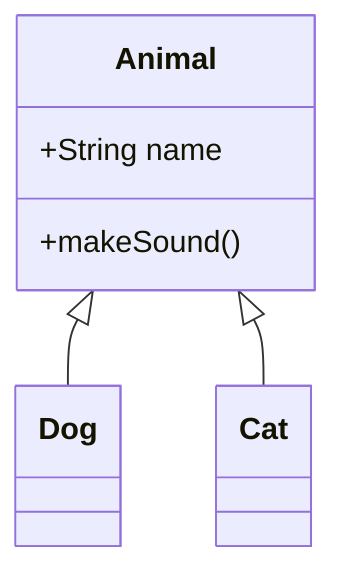
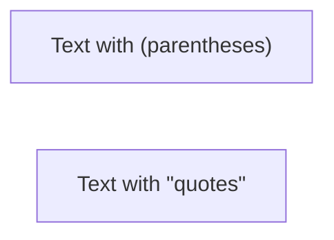
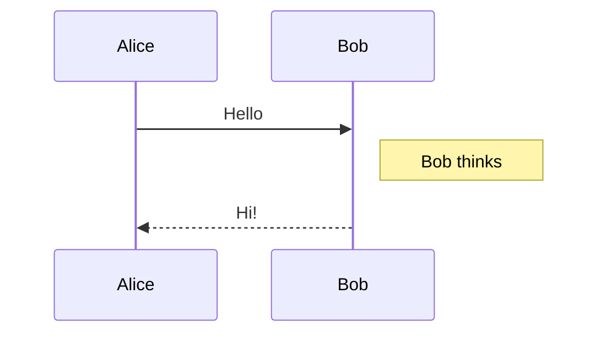
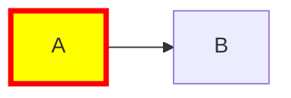
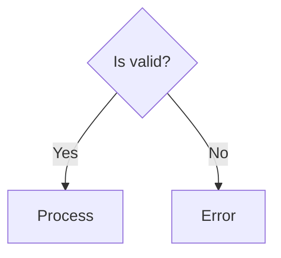

# Mermaid Diagrams

## Overview

This skill enables creation and editing of Mermaid diagrams - text-based
diagram definitions that render as visual diagrams. Mermaid supports 20+
diagram types for visualizing processes, data structures, timelines,
architectures, and more.

## When to Use This Skill

- Creating flowcharts, sequence diagrams, or any visual diagrams
- Debugging or fixing broken Mermaid syntax
- Converting descriptions into diagram code
- Explaining or documenting systems visually
- Any request involving "diagram", "flowchart", "chart", "visualization"

## Supported Diagram Types

| Type | Keyword | Use Case |
| --- | --- | --- |
| Flowchart | `flowchart` | Process flows, decision trees |
| Sequence | `sequenceDiagram` | API interactions, message flows |
| Class | `classDiagram` | OOP structures, relationships |
| State | `stateDiagram-v2` | State machines, lifecycles |
| ER | `erDiagram` | Database schemas |
| Gantt | `gantt` | Project timelines, schedules |
| Pie | `pie` | Proportional data |
| Mindmap | `mindmap` | Hierarchical concepts |
| Timeline | `timeline` | Chronological events |
| Quadrant | `quadrantChart` | Priority matrices |
| Git | `gitGraph` | Branch/merge visualization |
| XY Chart | `xychart-beta` | Bar and line charts |
| Sankey | `sankey-beta` | Flow quantities |
| Architecture | `architecture-beta` | System components |
| User Journey | `journey` | User experience mapping |
| Kanban | `kanban` | Task boards |
| Block | `block-beta` | Precise layout diagrams |

## Quick Reference

### Flowchart Basics



### Sequence Diagram Basics



### Class Diagram Basics



## Workflow

### Creating a New Diagram

1. **Identify diagram type** - Match the user's need to the appropriate type
2. **Consult reference** - Read the relevant reference file in `references/`
3. **Draft diagram** - Write the Mermaid code following syntax rules
4. **Validate** - Check for common issues (proper indentation, valid connections)
5. **Refine** - Add styling or improve layout as needed

### Debugging Diagrams

Common issues to check:

- Missing or extra brackets in node definitions
- Incorrect arrow syntax (`-->` vs `->` vs `--`)
- Unmatched quotes in labels
- Invalid characters (use entity codes: `#quot;`, `#lt;`, `#gt;`)
- Incorrect indentation (critical for mindmaps, Gantt)
- Missing diagram type declaration

### Choosing the Right Diagram Type

| User Intent | Recommended Diagram |
| --- | --- |
| "Show process steps" | Flowchart |
| "Show API calls" | Sequence diagram |
| "Show database tables" | ER diagram |
| "Show class hierarchy" | Class diagram |
| "Show project timeline" | Gantt chart |
| "Show state transitions" | State diagram |
| "Show proportions" | Pie chart |
| "Brainstorm/organize ideas" | Mindmap |
| "Show system architecture" | Architecture diagram |
| "Show user experience" | User journey |
| "Show task status" | Kanban |
| "Show data flow" | Sankey diagram |
| "Prioritize items" | Quadrant chart |
| "Show trends over time" | XY chart |
| "Show git history" | Git graph |

## Reference Documentation

Detailed syntax documentation is available in `references/`:

### Core Diagrams

- `flowcharts.md` - Nodes, edges, subgraphs, styling
- `sequence.md` - Participants, messages, loops, notes
- `class.md` - Classes, relationships, cardinality
- `state.md` - States, transitions, composite states
- `entity-relationship.md` - Entities, attributes, relationships

### Charts and Data

- `gantt.md` - Tasks, milestones, dependencies
- `pie.md` - Slices, labels, showData
- `xychart.md` - Bar charts, line charts, axes
- `quadrant.md` - Axes, quadrants, data points
- `sankey.md` - Flow diagrams, nodes, links

### Specialized Diagrams

- `mindmap.md` - Hierarchical concepts, icons
- `timeline.md` - Chronological events, sections
- `gitgraph.md` - Commits, branches, merges
- `architecture.md` - Services, groups, edges
- `journey.md` - User experiences, satisfaction scores
- `kanban.md` - Columns, tasks, metadata
- `block.md` - Precise layout control, columns

### Configuration

- `styling.md` - Themes, colors, fonts, configuration

## Grep Patterns for References

To find specific syntax, use these patterns:

```bash
# Find all node shape syntax
grep -r "shape\|rectangle\|circle\|diamond" references/

# Find arrow/edge syntax
grep -r "-->\\|--\\|-.->\\|==>" references/

# Find styling examples
grep -r "classDef\\|style\\|theme" references/

# Find configuration options
grep -r "init:\\|config:" references/
```

## Best Practices

1. **Start simple** - Begin with basic syntax, add complexity gradually
2. **Use meaningful IDs** - `userAuth` is better than `A` for node IDs
3. **Label edges** - Add text to arrows when relationships aren't obvious
4. **Group related items** - Use subgraphs, sections, or groups
5. **Consider direction** - `TD` for hierarchies, `LR` for processes
6. **Apply consistent styling** - Use classes for repeated styles
7. **Test incrementally** - Add a few elements at a time to catch errors early

## Common Syntax Patterns

### Special Characters in Labels



### Adding Notes



### Styling Nodes



### Conditional Branches



## Known Limitations

- No inline images (except icons in some diagram types)
- Limited interactive features in static renders
- Some diagram types are in beta (`-beta` suffix)
- Complex layouts may require manual adjustment
- Cross-browser rendering may vary slightly

## Troubleshooting

### "Parse error" or diagram not rendering

- Check diagram type declaration is first line
- Verify all brackets/quotes are matched
- Look for unsupported characters

### Diagram looks wrong

- Check direction (`TD`, `LR`, etc.)
- Verify edge syntax matches diagram type
- Review indentation (especially for Gantt, mindmap)

### Styling not applying

- Ensure `%%{init:` is at very start of diagram
- Check for JSON syntax errors (no trailing commas)
- Verify variable names are correct for diagram type
