# Class Diagrams

Class diagrams model object-oriented structures showing classes, attributes,
methods, and relationships.

## Basic Syntax

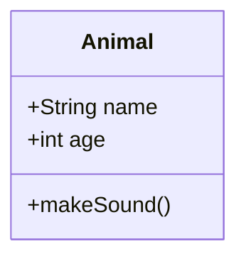

## Class Definition

### Attributes and Methods

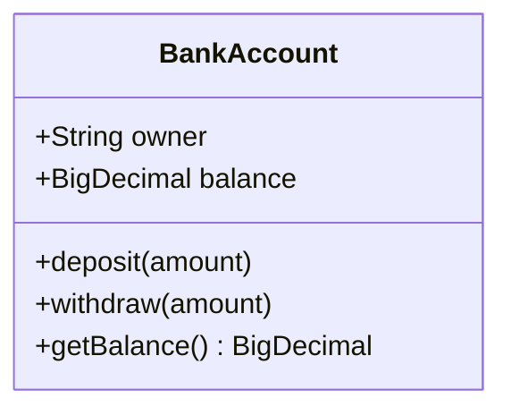

### Visibility Modifiers

- `+` Public
- `-` Private
- `#` Protected
- `~` Package/Internal

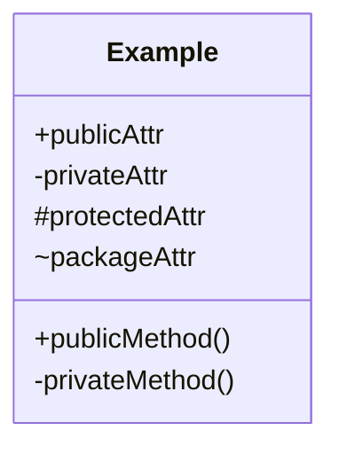

### Generic Types

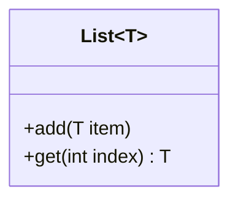

### Abstract Classes and Methods

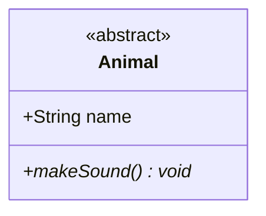

### Interfaces

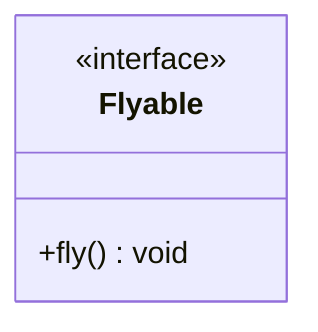

### Other Annotations

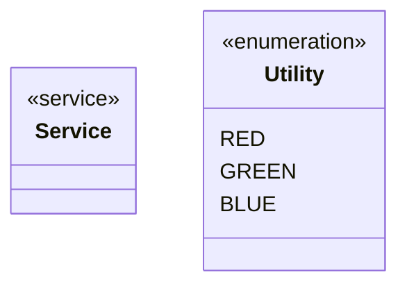

## Relationships

### Inheritance (Extends)

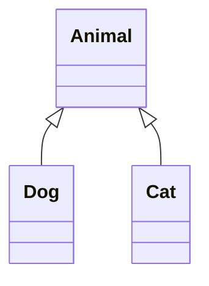

### Composition (Strong "has-a")

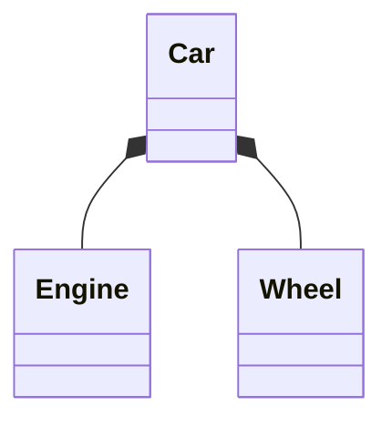

### Aggregation (Weak "has-a")

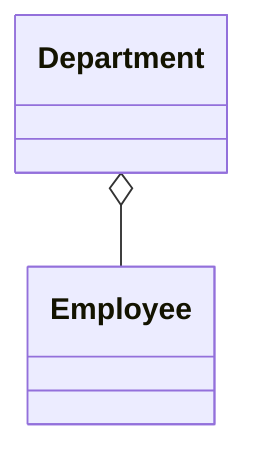

### Association

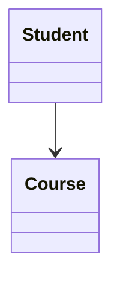

### Dependency

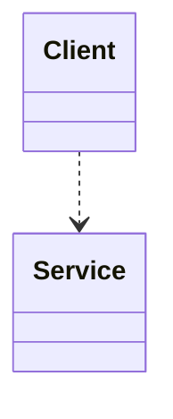

### Realization (Implements)

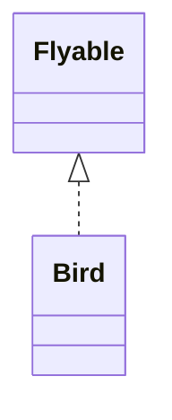

### All Relationship Types

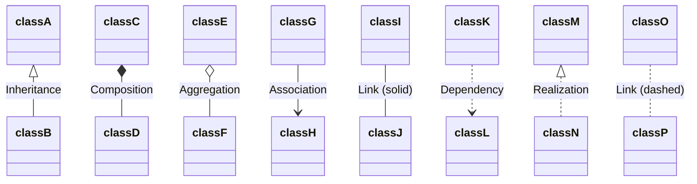

## Cardinality/Multiplicity

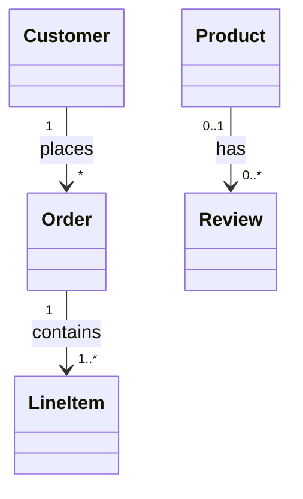

Common multiplicities:

- `1` - Exactly one
- `0..1` - Zero or one
- `1..*` - One or more
- `*` - Zero or more (same as `0..*`)
- `n` - Specific number
- `0..n` - Zero to n

## Labels

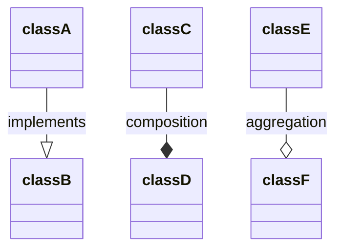

## Namespaces

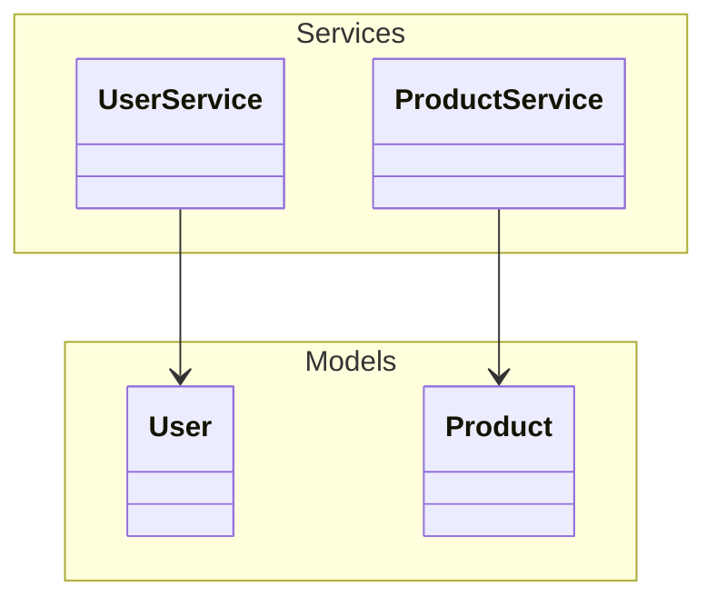

## Notes

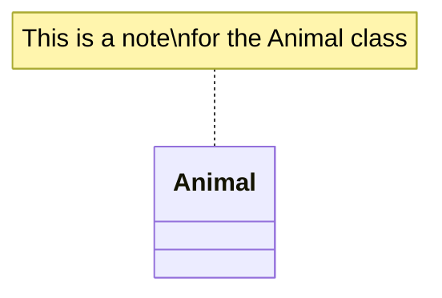

General notes:

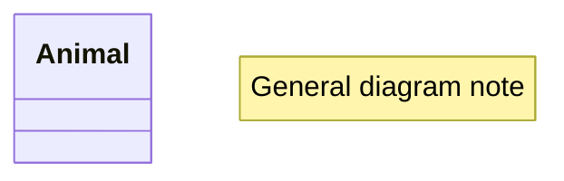

## Direction

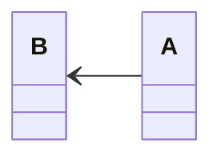

Options: `TB`, `BT`, `LR`, `RL`

## Styling

### Class Styling

```mermaid
classDiagram
    class Animal
    class Mammal
    Animal <|-- Mammal

    style Animal fill:#f9f,stroke:#333,stroke-width:4px
    style Mammal fill:#bbf,stroke:#f66,stroke-width:2px
```

### CSS Classes

```mermaid
classDiagram
    class Animal:::highlight
    classDef highlight fill:#ff0,stroke:#000
```

## Complete Example

```mermaid
classDiagram
    class Animal {
        <<abstract>>
        +String name
        +int age
        +makeSound()* void
        +move() void
    }

    class Dog {
        +String breed
        +makeSound() void
        +fetch() void
    }

    class Cat {
        +boolean indoor
        +makeSound() void
        +scratch() void
    }

    class Pet {
        <<interface>>
        +play() void
    }

    Animal <|-- Dog
    Animal <|-- Cat
    Pet <|.. Dog
    Pet <|.. Cat

    class Owner {
        +String name
        +adopt(Pet pet) void
    }

    Owner "1" --> "*" Pet : owns
```

## Best Practices

1. Use meaningful class and method names
2. Show only relevant attributes and methods
3. Use proper visibility modifiers
4. Group related classes with namespaces
5. Add cardinality to clarify relationships
6. Use notes to explain complex logic
7. Keep diagrams focused on one aspect of the system

## Common Patterns

### Repository Pattern

```mermaid
classDiagram
    class Repository~T~ {
        <<interface>>
        +findById(id) T
        +findAll() List~T~
        +save(T entity) T
        +delete(id) void
    }

    class UserRepository {
        +findByEmail(email) User
    }

    Repository~User~ <|.. UserRepository
```

### Factory Pattern

```mermaid
classDiagram
    class Product {
        <<interface>>
        +use() void
    }
    class ConcreteProductA {
        +use() void
    }
    class ConcreteProductB {
        +use() void
    }
    class Factory {
        <<interface>>
        +create() Product
    }
    class ConcreteFactory {
        +create() Product
    }

    Product <|.. ConcreteProductA
    Product <|.. ConcreteProductB
    Factory <|.. ConcreteFactory
    ConcreteFactory ..> Product
```

### MVC Pattern

```mermaid
classDiagram
    class Model {
        +data
        +getData()
        +setData()
    }
    class View {
        +render()
        +getUserInput()
    }
    class Controller {
        +handleRequest()
        +updateModel()
        +updateView()
    }

    Controller --> Model
    Controller --> View
    View ..> Model
```
