# Entity Relationship Diagrams (ERD)

ER diagrams model database schemas showing entities, attributes, and relationships.

## Basic Syntax

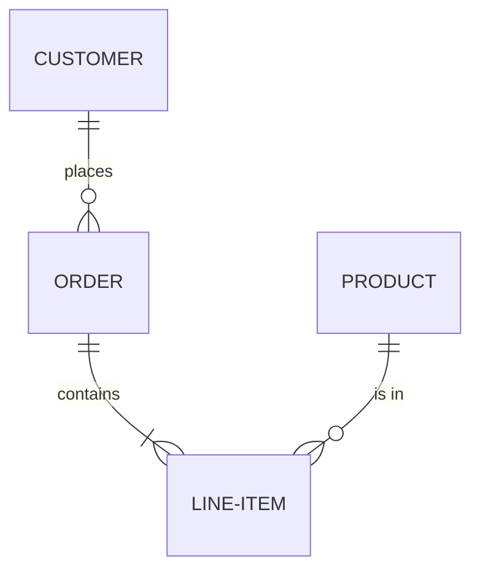

## Entities

Entities are defined implicitly through relationships or with attributes:

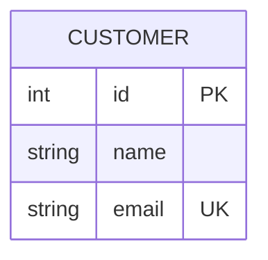

## Attributes

### Attribute Types

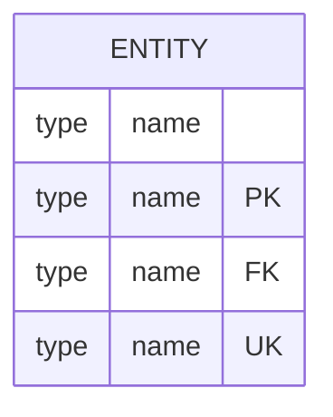

- `PK` - Primary Key
- `FK` - Foreign Key
- `UK` - Unique Key

### Common Types

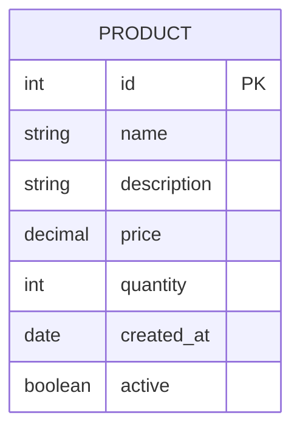

### Attribute Comments

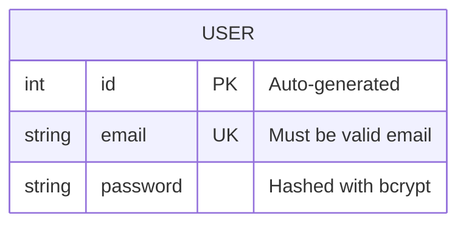

## Relationships

### Relationship Syntax

`Entity1 <cardinality1>--<cardinality2> Entity2 : "label"`

### Cardinality Notation

Left side of `--`:

- `|o` - Zero or one
- `||` - Exactly one
- `}o` - Zero or more
- `}|` - One or more

Right side of `--`:

- `o|` - Zero or one
- `||` - Exactly one
- `o{` - Zero or more
- `|{` - One or more

### Relationship Types

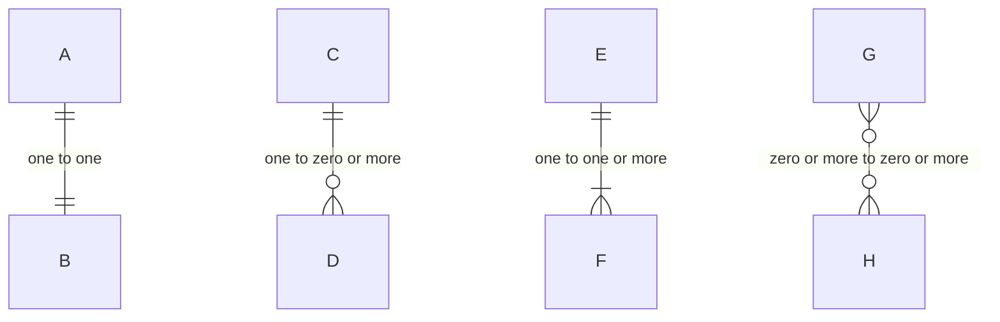

### All Cardinality Combinations

| Left | Right | Meaning |
| --- | --- | --- |
| `\|o` | `o\|` | Zero or one to zero or one |
| `\|o` | `\|\|` | Zero or one to exactly one |
| `\|o` | `o{` | Zero or one to zero or more |
| `\|o` | `\|{` | Zero or one to one or more |
| `\|\|` | `o\|` | Exactly one to zero or one |
| `\|\|` | `\|\|` | Exactly one to exactly one |
| `\|\|` | `o{` | Exactly one to zero or more |
| `\|\|` | `\|{` | Exactly one to one or more |
| `}o` | `o\|` | Zero or more to zero or one |
| `}o` | `\|\|` | Zero or more to exactly one |
| `}o` | `o{` | Zero or more to zero or more |
| `}o` | `\|{` | Zero or more to one or more |
| `}\|` | `o\|` | One or more to zero or one |
| `}\|` | `\|\|` | One or more to exactly one |
| `}\|` | `o{` | One or more to zero or more |
| `}\|` | `\|{` | One or more to one or more |

### Identifying vs Non-Identifying

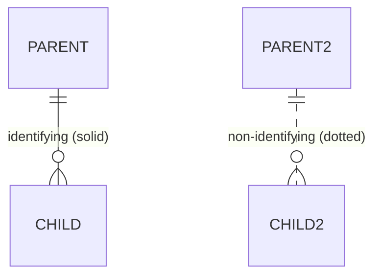

- Solid line `--` = Identifying relationship (child depends on parent for identity)
- Dotted line `..` = Non-identifying relationship (child has independent identity)

## Relationship Labels

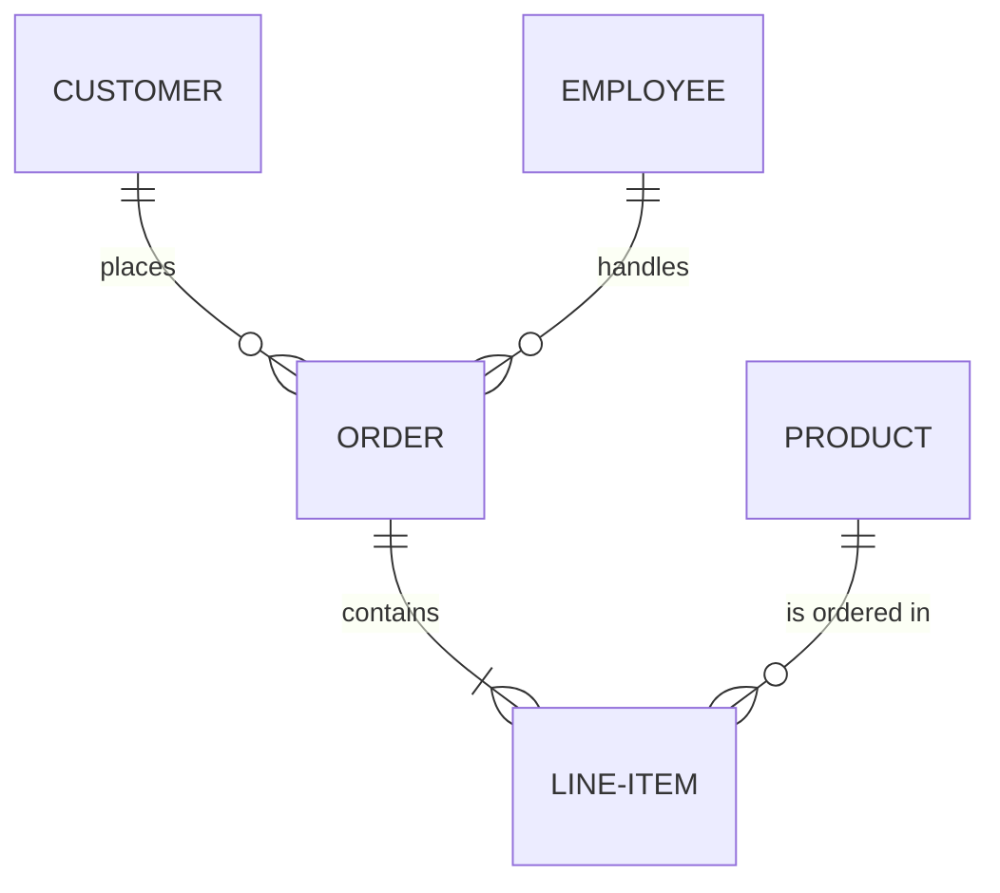

Use quotes for labels with spaces.

## Complete Examples

### E-Commerce Database

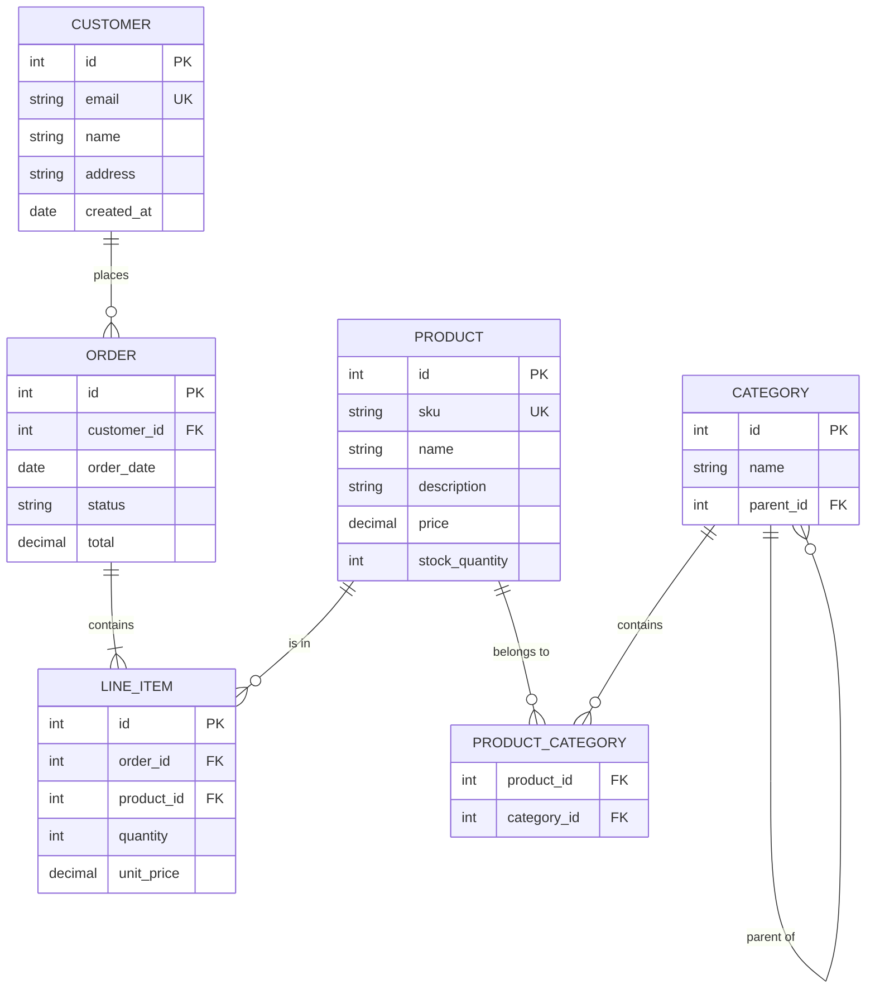

### Blog Platform

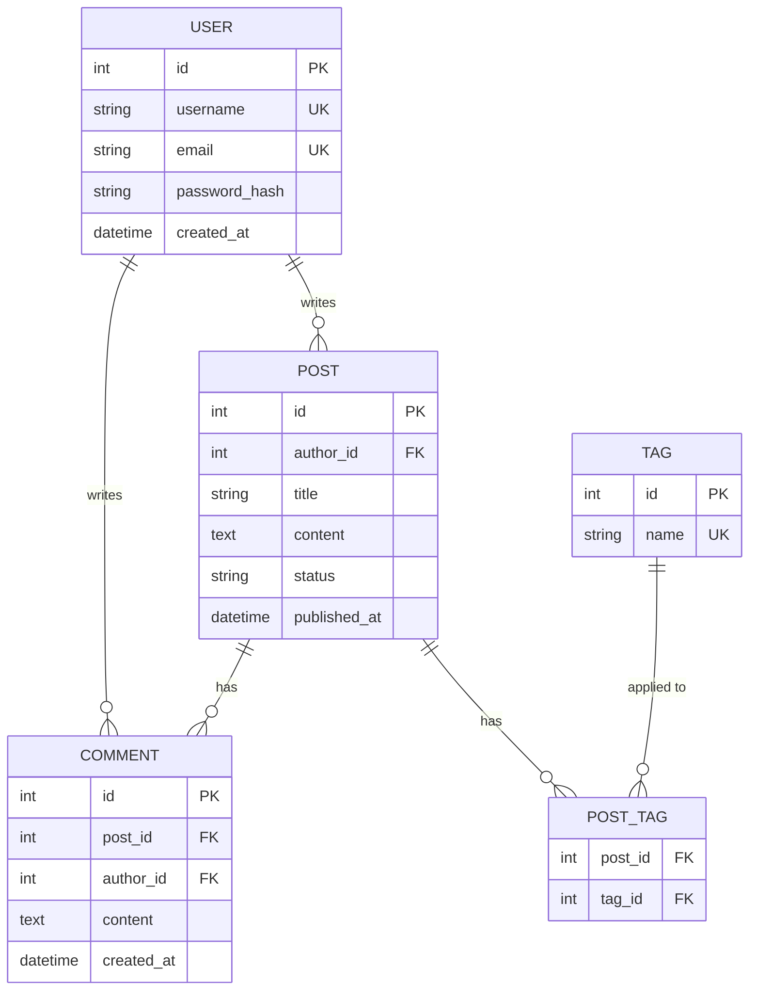

### HR System

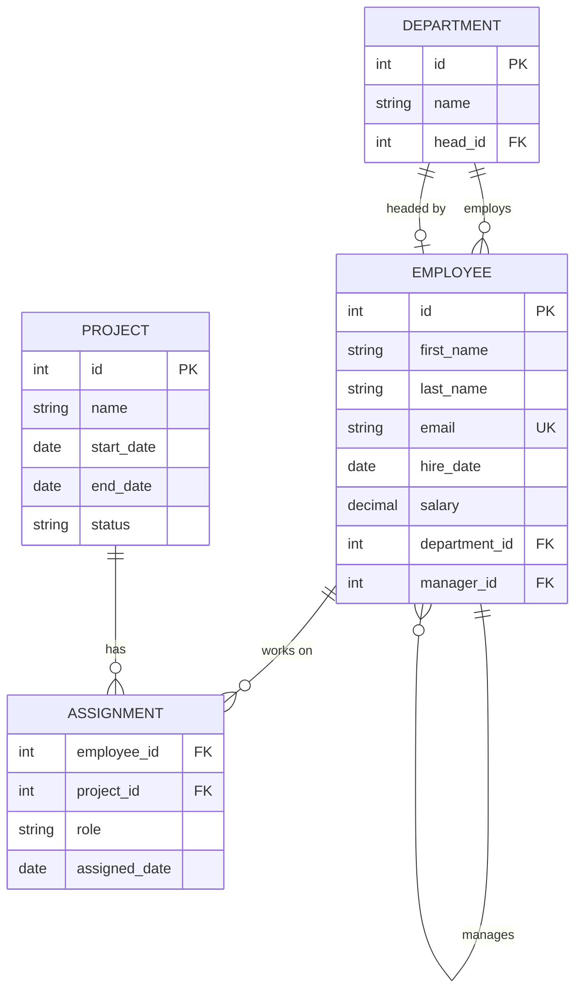

## Styling

### Entity Styling

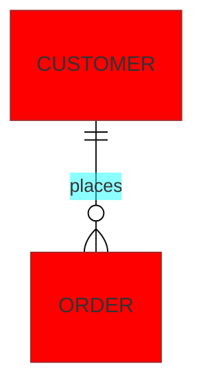

## Best Practices

1. Use singular nouns for entity names (CUSTOMER, not CUSTOMERS)
2. Use SCREAMING_SNAKE_CASE for entity names
3. Include appropriate data types for attributes
4. Mark primary keys (PK), foreign keys (FK), and unique keys (UK)
5. Use meaningful relationship labels
6. Group related entities together visually
7. Keep diagrams focused - split large schemas into domains
8. Use identifying relationships when appropriate
9. Add comments to complex attributes

## Common Patterns

### Many-to-Many with Junction Table

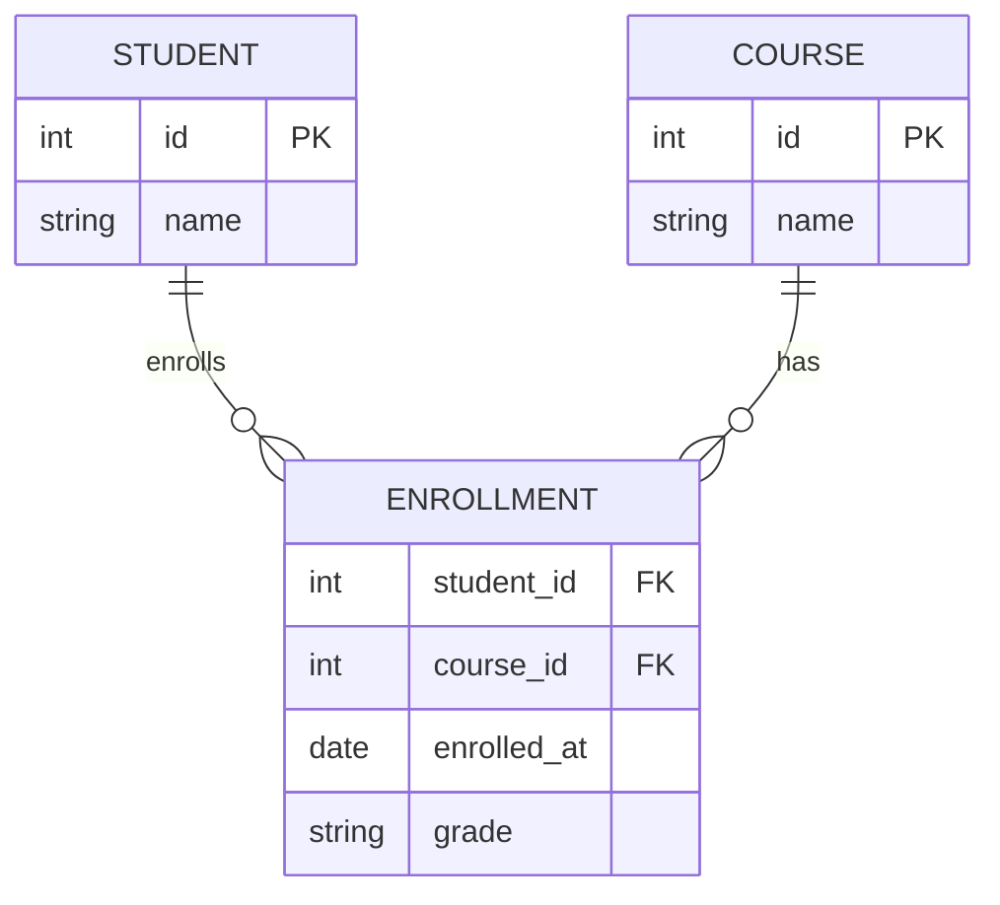

### Self-Referencing Relationship

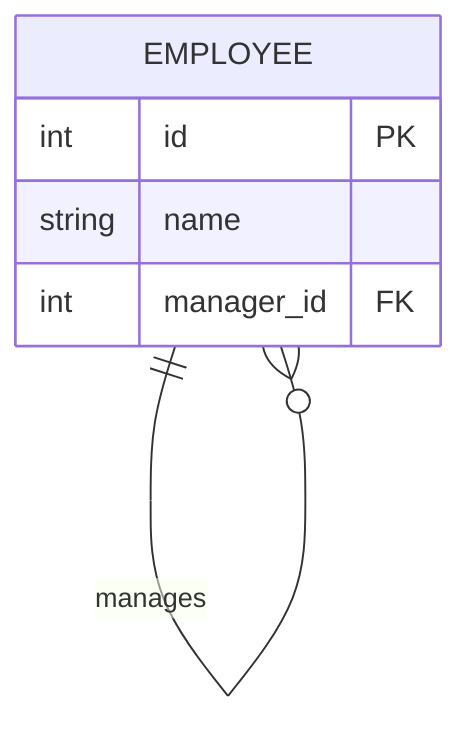

### Polymorphic Association

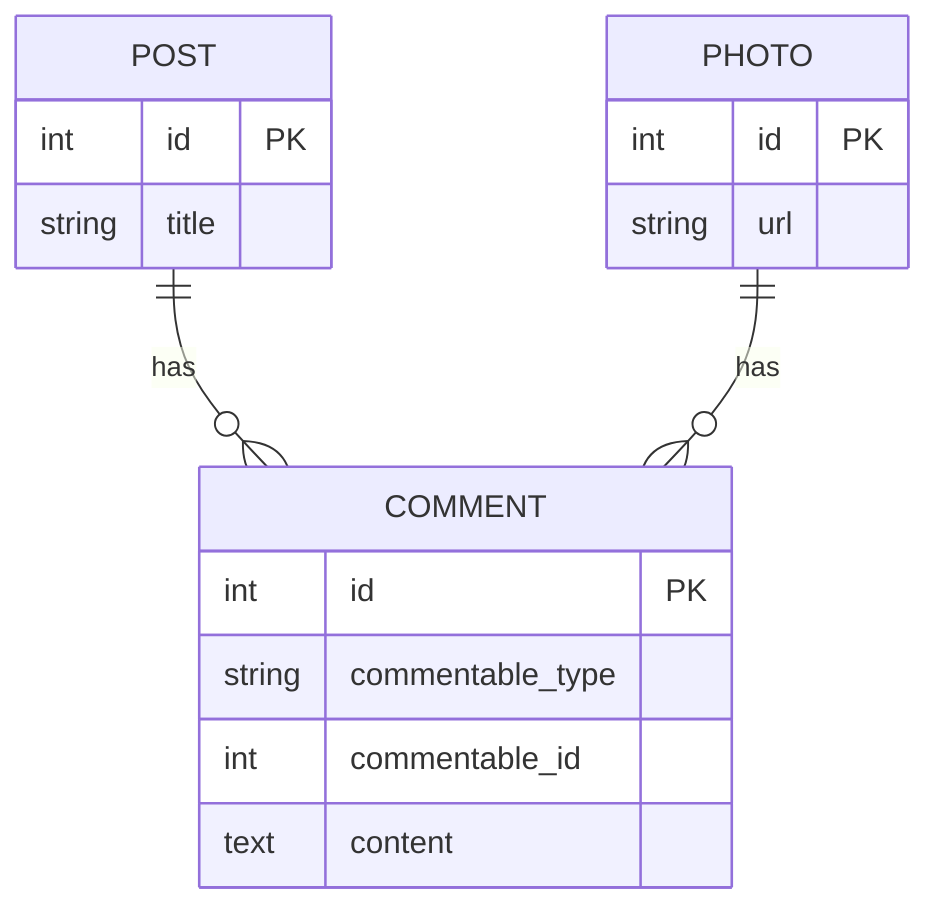
