# Flowcharts

Flowcharts are composed of nodes (geometric shapes) and edges (arrows or lines).

## Basic Syntax

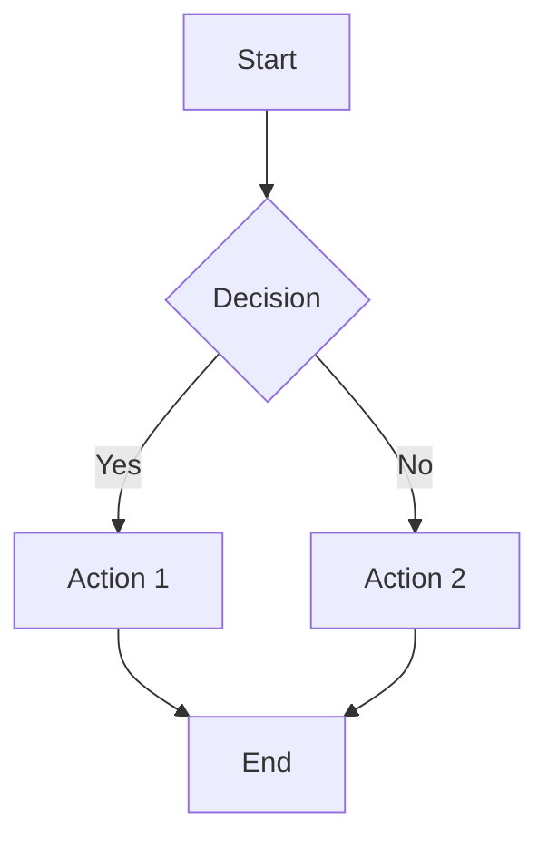

## Graph Direction

- `TB` or `TD` - Top to bottom (default)
- `BT` - Bottom to top
- `LR` - Left to right
- `RL` - Right to left

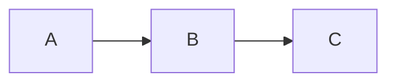

## Node Shapes

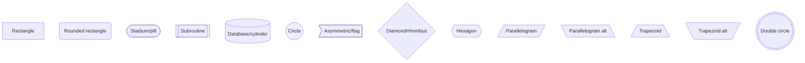

## Links/Edges

### Arrow Types

```mermaid
flowchart LR
    A --> B           %% Arrow
    C --- D           %% Open link (no arrow)
    E -.- F           %% Dotted link
    G -.-> H          %% Dotted arrow
    I ==> J           %% Thick arrow
    K ~~~ L           %% Invisible link
    M <--> N          %% Multi-directional
    O o--o P          %% Circle endpoints
    Q x--x R          %% Cross endpoints
```

### Link Text

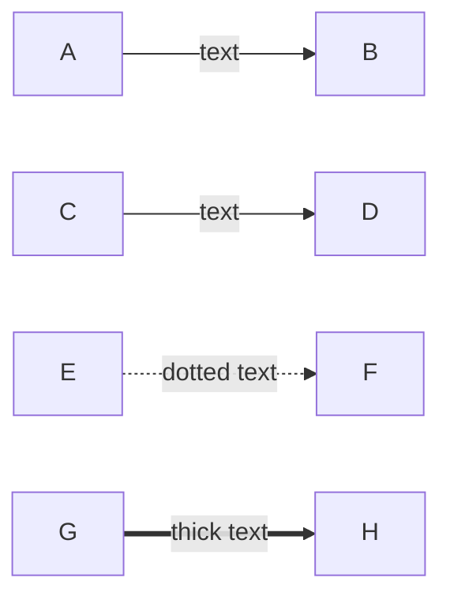

### Link Length

Add extra dashes/dots to make links longer:

```mermaid
flowchart TD
    A ---> B          %% Longer
    C ----> D         %% Even longer
    E -.....-> F      %% Long dotted
```

## Subgraphs

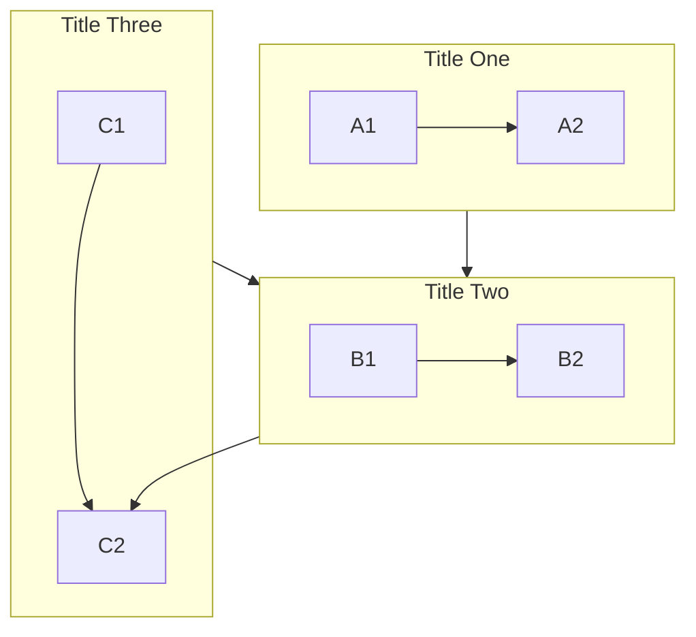

### Subgraph Direction

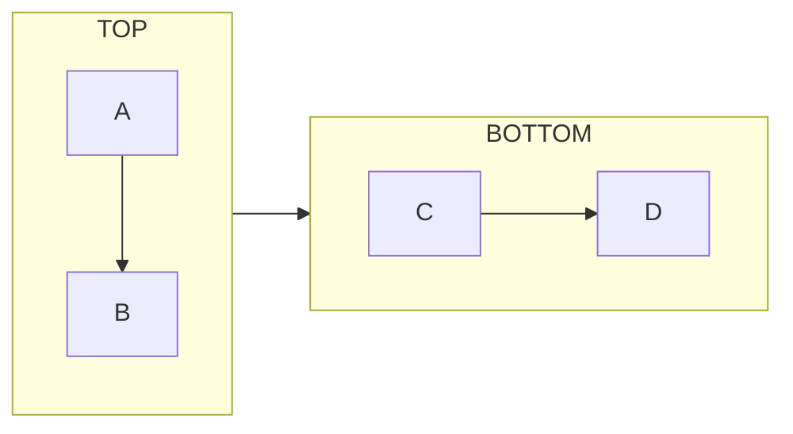

## Special Characters

Use quotes for special characters in node text:

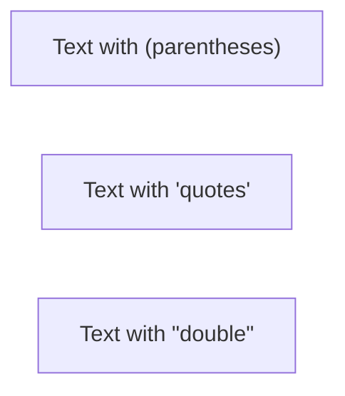

### Entity Codes

- `#quot;` - Double quote
- `#39;` - Single quote
- `#lt;` - Less than
- `#gt;` - Greater than
- `#amp;` - Ampersand

## Comments

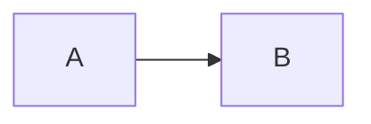

## Styling

### Inline Styling

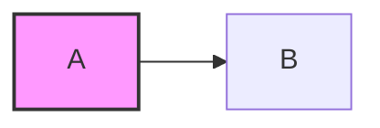

### Style Definitions

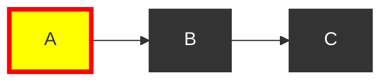

### Link Styling

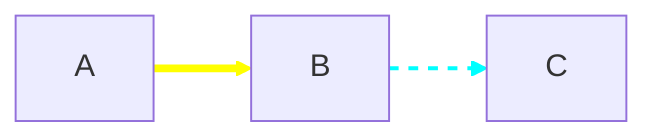

## Click Events


## Multiple Nodes Declaration

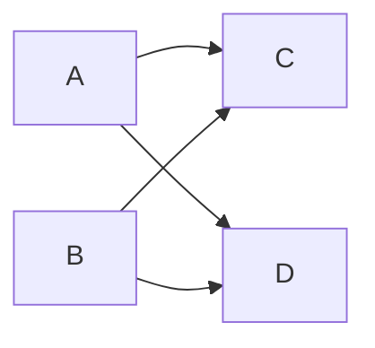

Equivalent to:


## Icon Support

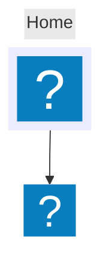

Icon options:

- `icon` - FontAwesome icon (fa:iconname)
- `form` - Shape: square, circle, rounded
- `label` - Text label
- `pos` - Label position: t, b, l, r
- `h` - Height in pixels

## Best Practices

1. Use meaningful node IDs (e.g., `start`, `validateInput` instead of `A`, `B`)
2. Keep flowcharts readable - split complex diagrams into subgraphs
3. Use consistent direction within subgraphs
4. Add labels to edges when the relationship isn't obvious
5. Use appropriate node shapes (diamonds for decisions, cylinders for databases)
