# Gantt Charts

Gantt charts illustrate project schedules, showing tasks, durations, and dependencies.

## Basic Syntax

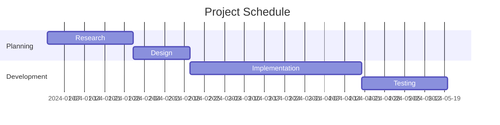

## Configuration

### Title

```mermaid
gantt
    title My Project Timeline
```

### Date Format

```mermaid
gantt
    dateFormat YYYY-MM-DD
```

Common formats:

- `YYYY-MM-DD` - 2024-01-15
- `DD-MM-YYYY` - 15-01-2024
- `YYYY-MM-DDTHH:mm` - 2024-01-15T09:30

### Axis Format

```mermaid
gantt
    axisFormat %Y-%m-%d
```

Format tokens:

- `%Y` - 4-digit year
- `%y` - 2-digit year
- `%m` - Month (01-12)
- `%d` - Day (01-31)
- `%H` - Hour (00-23)
- `%M` - Minute (00-59)
- `%S` - Second (00-59)
- `%b` - Abbreviated month
- `%B` - Full month name
- `%a` - Abbreviated weekday
- `%A` - Full weekday name
- `%W` - Week number

### Tick Interval

```mermaid
gantt
    tickInterval 1week
```

Options: `1day`, `1week`, `1month`

### Week Start

```mermaid
gantt
    weekday monday
```

Options: `sunday` (default), `monday`, `saturday`

### Excludes (Non-Working Days)

```mermaid
gantt
    excludes weekends
    excludes 2024-01-01, 2024-12-25
```

Options:

- `weekends` - Saturday and Sunday
- `saturday` or `sunday` - Specific day
- Specific dates in dateFormat

### Include Today Marker

```mermaid
gantt
    todayMarker stroke-width:5px,stroke:#0f0
```

Or disable:

```mermaid
gantt
    todayMarker off
```

## Sections

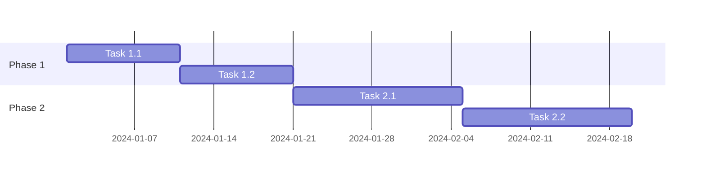

## Tasks

### Task Syntax

```text
TaskName :taskId, startDate, duration
TaskName :taskId, startDate, endDate
TaskName :taskId, after taskId, duration
```

### Task Status

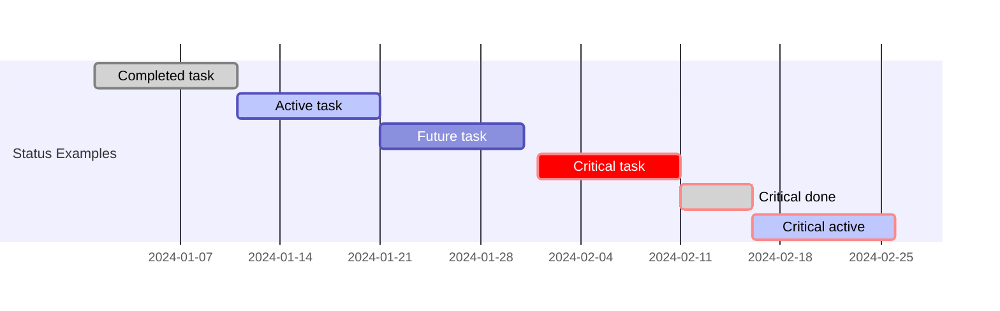

Status keywords:

- `done` - Completed (grayed out)
- `active` - In progress (highlighted)
- `crit` - Critical path (red)

### Milestones

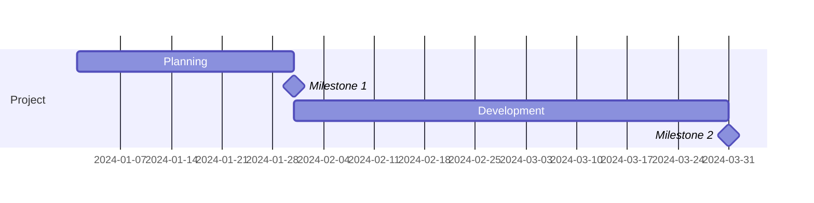

### Duration Formats

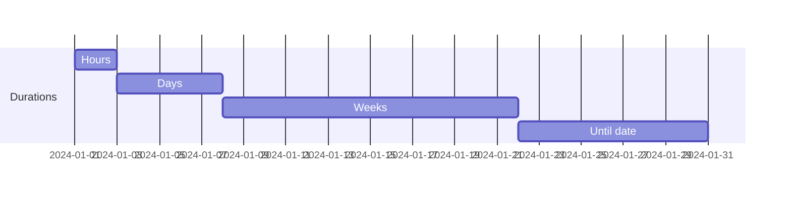

### Dependencies

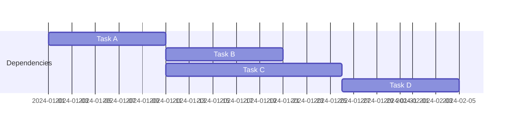

Use `after taskId` or `after taskId1 taskId2` for multiple dependencies.

## Complete Examples

### Software Development Project

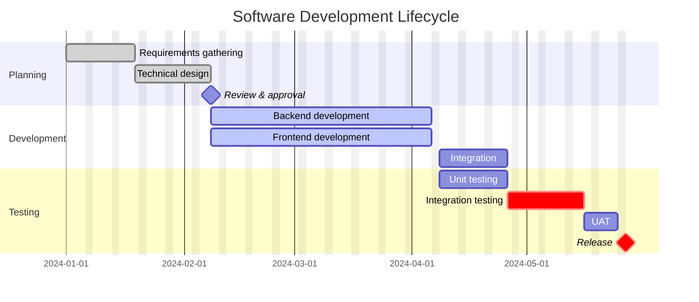

### Marketing Campaign

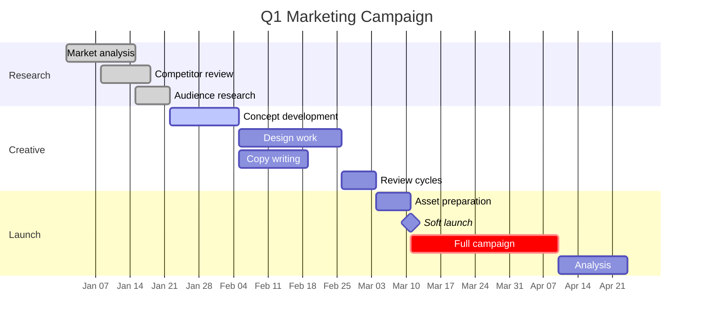

### Sprint Planning

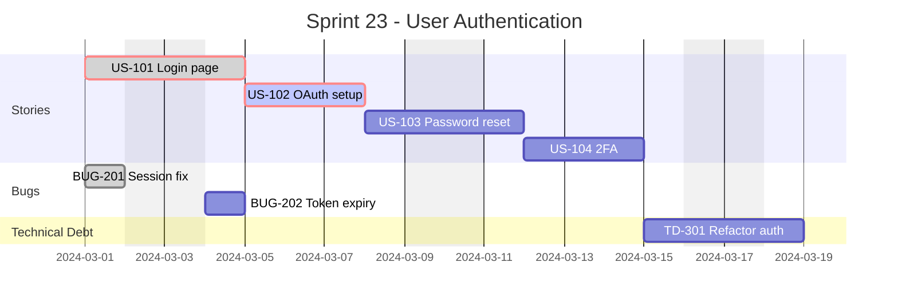

### Event Planning

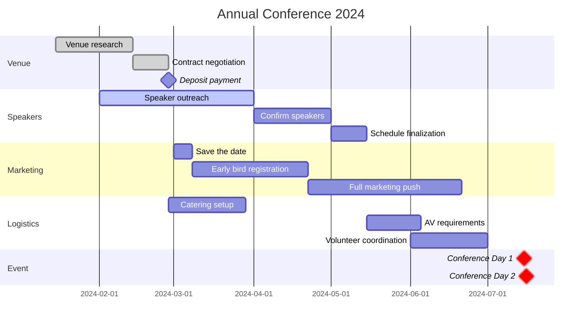

## Styling

### Theme Configuration

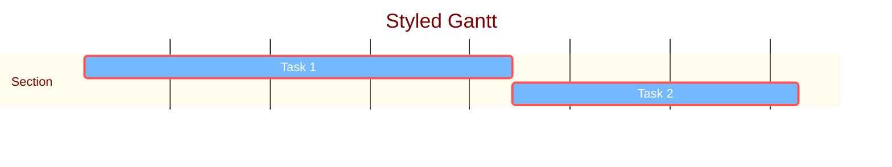

## Best Practices

1. Use meaningful task IDs for dependencies
2. Group related tasks into sections
3. Mark completed tasks as `done`
4. Highlight critical path with `crit`
5. Use milestones for key dates
6. Exclude weekends for realistic schedules
7. Keep task names concise
8. Use consistent date format
9. Add a clear title

## Common Issues

### Tasks Not Showing

Ensure dateFormat matches your dates:

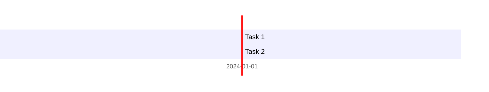

### Dependencies Not Working

Use `after` keyword correctly:

```mermaid
gantt
    Task A :a, 2024-01-01, 10d
    Task B :b, after a, 10d      %% Correct
    Task C :c, a, 10d            %% Wrong - missing 'after'
```
