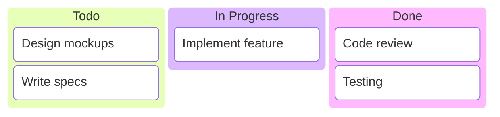
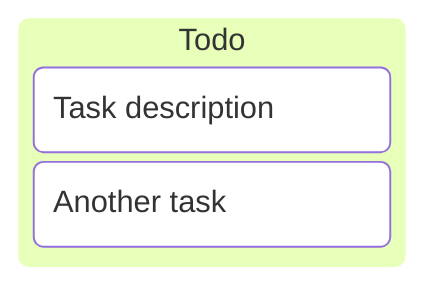
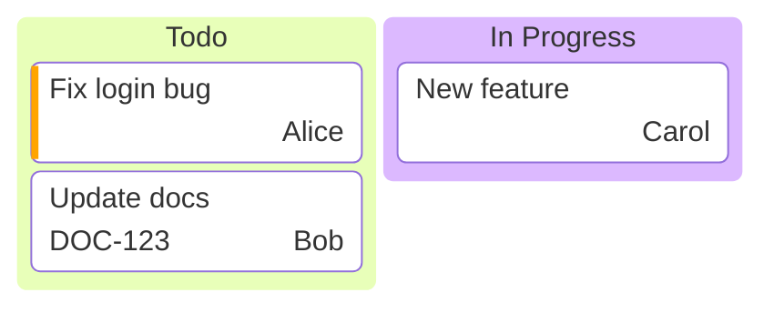
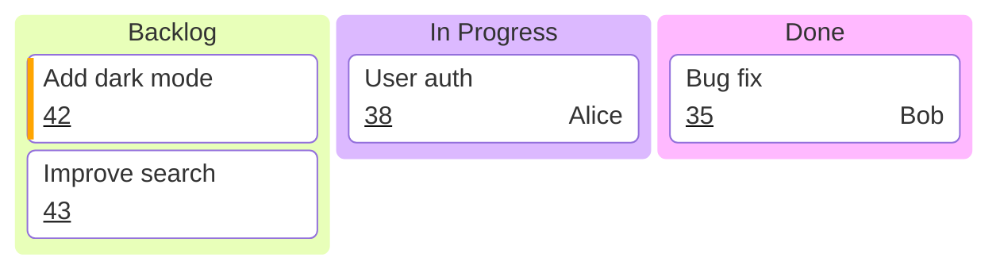
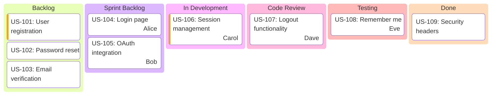
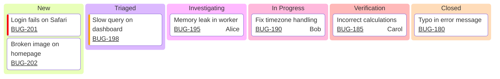
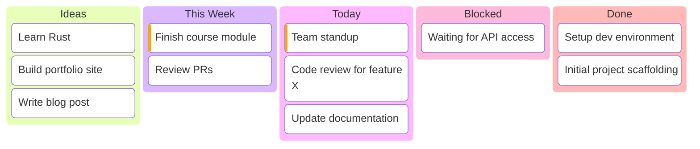
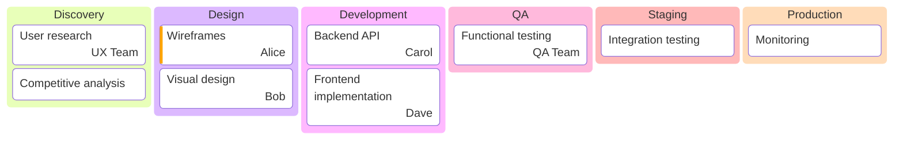
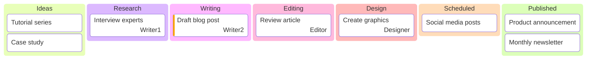

# Kanban Boards

Kanban diagrams visualize workflow with columns and task cards.

## Basic Syntax



## Columns

Define columns with their title:


### Column with ID and Title


## Tasks

Tasks are indented under columns:



### Task Syntax

```text
taskId[Task Description]
```

- **taskId** - Unique identifier for the task
- **Task Description** - Display text in brackets

## Task Metadata

Add metadata using `@{ }` syntax:



### Supported Metadata Keys

- `assigned` - Task owner/assignee
- `ticket` - Issue/ticket reference number
- `priority` - Task priority level

### Priority Values

- `Very High` - Critical priority
- `High` - High priority
- `Low` - Low priority
- `Very Low` - Minimal priority

## Configuration

### Ticket URL Base

Link tickets to external systems:

```yaml
---
config:
  kanban:
    ticketBaseUrl: 'https://jira.example.com/browse/#TICKET#'
---
```

The `#TICKET#` placeholder is replaced with the ticket value.

### Full Configuration Example



## Complete Examples

### Sprint Board



### Bug Tracking



### Personal Task Board



### Feature Development



### Content Pipeline



## Best Practices

1. Use clear, descriptive task names
2. Limit WIP (Work In Progress) in middle columns
3. Keep columns consistent across the team
4. Use metadata for filtering and searching
5. Link tickets to your issue tracker
6. Assign owners to active tasks
7. Use priority for critical items
8. Keep Done column for visibility (archive periodically)

## Limitations

- No drag-and-drop interactivity
- No swimlanes
- No WIP limits enforcement
- Limited styling options
- No custom fields beyond built-in metadata
- Static representation only

## When to Use Kanban Diagrams

Good for:

- Sprint/project status visualization
- Task tracking documentation
- Team workflow overview
- Status reports
- Process documentation

Avoid when:

- Need interactive board (use Trello, Jira)
- Complex workflows with automation
- Real-time collaboration required
- Detailed time tracking needed
