# Mind Maps

Mind maps visualize hierarchical information radiating from a central concept.

## Basic Syntax

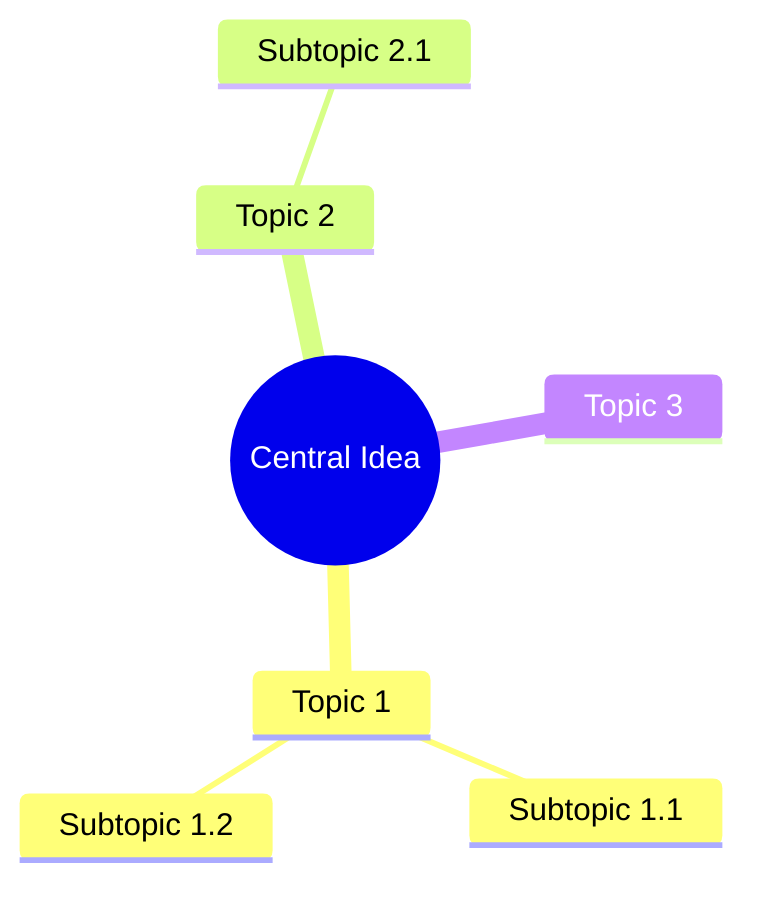

## Node Shapes

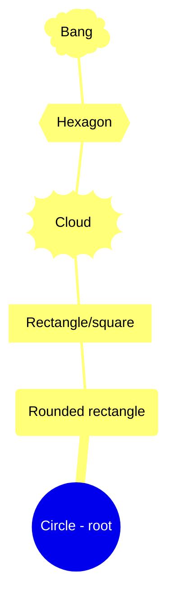

Shape syntax:

- `((text))` - Circle (typically for root)
- `(text)` - Rounded rectangle
- `[text]` - Square/rectangle
- `))text((` - Cloud
- `{{text}}` - Hexagon
- `)text(` - Bang/explosion

## Hierarchy

Indentation defines the hierarchy:

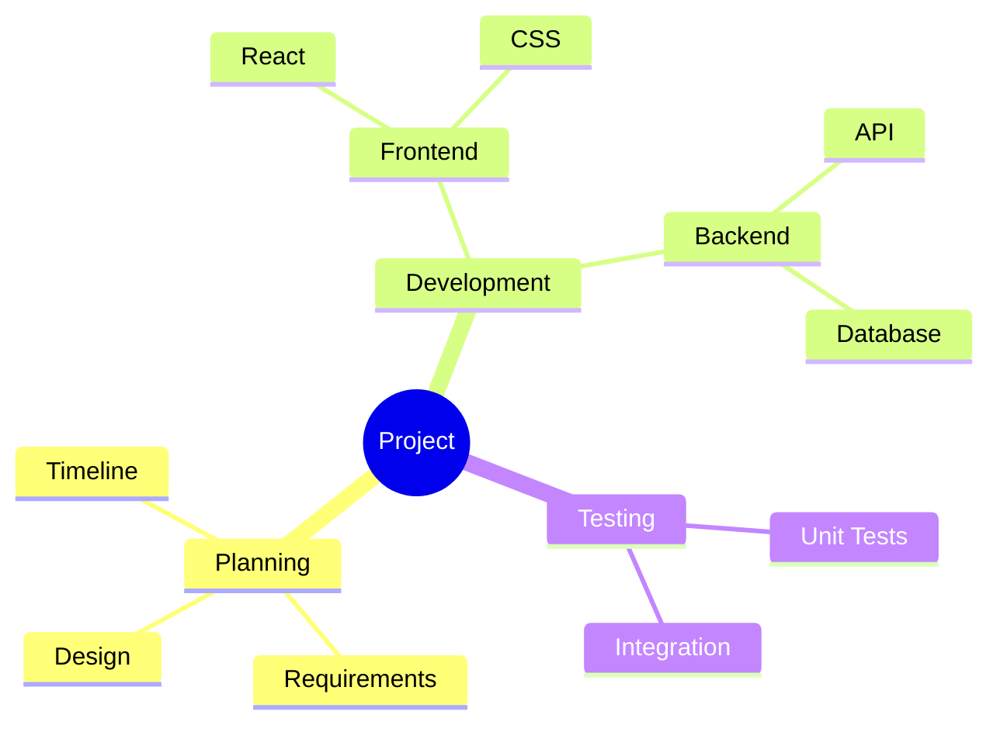

## Icons

Add Font Awesome icons:

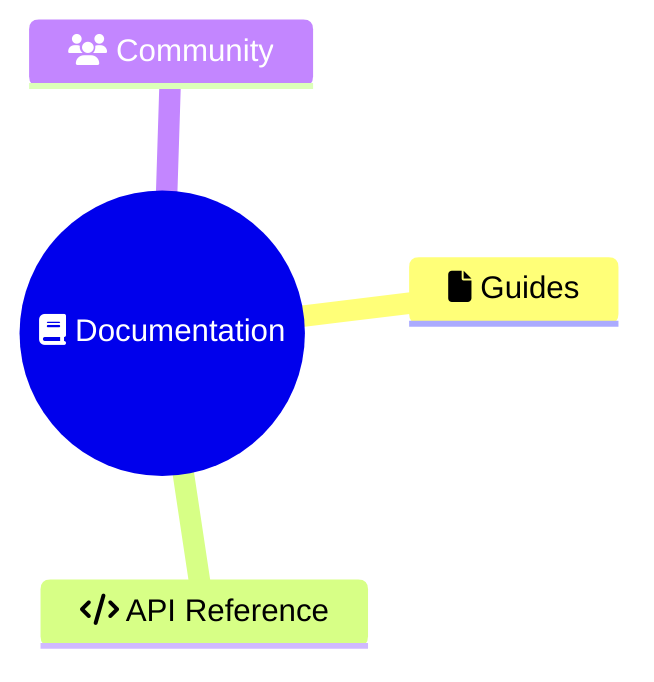

Common icons:

- `fa:fa-home` - Home
- `fa:fa-user` - User
- `fa:fa-cog` - Settings
- `fa:fa-check` - Check
- `fa:fa-star` - Star
- `fa:fa-heart` - Heart
- `fa:fa-folder` - Folder
- `fa:fa-file` - File

## Markdown in Nodes

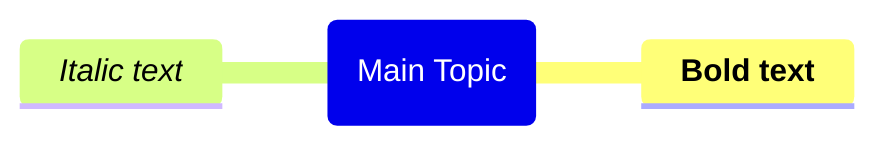

## Complete Examples

### Project Planning

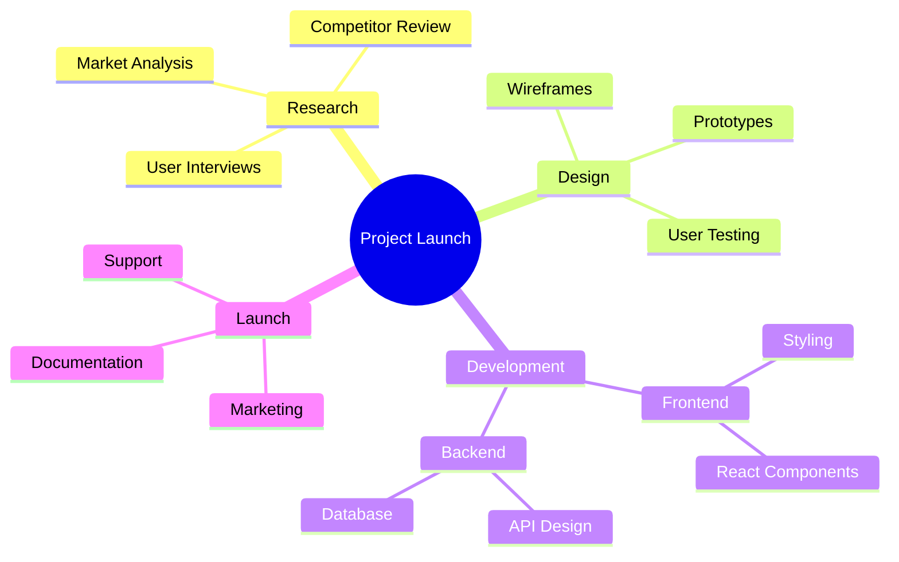

### Learning Path

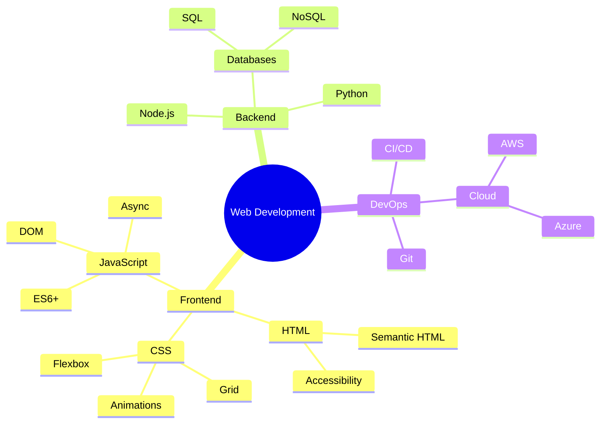

### Meeting Notes

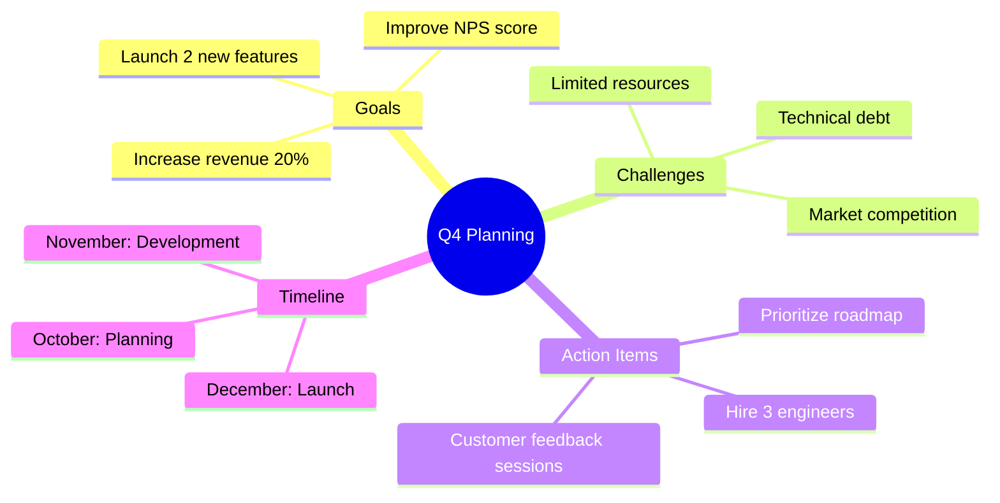

### Problem Solving

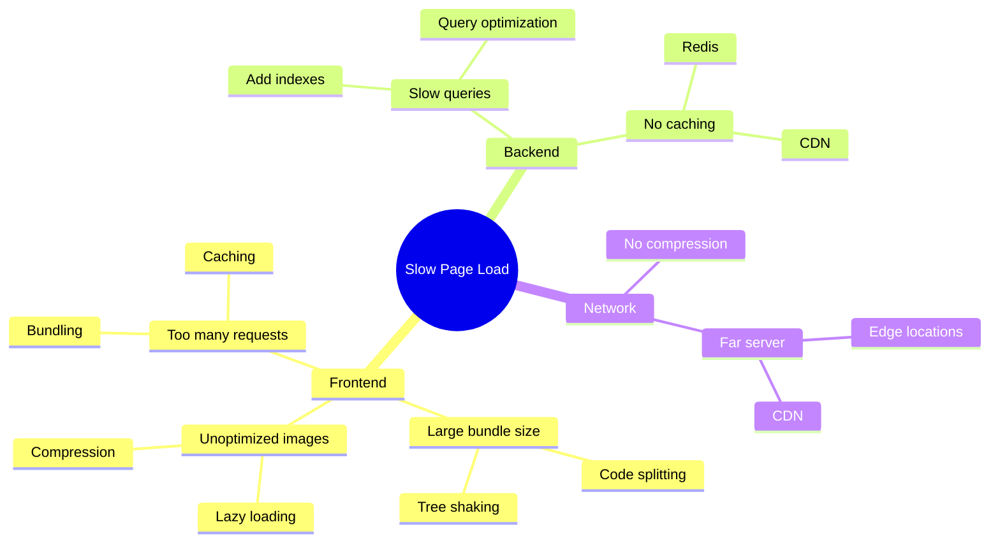

### Decision Tree

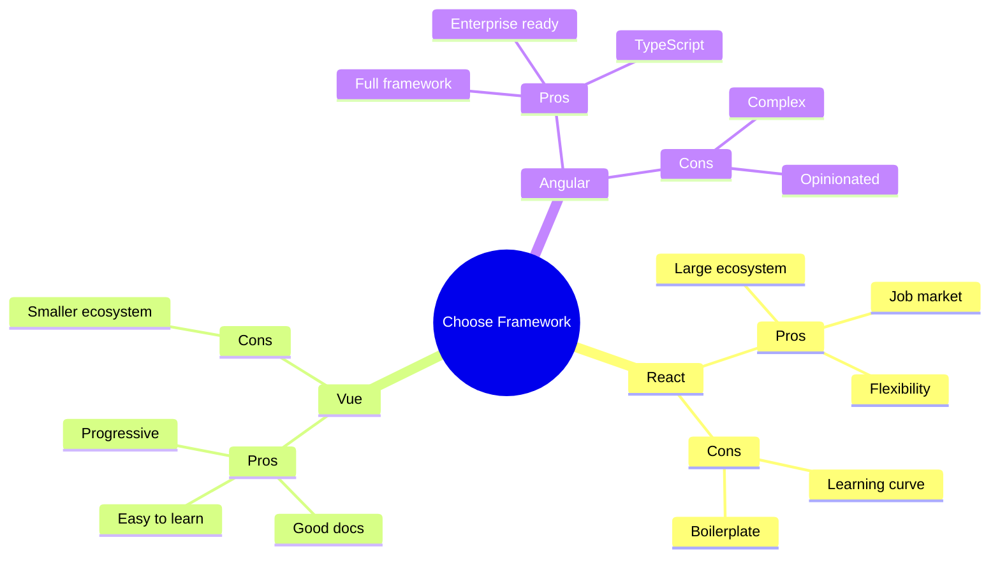

## Styling

### Theme Configuration

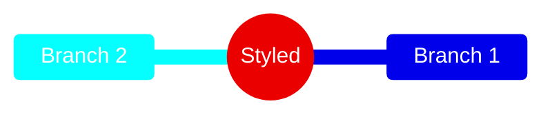

## Best Practices

1. Keep the central idea concise and clear
2. Use consistent indentation (2 or 4 spaces)
3. Limit depth to 3-4 levels for readability
4. Use shapes strategically to highlight important nodes
5. Add icons for visual recognition
6. Group related concepts together
7. Keep node text brief

## Limitations

- No custom colors per branch
- Limited styling options
- No connection lines between non-adjacent nodes
- Icons require Font Awesome
- Cannot control layout direction

## When to Use Mind Maps

Good for:

- Brainstorming and ideation
- Organizing hierarchical information
- Note-taking and summarization
- Planning and outlining
- Visualizing relationships

Avoid when:

- Showing sequential processes (use flowchart)
- Precise relationships matter (use class diagram)
- Data has many cross-connections (use flowchart with links)
