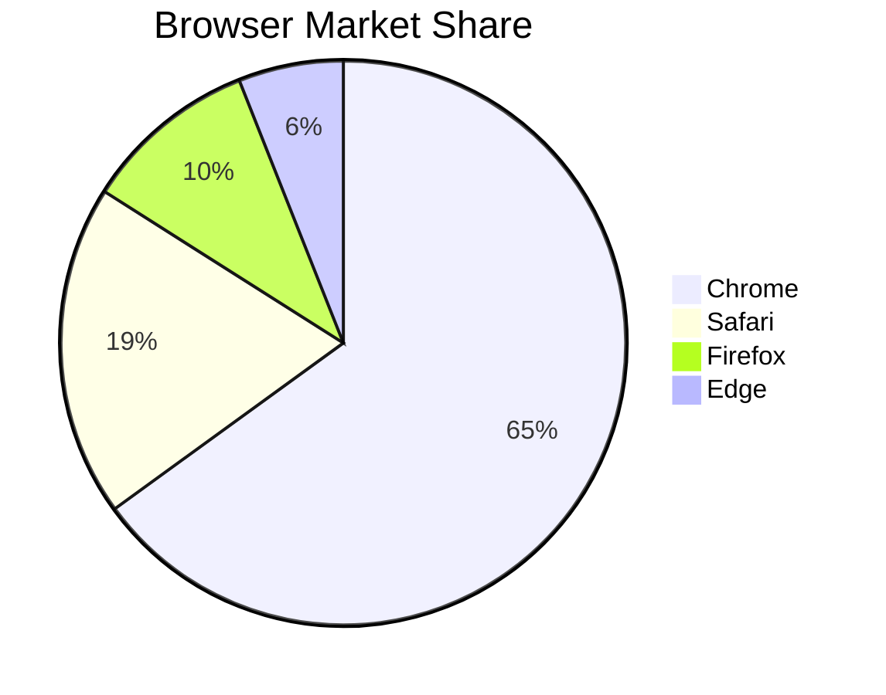
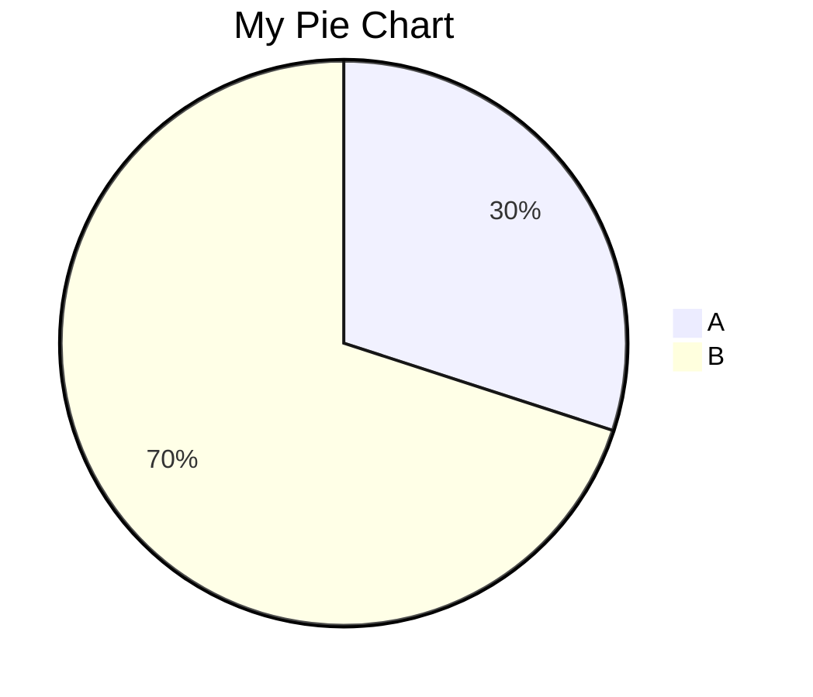
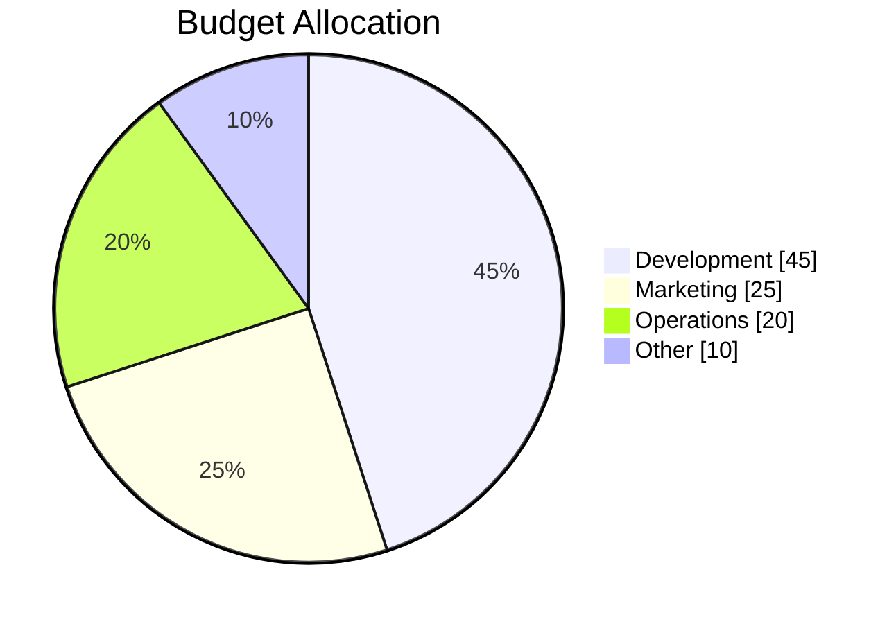
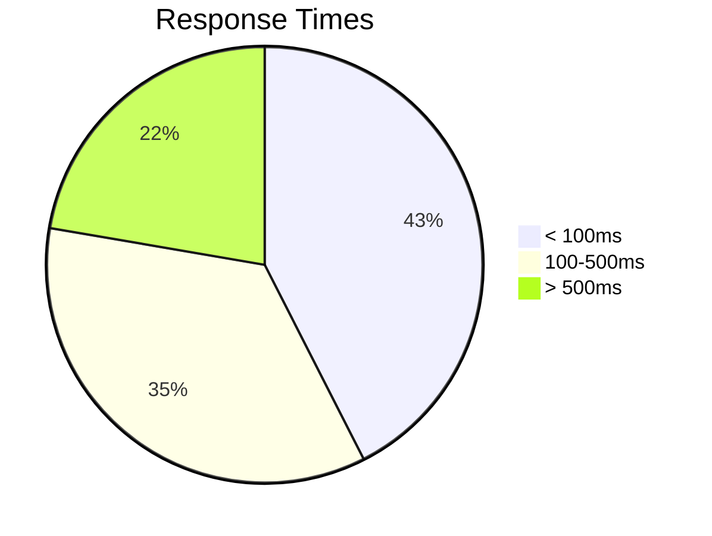
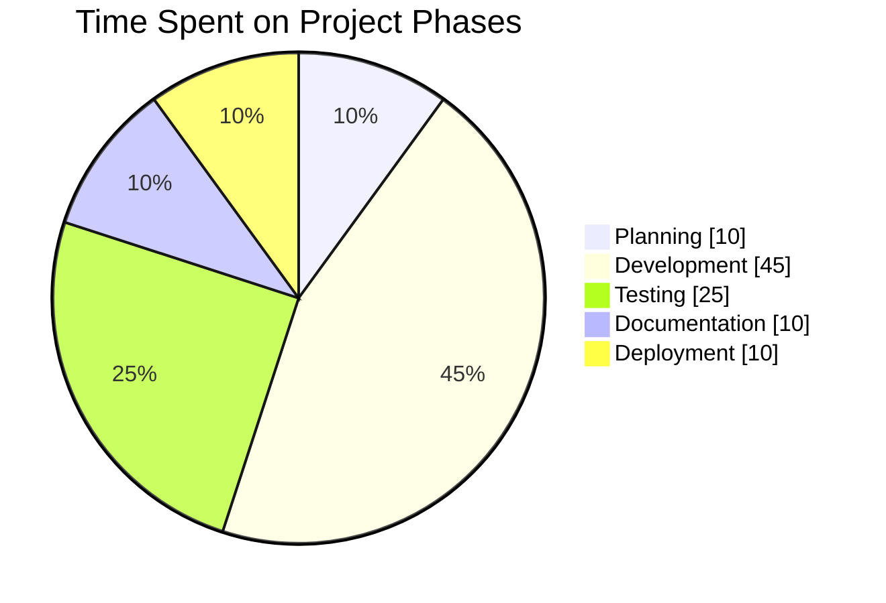
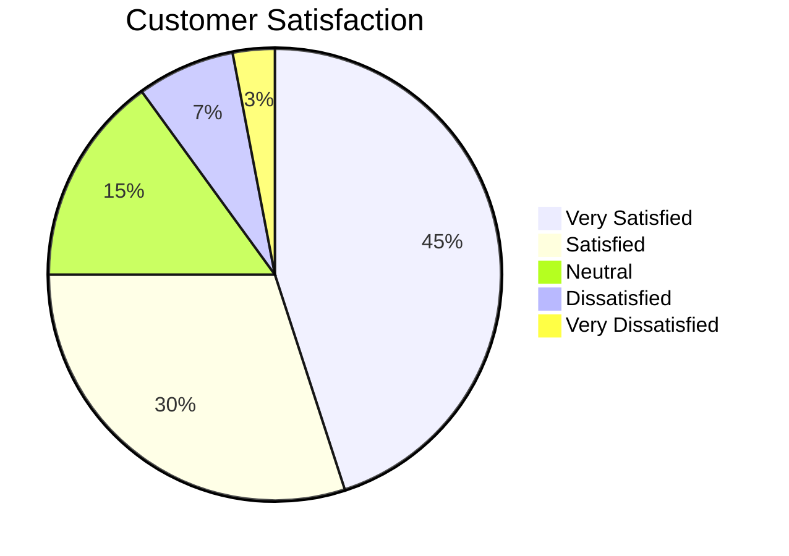
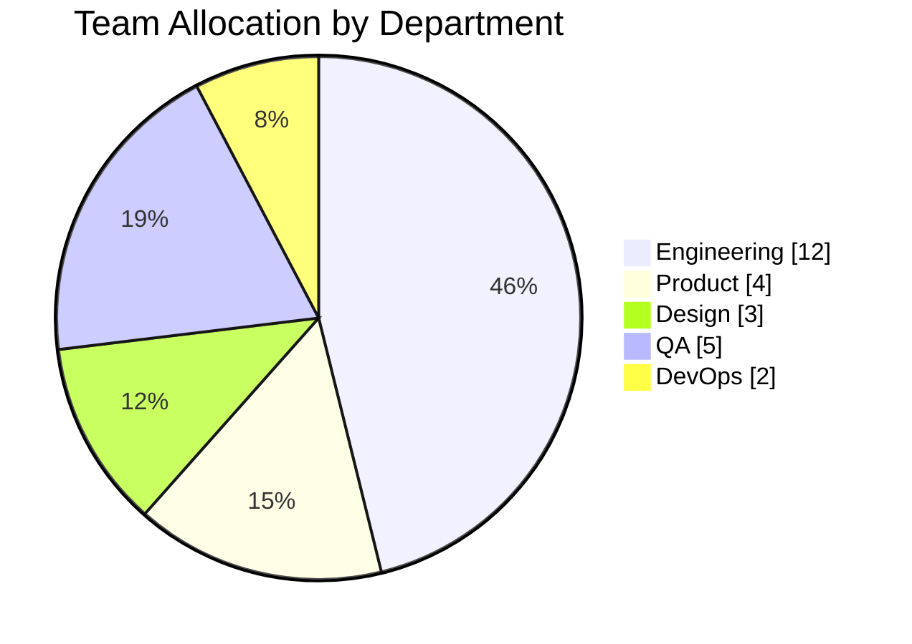
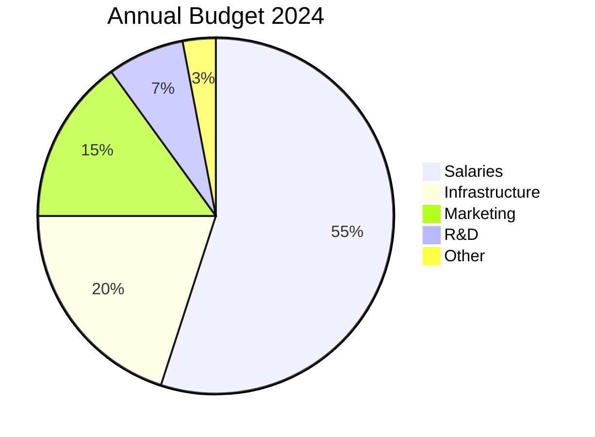
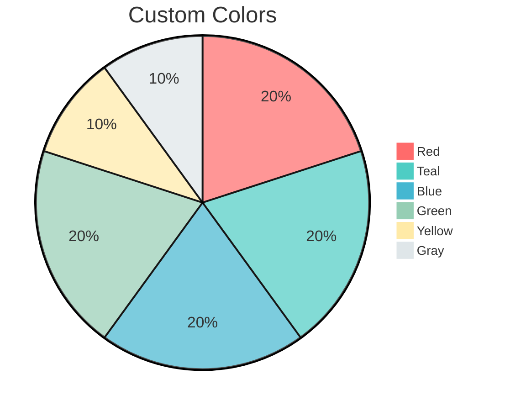

# Pie Charts

Pie charts show proportional data as slices of a circle.

## Basic Syntax



## Configuration

### Title



### Show Data

Display values on the chart:



## Data Format

Each slice is defined as:

```text
"Label" : value
```

Values can be integers or decimals. The chart automatically calculates percentages.



## Complete Examples

### Project Time Distribution



### Survey Results



### Resource Allocation



### Budget Breakdown



## Styling

### Theme Configuration



### Available Theme Variables

- `pie1` through `pie12` - Slice colors
- `pieStrokeColor` - Border color
- `pieStrokeWidth` - Border width
- `pieOpacity` - Slice opacity
- `pieLegendTextSize` - Legend font size
- `pieLegendTextColor` - Legend text color
- `pieTitleTextColor` - Title color
- `pieTitleTextSize` - Title font size
- `pieSectionTextSize` - Label font size
- `pieSectionTextColor` - Label color

## Best Practices

1. Limit to 5-7 slices for readability
2. Use meaningful labels
3. Order slices by size (largest first) or logically
4. Use `showData` when exact values matter
5. Consider using a bar chart for many categories
6. Use contrasting colors for adjacent slices
7. Include a descriptive title

## Limitations

- No interactive features
- Limited customization of individual slices
- No doughnut chart variant
- Labels may overlap with many slices
- Percentages auto-calculated (cannot override display)

## When to Use Pie Charts

Good for:

- Showing parts of a whole
- Comparing proportions at a glance
- Simple distributions with few categories

Avoid when:

- Comparing values precisely
- Showing changes over time
- Many categories (use bar chart)
- Values don't sum to a meaningful total
