# Sankey Diagrams

Sankey diagrams visualize flow quantities between nodes, where link width
represents magnitude.

## Basic Syntax

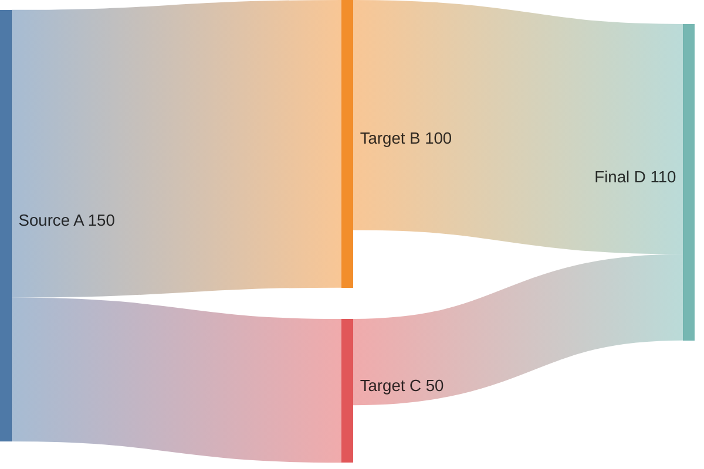

## Format

Sankey diagrams use CSV-like format with three columns:

- **Source** - Starting node
- **Target** - Ending node
- **Value** - Flow magnitude (determines link width)

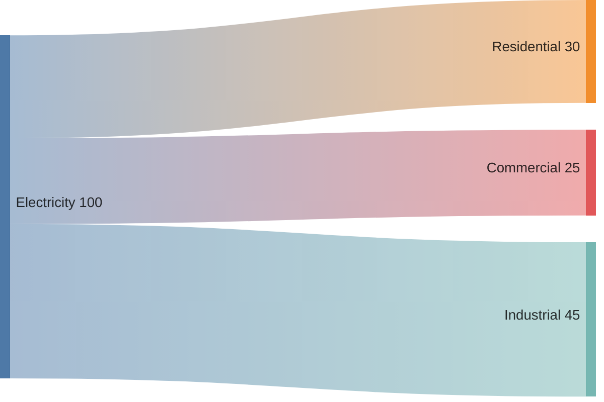

## Special Characters

### Commas in Labels

Wrap labels with commas in double quotes:

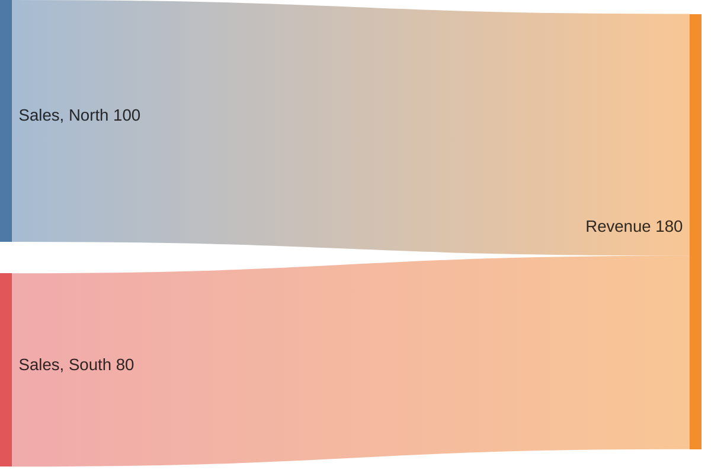

### Double Quotes in Labels

Use paired double quotes inside quoted strings:

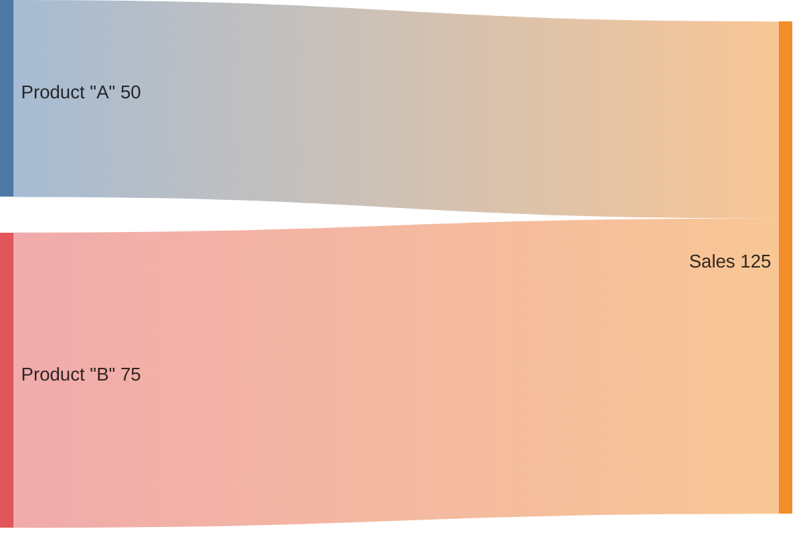

### Empty Lines

Empty lines are allowed for visual separation (no commas):

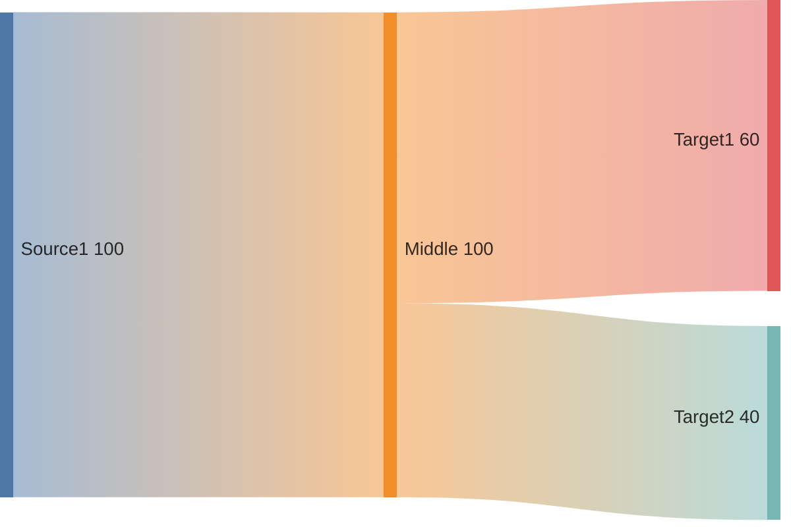

## Complete Examples

### Energy Flow

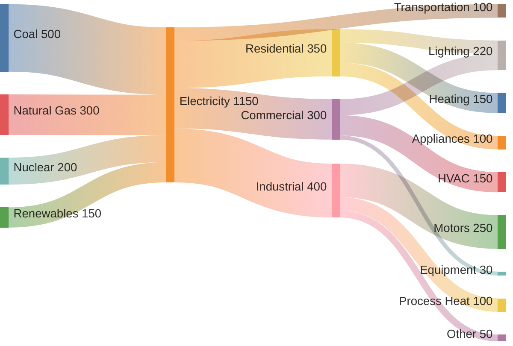

### Website Traffic Flow

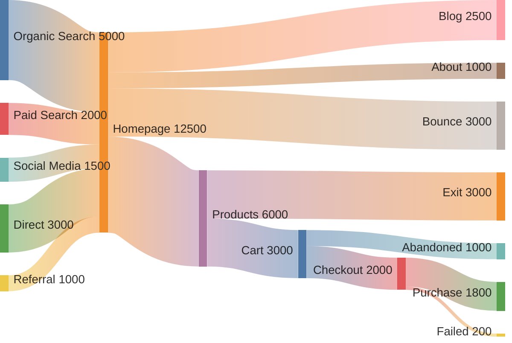

### Budget Allocation

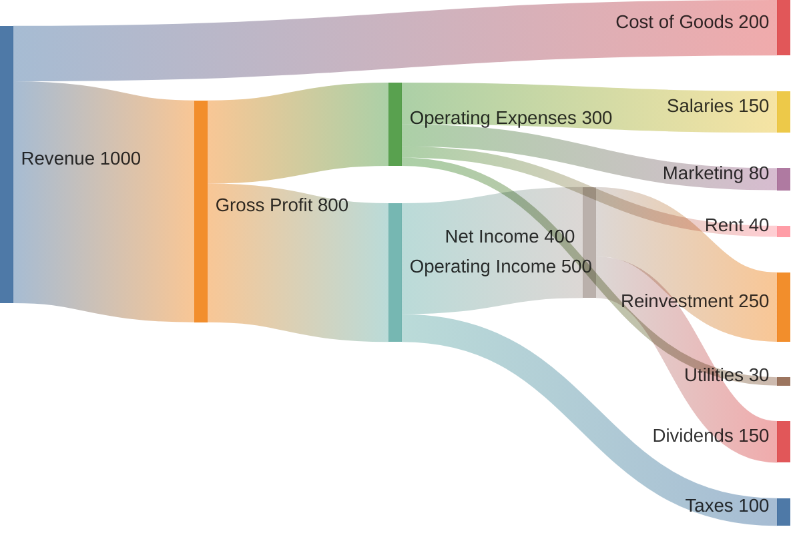

### User Journey Conversion

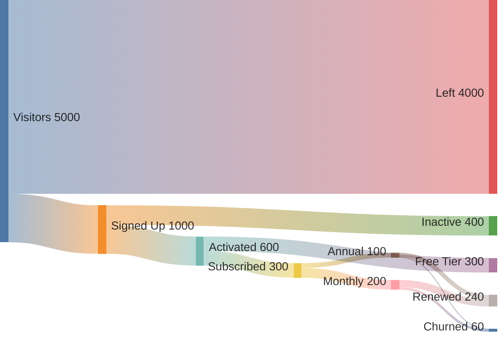

### Data Pipeline

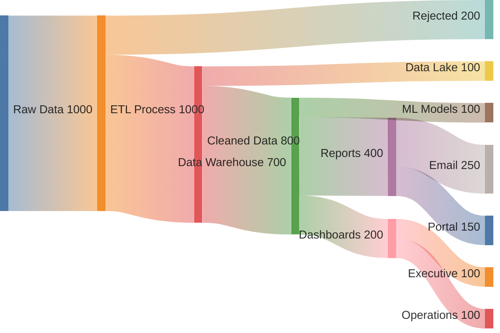

## Configuration

### Via Init Directive

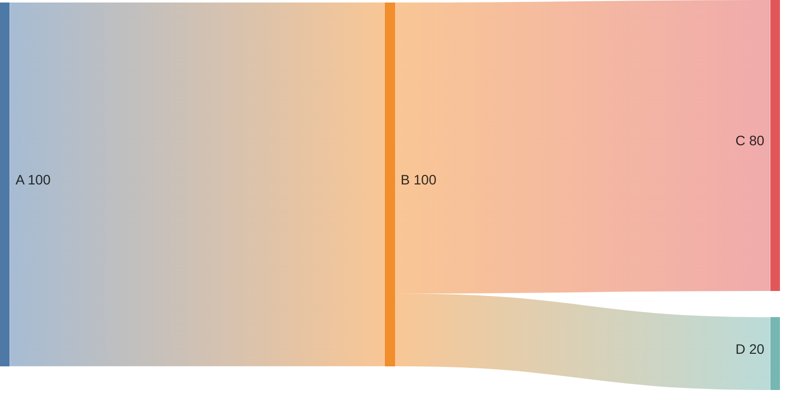

### Configuration Options

| Parameter | Default | Description |
| --- | --- | --- |
| `width` | 600 | Diagram width in pixels |
| `height` | 400 | Diagram height in pixels |
| `linkColor` | 'source' | Link coloring method |
| `nodeAlignment` | 'justify' | Node positioning |

### Link Color Options

- `'source'` - Color based on source node
- `'target'` - Color based on target node
- `'gradient'` - Gradient from source to target
- `'#hexcode'` - Specific hex color

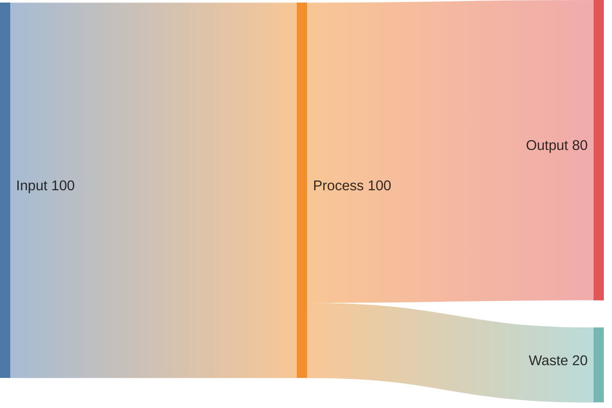

### Node Alignment Options

- `'justify'` - Spread nodes across full height (default)
- `'left'` - Align to left/top
- `'right'` - Align to right/bottom
- `'center'` - Center alignment

## Styling

### Theme Configuration

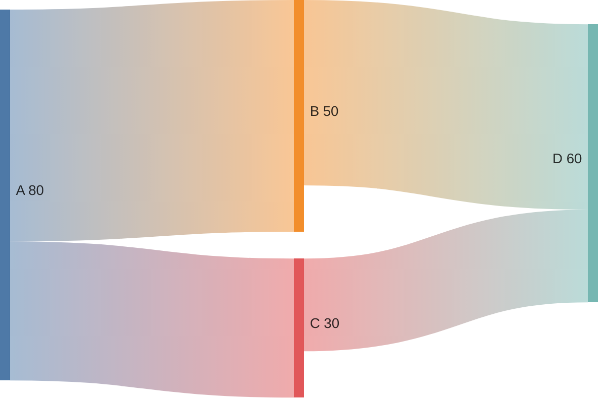

## Best Practices

1. Order flows logically (left to right, top to bottom)
2. Use meaningful node labels
3. Keep node names concise
4. Use gradient colors to show flow direction
5. Group related flows together
6. Add empty lines between logical sections
7. Ensure values are proportionally accurate
8. Limit complexity - split large diagrams

## Limitations

- Experimental feature (v10.3.0+)
- CSV format only (no inline styling per node)
- No custom node colors
- No click events or interactivity
- Cannot control node order explicitly
- Limited annotation options

## When to Use Sankey Diagrams

Good for:

- Energy or resource flows
- Budget allocation visualization
- Website user flow analysis
- Process material flows
- Conversion funnels
- Supply chain visualization

Avoid when:

- Showing hierarchical data (use mind map)
- Simple comparisons (use bar chart)
- Time-based data (use line chart)
- Bidirectional flows are important
