# Sequence Diagrams

Sequence diagrams show interactions between participants over time.

## Basic Syntax

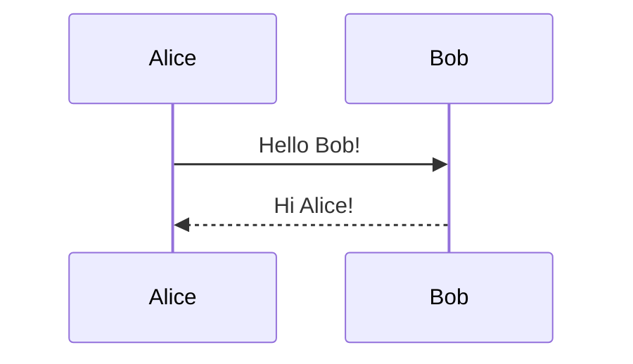

## Participants

### Declaration

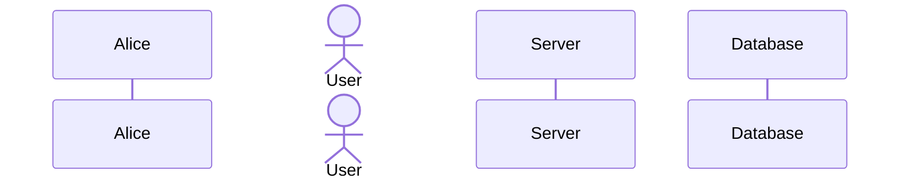

### Participant Types

- `participant` - Box shape (default)
- `actor` - Person/stick figure shape

### Auto-numbering

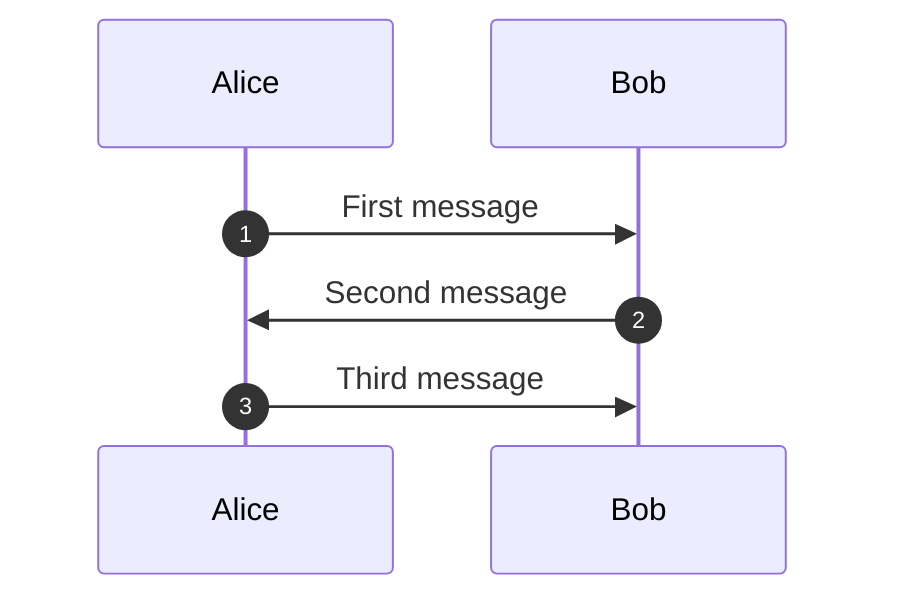

## Message Types

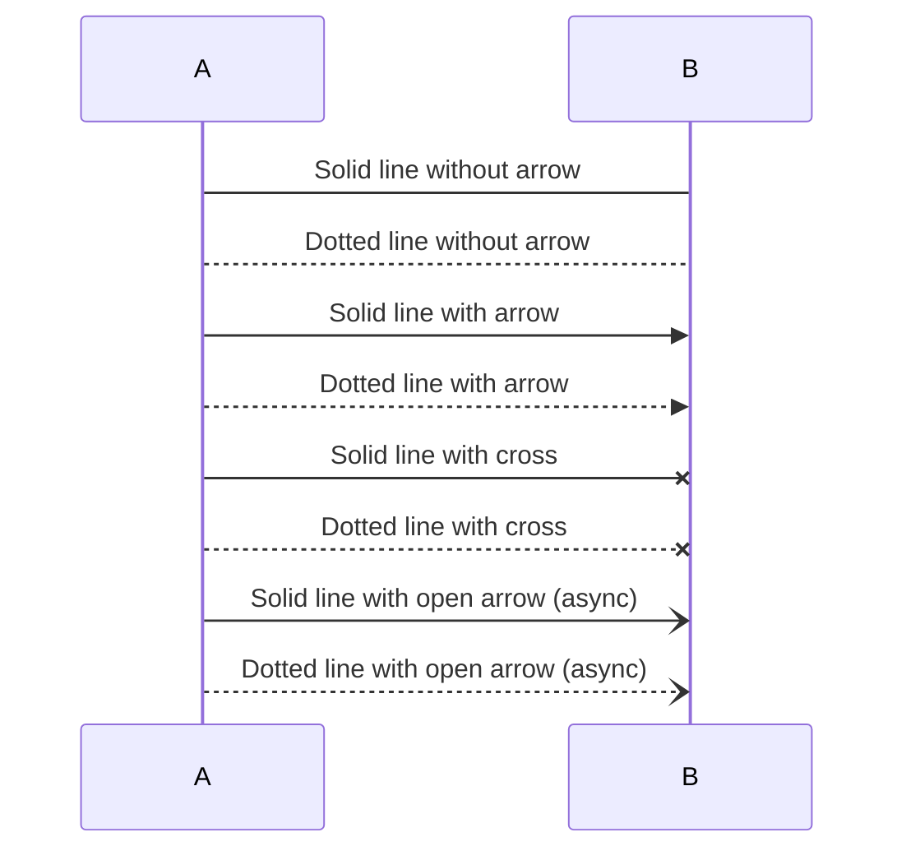

### Bidirectional Messages

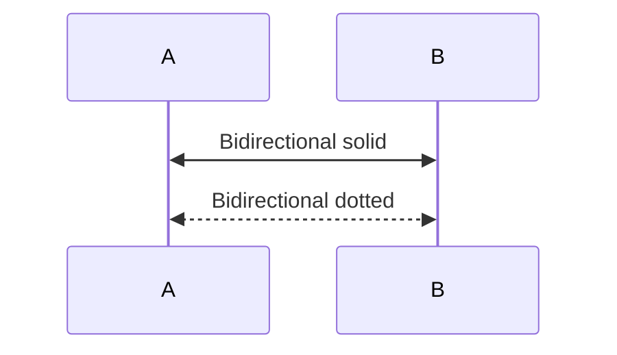

## Activations

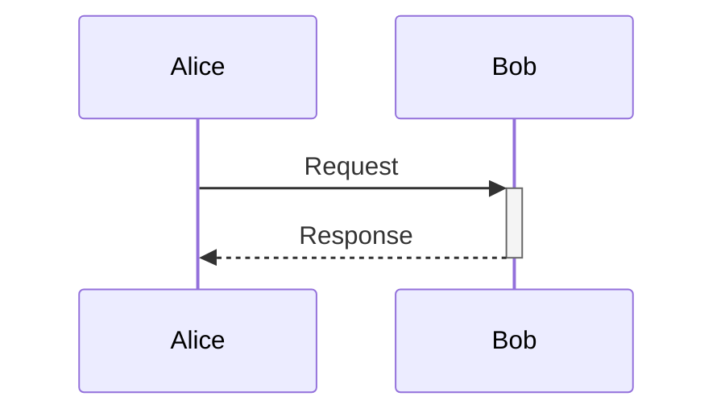

Or explicit:

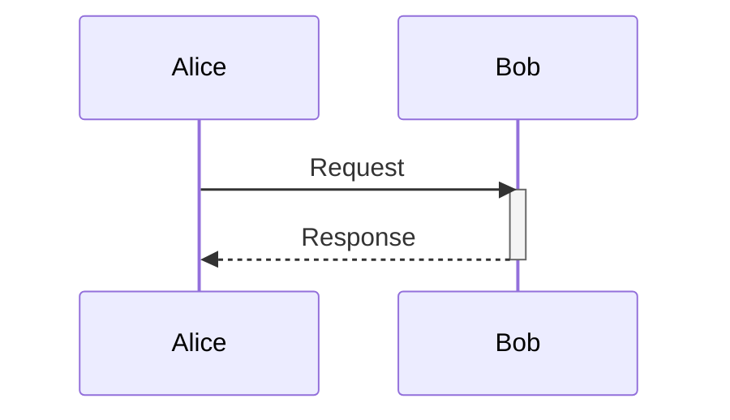

### Nested Activations

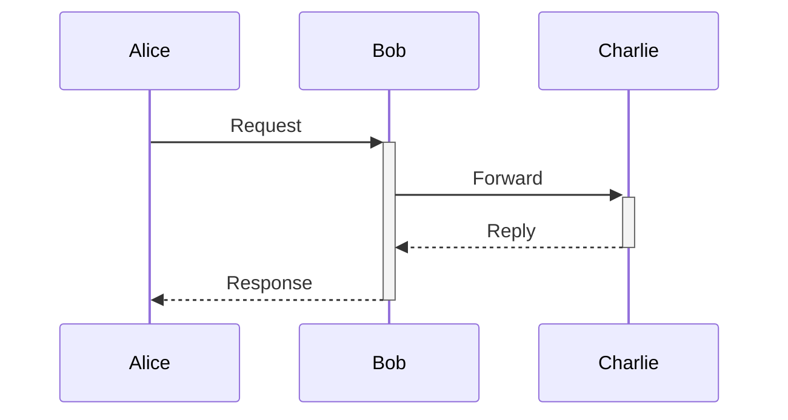

## Notes

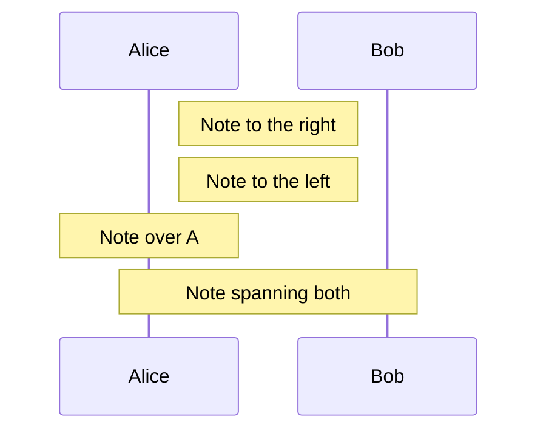

## Loops

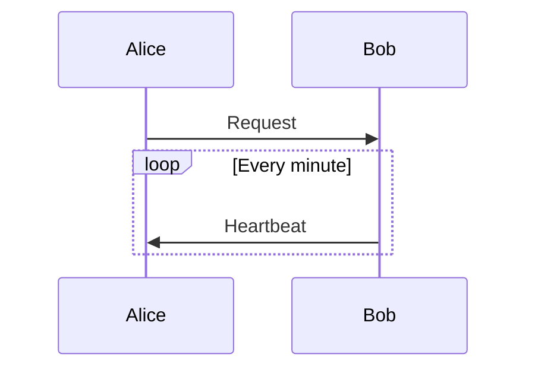

## Alternatives (Alt/Else)

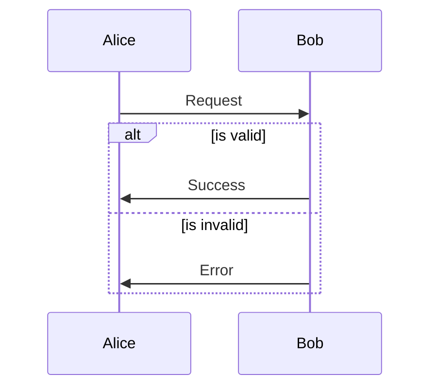

### Optional (Opt)

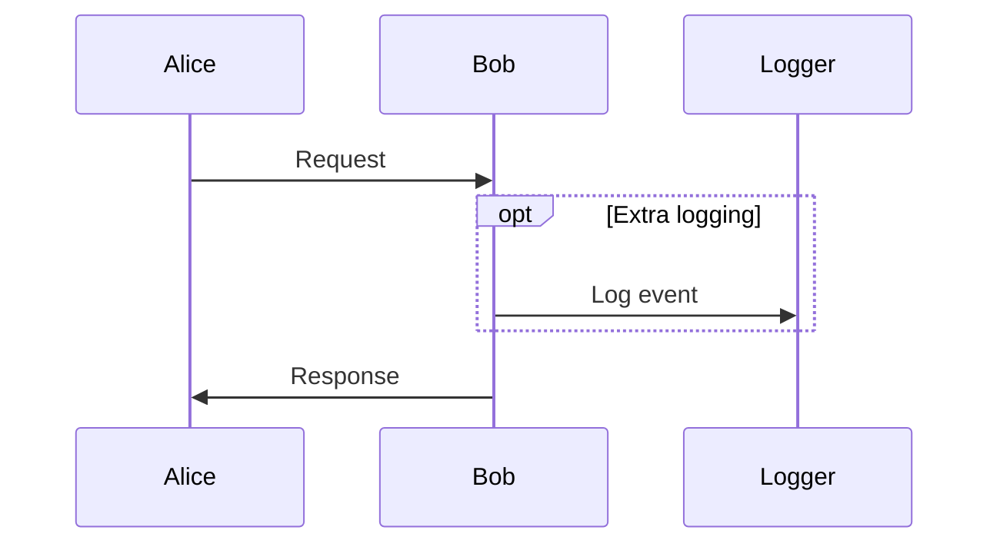

## Parallel (Par)

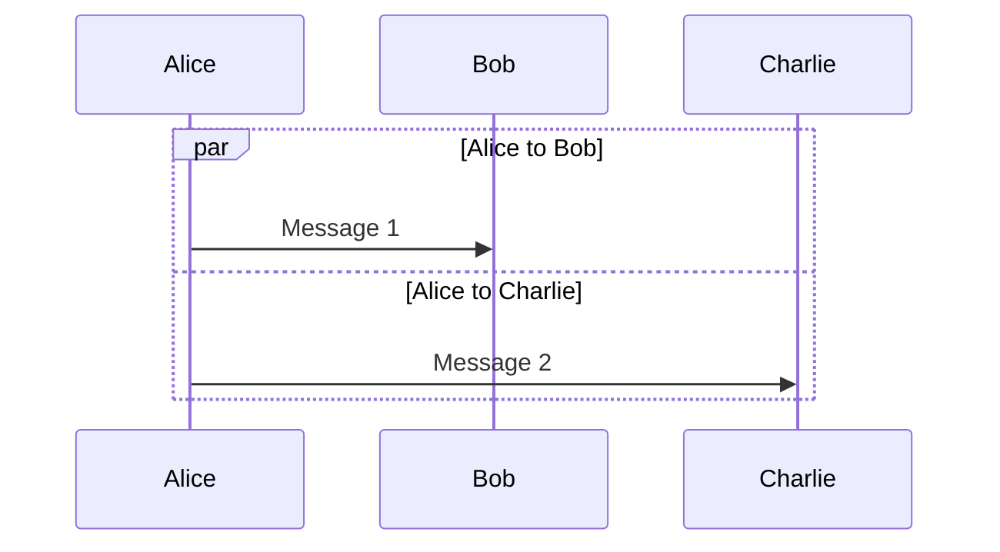

## Critical Region

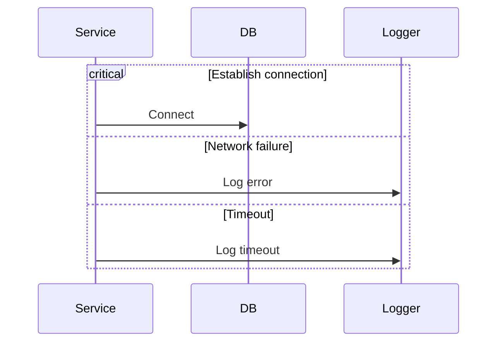

## Break

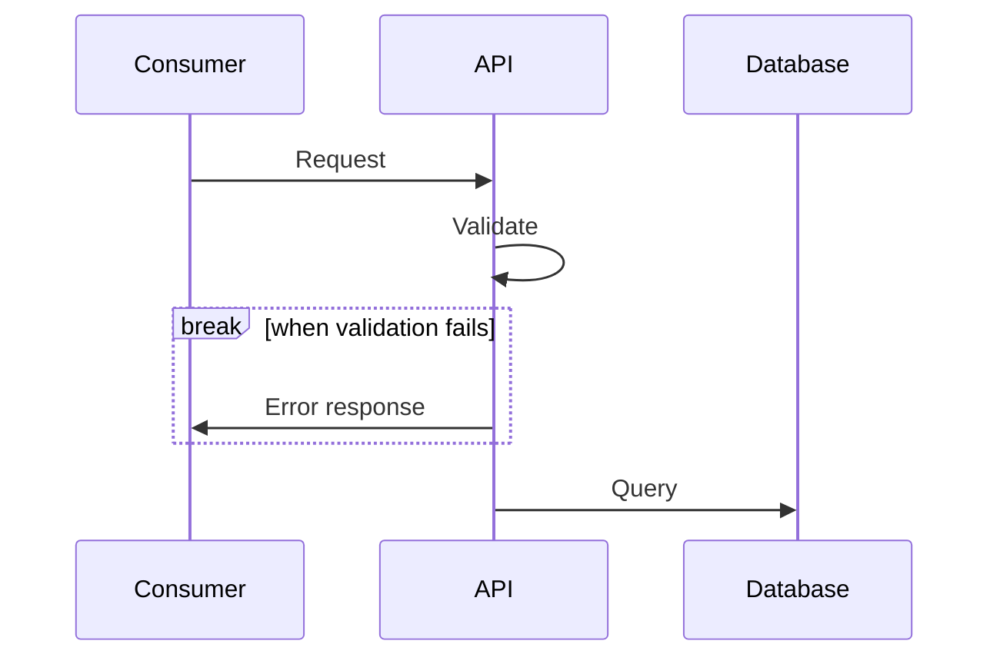

## Grouping with Rect

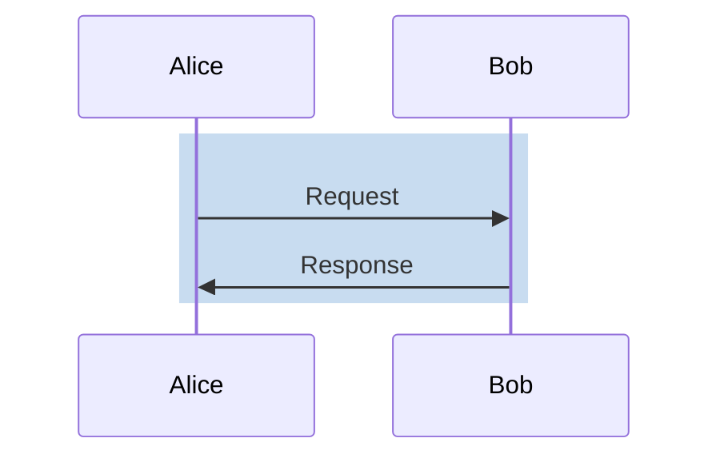

## Links

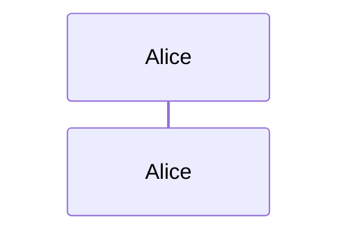

## Comments

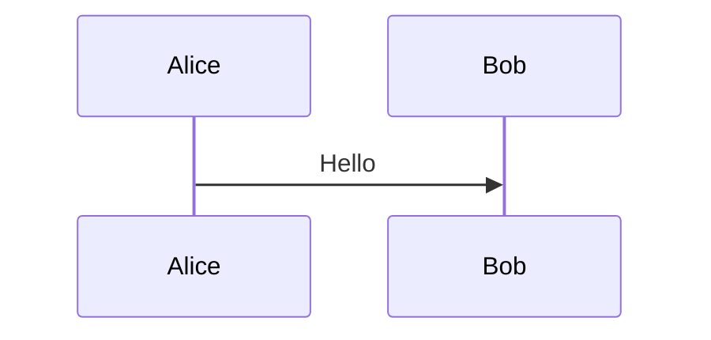

## Styling

### Actor Styles

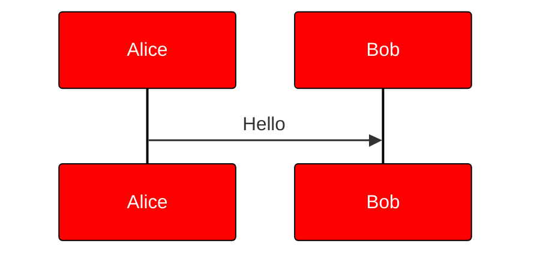

### Custom Styling with CSS Classes

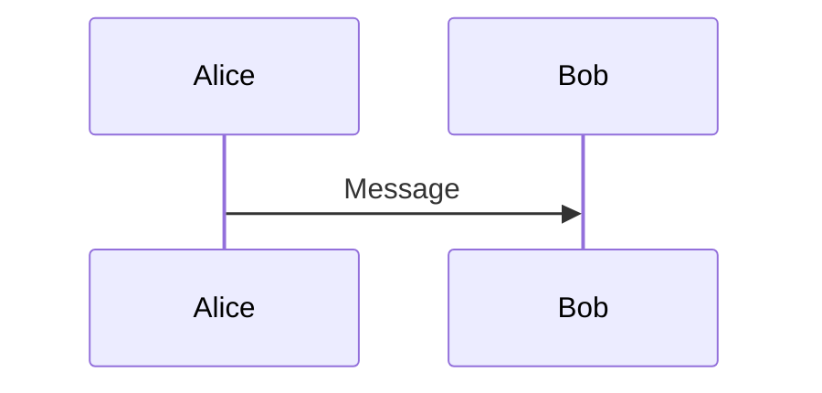

## Best Practices

1. List participants explicitly for control over order
2. Use meaningful participant aliases
3. Group related messages with rect backgrounds
4. Use activation bars to show processing time
5. Add notes to explain complex logic
6. Use autonumber for reference in documentation
7. Keep diagrams focused - split complex flows into multiple diagrams

## Common Patterns

### Request-Response

```mermaid
sequenceDiagram
    Client->>+Server: HTTP Request
    Server->>+Database: Query
    Database-->>-Server: Results
    Server-->>-Client: HTTP Response
```

### Authentication Flow

```mermaid
sequenceDiagram
    autonumber
    User->>+App: Login request
    App->>+AuthService: Validate credentials
    AuthService->>+Database: Check user
    Database-->>-AuthService: User data
    AuthService-->>-App: Token
    App-->>-User: Success + Token
```

### Error Handling

```mermaid
sequenceDiagram
    Client->>+Server: Request
    alt Success
        Server-->>Client: 200 OK
    else Validation Error
        Server-->>Client: 400 Bad Request
    else Server Error
        Server-->>Client: 500 Error
    end
    deactivate Server
```
