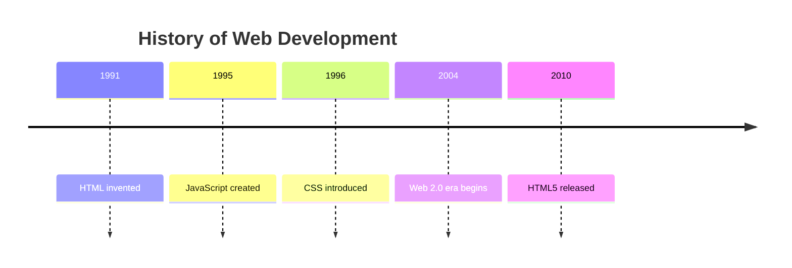
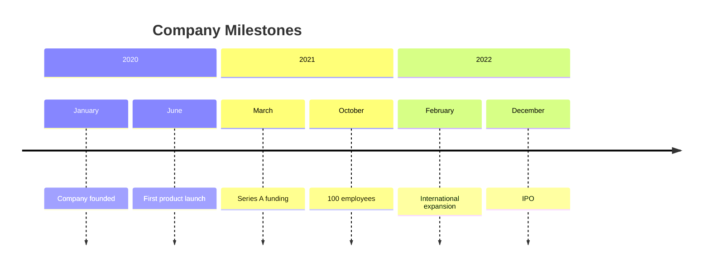
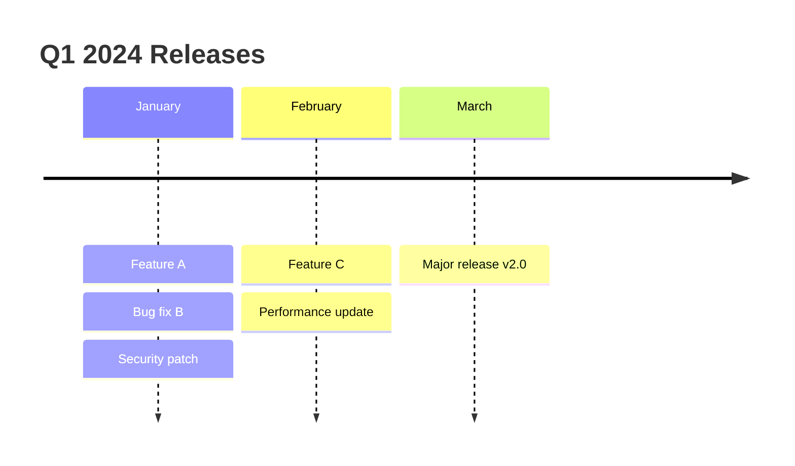
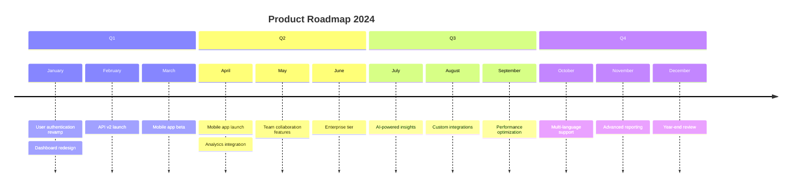
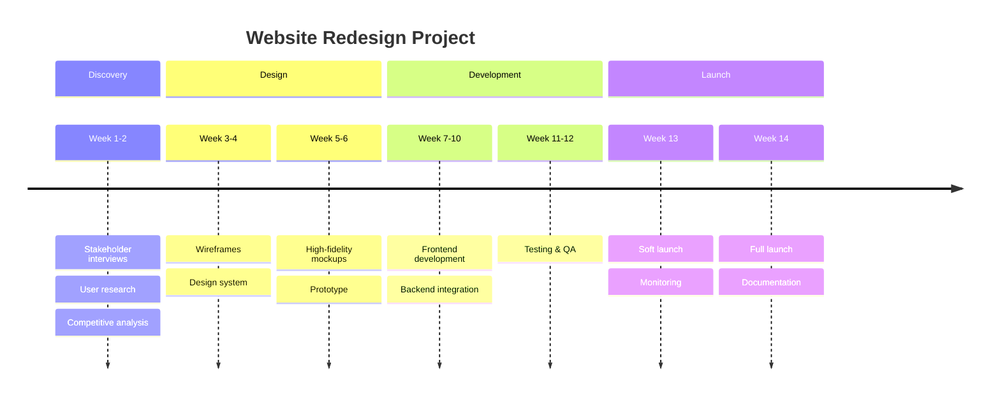
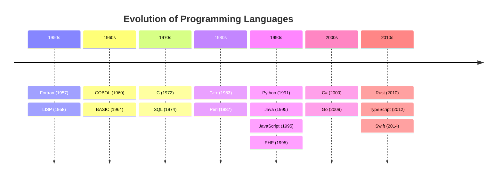
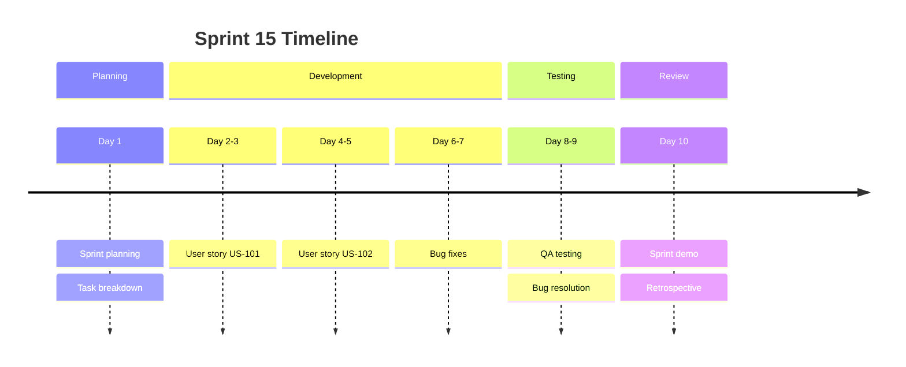
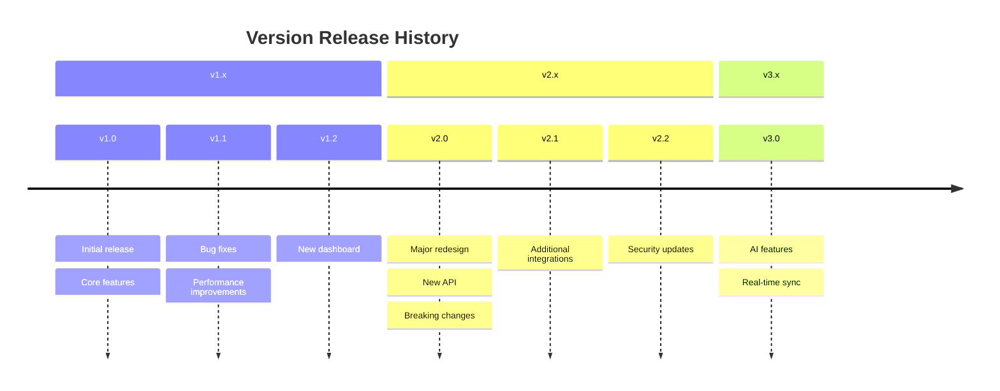
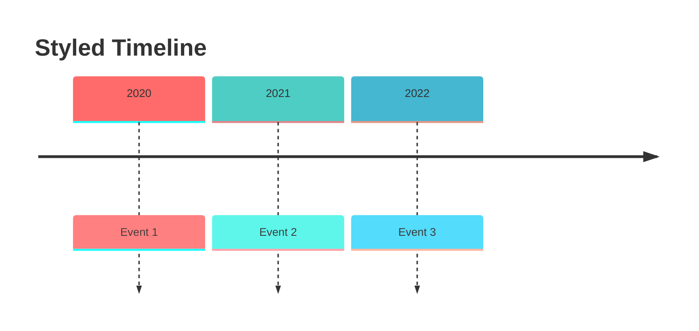

# Timeline Diagrams

Timeline diagrams show events arranged chronologically.

## Basic Syntax

## Title and Sections

## Multiple Events Per Period

## Complete Examples

### Product Roadmap

### Project Timeline

### Historical Timeline

### Sprint Timeline

### Release History

## Styling

### Theme Configuration

### Available Theme Variables

- `cScale0` through `cScale11` - Section background colors
- `cScaleLabel0` through `cScaleLabel11` - Section label colors
- `cScalePeer1` - Alternative color scheme

## Best Practices

1. Use clear, concise event descriptions
2. Group related events into sections
3. Maintain chronological order
4. Use consistent time period formats
5. Keep the timeline focused on one topic
6. Limit events per period for readability
7. Use descriptive section titles

## Limitations

- Limited styling per event
- No custom icons or images
- Cannot show overlapping events
- No duration visualization
- Simple vertical layout only

## When to Use Timeline Diagrams

Good for:

- Historical events
- Project milestones
- Release history
- Roadmaps
- Process phases
- Sprint planning

Avoid when:

- Showing complex dependencies (use Gantt)
- Overlapping time periods
- Detailed task scheduling
- Resource allocation
