# XY Charts (Bar and Line Charts)

XY charts visualize data using x and y axes, supporting bar charts and line charts.

## Basic Syntax

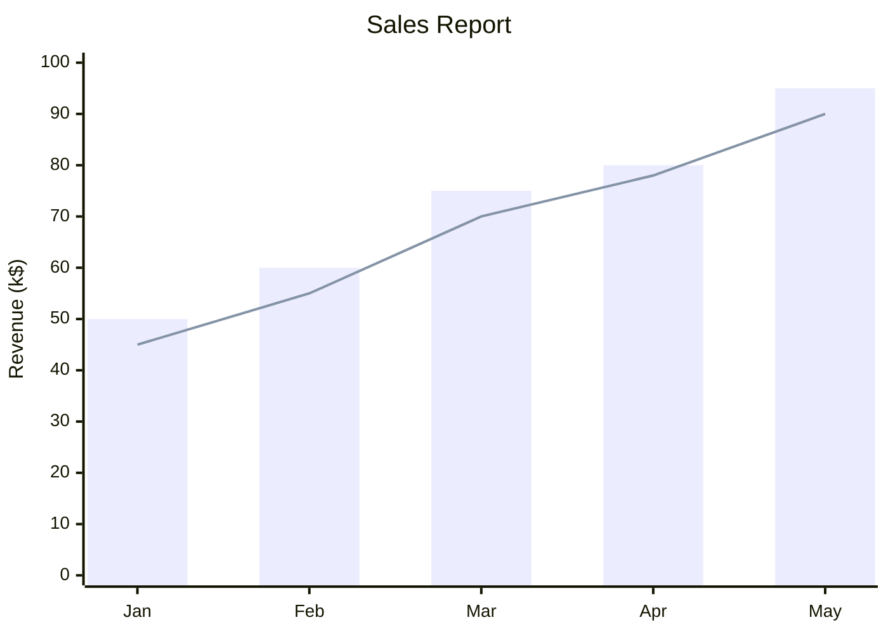
```mermaid
xychart-beta
    title "Sales Report"
    x-axis [Jan, Feb, Mar, Apr, May]
    y-axis "Revenue (k$)" 0 --> 100
    bar [50, 60, 75, 80, 95]
    line [45, 55, 70, 78, 90]
```

## Orientation

### Vertical (Default)

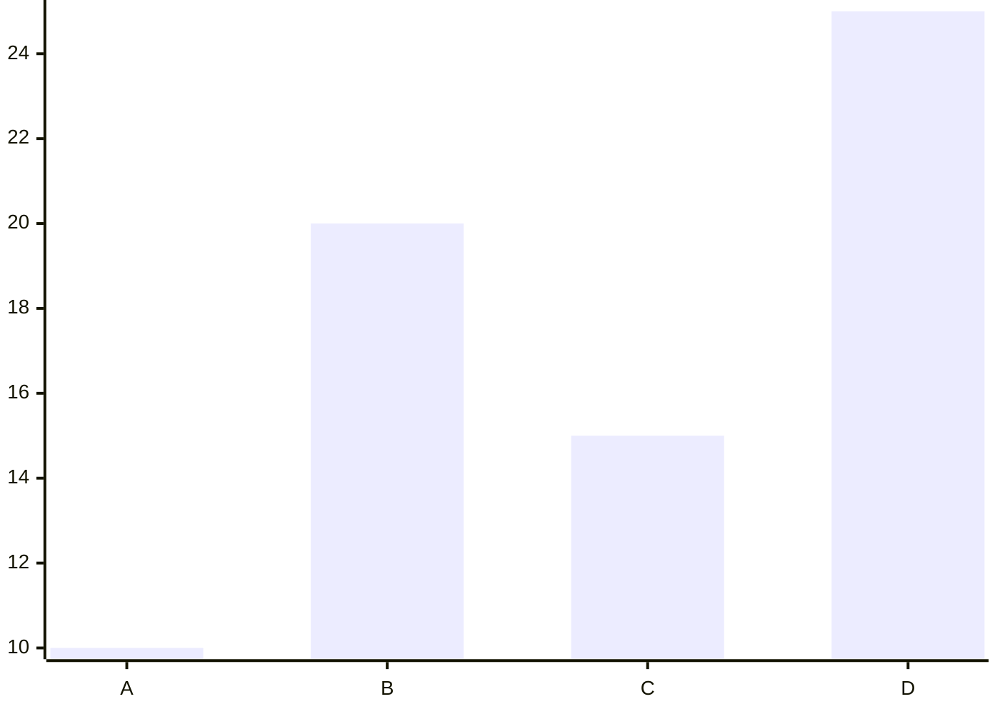
```mermaid
xychart-beta
    x-axis [A, B, C, D]
    bar [10, 20, 15, 25]
```

### Horizontal

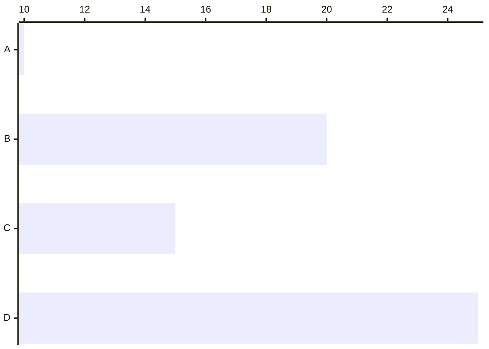
```mermaid
xychart-beta horizontal
    x-axis [A, B, C, D]
    bar [10, 20, 15, 25]
```

## Title

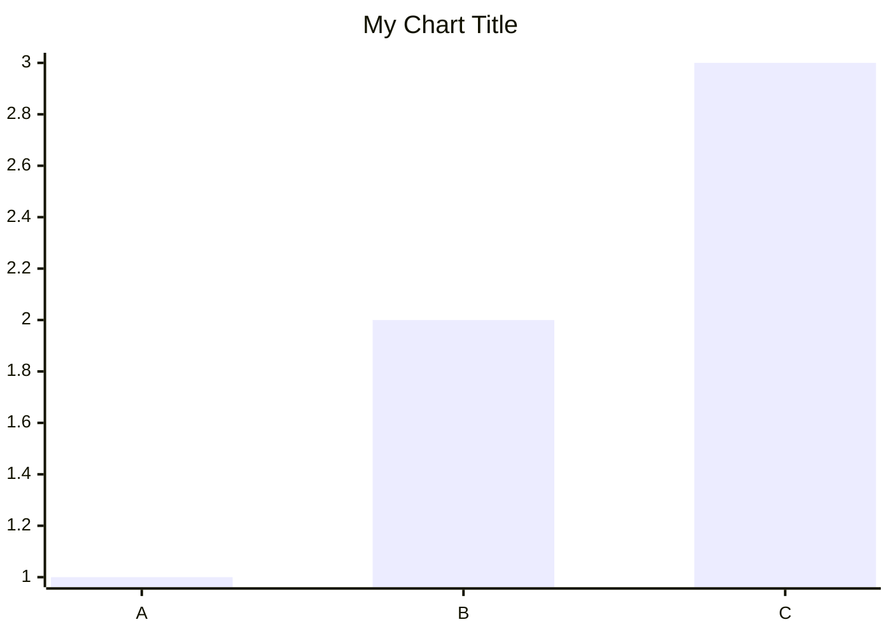
```mermaid
xychart-beta
    title "My Chart Title"
    x-axis [A, B, C]
    bar [1, 2, 3]
```

Multi-word titles require quotes.

## Axes

### X-Axis (Categorical)

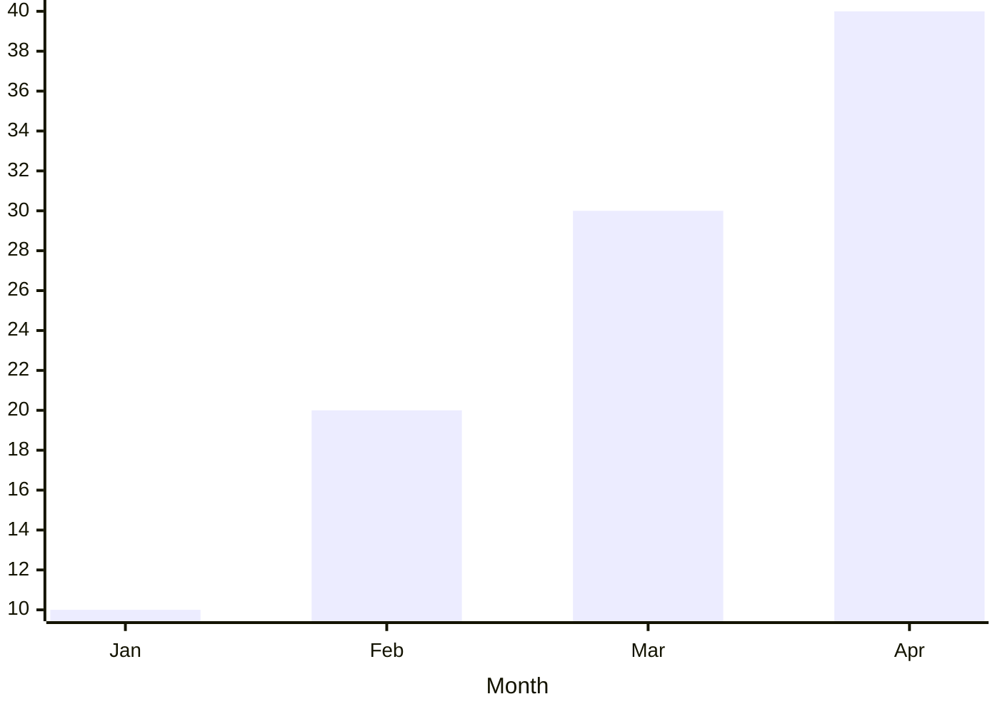
```mermaid
xychart-beta
    x-axis "Month" [Jan, Feb, Mar, Apr]
    bar [10, 20, 30, 40]
```

With spaces in categories:

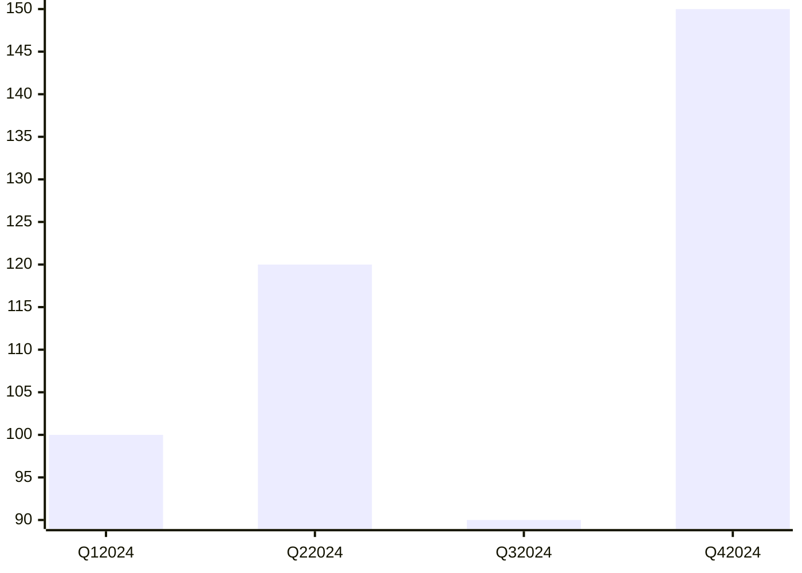
```mermaid
xychart-beta
    x-axis [Q1 2024, Q2 2024, Q3 2024, Q4 2024]
    bar [100, 120, 90, 150]
```

### X-Axis (Numeric Range)

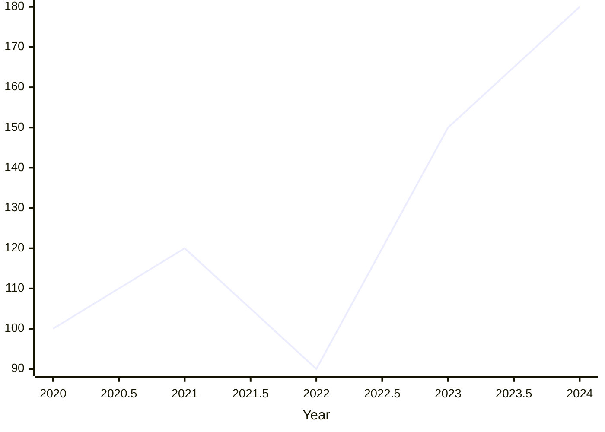
```mermaid
xychart-beta
    x-axis "Year" 2020 --> 2024
    line [100, 120, 90, 150, 180]
```

### Y-Axis

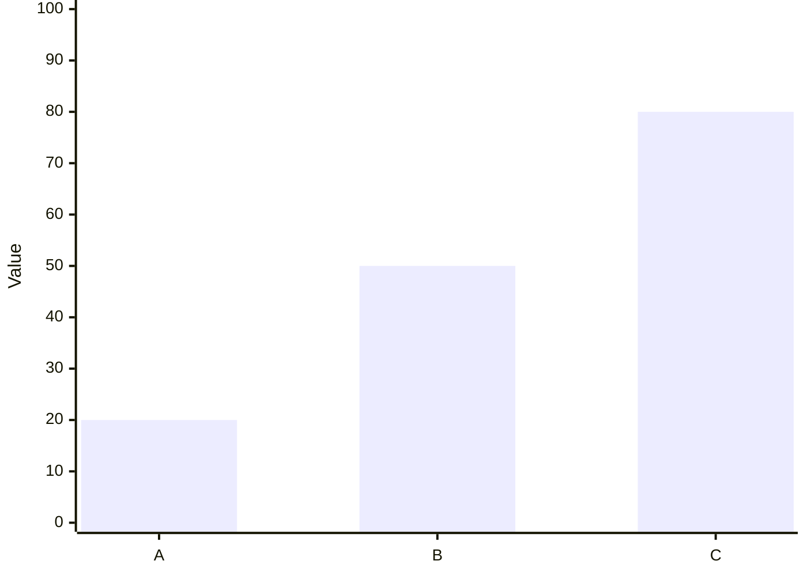
```mermaid
xychart-beta
    x-axis [A, B, C]
    y-axis "Value" 0 --> 100
    bar [20, 50, 80]
```

Y-axis is always numeric. Range is auto-calculated if not specified.

## Chart Types

### Bar Chart

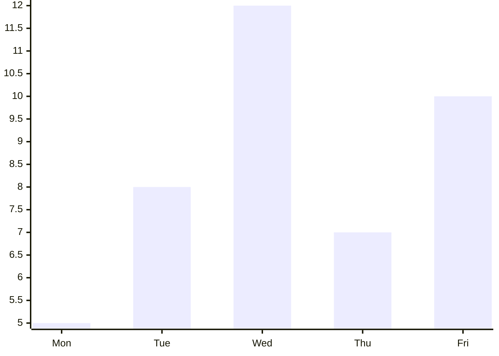
```mermaid
xychart-beta
    x-axis [Mon, Tue, Wed, Thu, Fri]
    bar [5, 8, 12, 7, 10]
```

### Line Chart

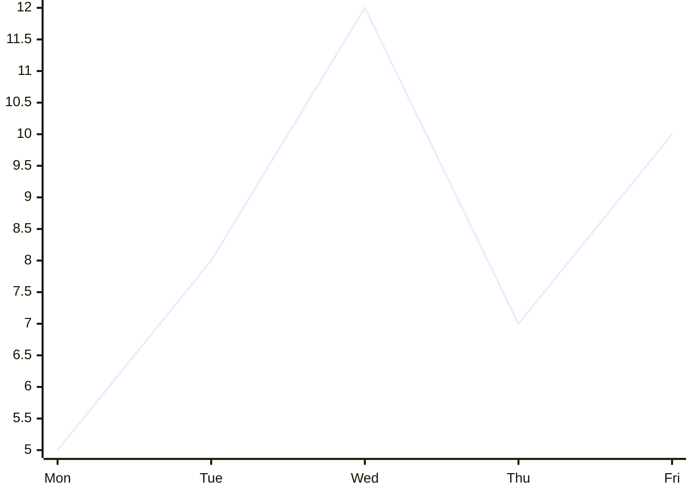
```mermaid
xychart-beta
    x-axis [Mon, Tue, Wed, Thu, Fri]
    line [5, 8, 12, 7, 10]
```

### Combined Bar and Line

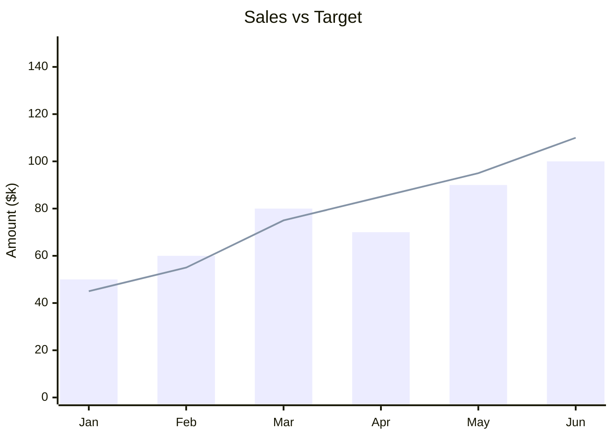
```mermaid
xychart-beta
    title "Sales vs Target"
    x-axis [Jan, Feb, Mar, Apr, May, Jun]
    y-axis "Amount ($k)" 0 --> 150
    bar [50, 60, 80, 70, 90, 100]
    line [45, 55, 75, 85, 95, 110]
```

### Multiple Series

```mermaid
xychart-beta
    title "Product Comparison"
    x-axis [Q1, Q2, Q3, Q4]
    bar [20, 30, 25, 35]
    bar [15, 25, 30, 28]
    line [18, 28, 27, 32]
```

## Data Values

Values can be:

- Integers: `[1, 2, 3, 4]`
- Decimals: `[1.5, 2.7, 3.2]`
- Negative: `[-5, 10, -3, 8]`
- Mixed: `[+1.3, .6, 2.4, -.34]`

## Complete Examples

### Monthly Revenue

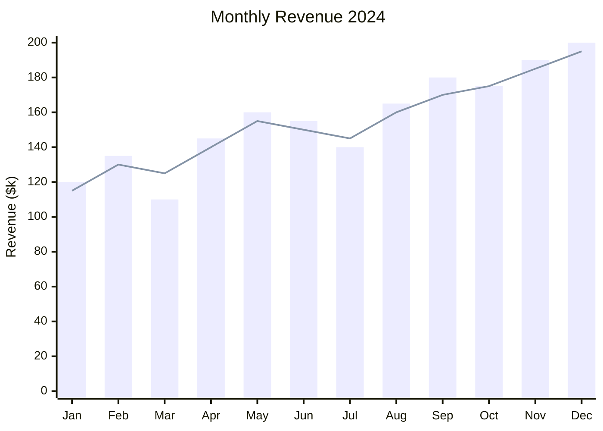
```mermaid
xychart-beta
    title "Monthly Revenue 2024"
    x-axis [Jan, Feb, Mar, Apr, May, Jun, Jul, Aug, Sep, Oct, Nov, Dec]
    y-axis "Revenue ($k)" 0 --> 200
    bar [120, 135, 110, 145, 160, 155, 140, 165, 180, 175, 190, 200]
    line [115, 130, 125, 140, 155, 150, 145, 160, 170, 175, 185, 195]
```

### Performance Metrics

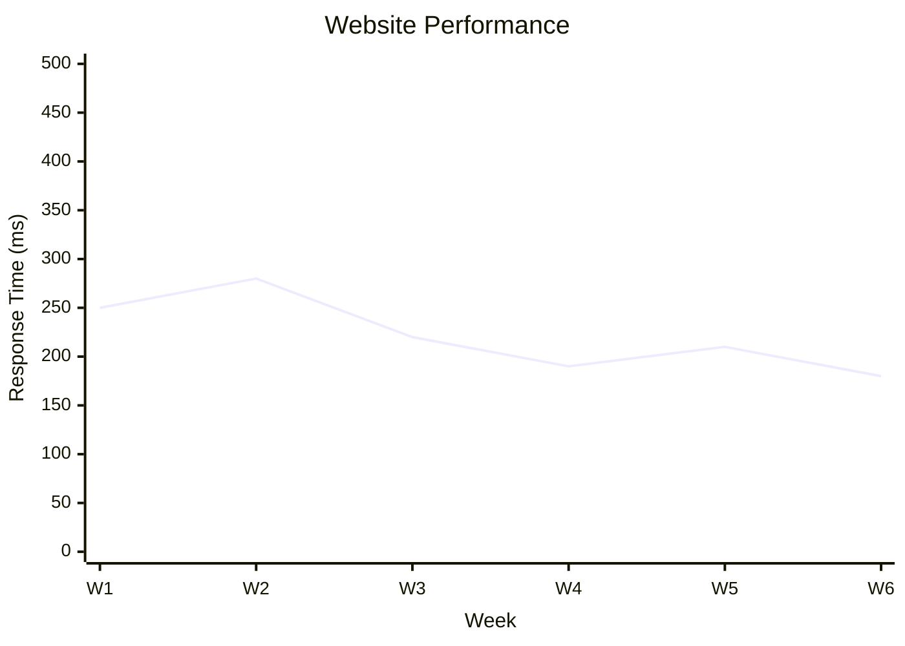
```mermaid
xychart-beta
    title "Website Performance"
    x-axis "Week" [W1, W2, W3, W4, W5, W6]
    y-axis "Response Time (ms)" 0 --> 500
    line [250, 280, 220, 190, 210, 180]
```

### Comparison Chart

```mermaid
xychart-beta
    title "Team Productivity"
    x-axis [Mon, Tue, Wed, Thu, Fri]
    y-axis "Tasks Completed" 0 --> 30
    bar [15, 20, 18, 22, 25]
    bar [12, 18, 20, 19, 23]
    line [14, 19, 19, 21, 24]
```

### Financial Data

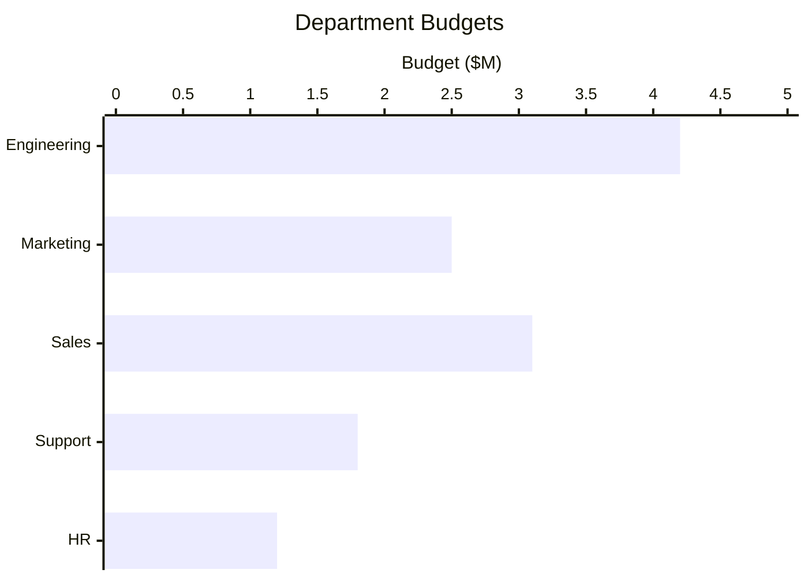
```mermaid
xychart-beta horizontal
    title "Department Budgets"
    x-axis [Engineering, Marketing, Sales, Support, HR]
    y-axis "Budget ($M)" 0 --> 5
    bar [4.2, 2.5, 3.1, 1.8, 1.2]
```

### Growth Trends

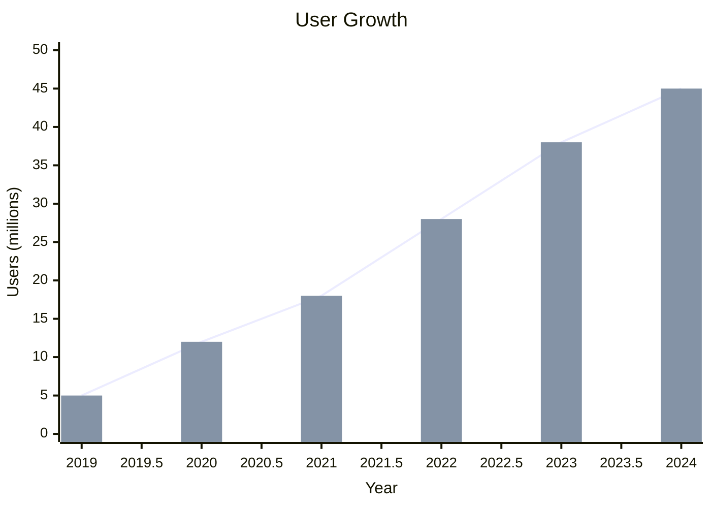
```mermaid
xychart-beta
    title "User Growth"
    x-axis "Year" 2019 --> 2024
    y-axis "Users (millions)" 0 --> 50
    line [5, 12, 18, 28, 38, 45]
    bar [5, 12, 18, 28, 38, 45]
```

## Configuration

### Via Init Directive

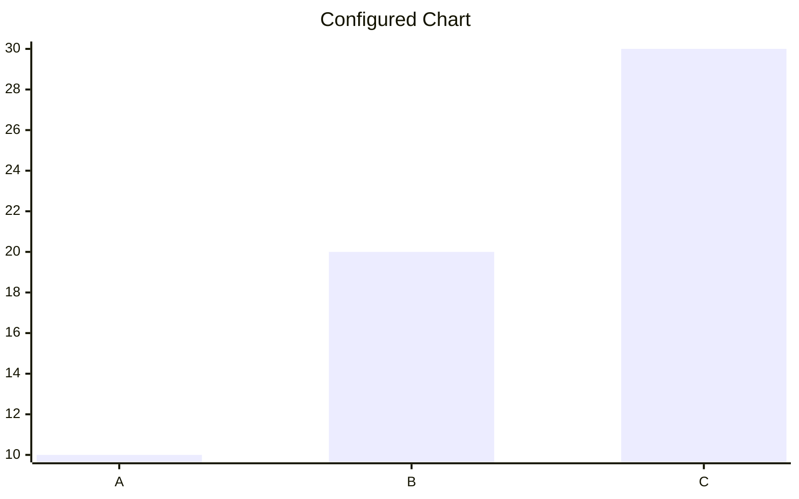
```mermaid
%%{init: {'xyChart': {
    'width': 800,
    'height': 500,
    'titleFontSize': 20,
    'showTitle': true
}}}%%
xychart-beta
    title "Configured Chart"
    x-axis [A, B, C]
    bar [10, 20, 30]
```

### Configuration Options

| Parameter | Default | Description |
| --- | --- | --- |
| `width` | 700 | Chart width in pixels |
| `height` | 500 | Chart height in pixels |
| `titleFontSize` | 20 | Title font size |
| `titlePadding` | 10 | Padding around title |
| `showTitle` | true | Display title |
| `chartOrientation` | vertical | vertical or horizontal |
| `xAxisLabelFontSize` | 14 | X-axis label size |
| `yAxisLabelFontSize` | 14 | Y-axis label size |
| `xAxisTitleFontSize` | 16 | X-axis title size |
| `yAxisTitleFontSize` | 16 | Y-axis title size |
| `plotReservedSpacePercent` | 50 | Space for plot area |

## Styling

### Theme Variables

```mermaid
%%{init: {'theme': 'base', 'themeVariables': {
    'xyChart': {
        'backgroundColor': '#ffffff',
        'titleColor': '#333333',
        'xAxisLabelColor': '#666666',
        'yAxisLabelColor': '#666666',
        'xAxisTitleColor': '#333333',
        'yAxisTitleColor': '#333333',
        'xAxisLineColor': '#cccccc',
        'yAxisLineColor': '#cccccc',
        'plotColorPalette': '#4ecdc4, #ff6b6b, #45b7d1, #96ceb4'
    }
}}}%%
xychart-beta
    x-axis [A, B, C, D]
    bar [10, 20, 15, 25]
    bar [8, 18, 12, 22]
    line [9, 19, 14, 24]
```

### Available Theme Variables

- `backgroundColor` - Chart background
- `titleColor` - Title text color
- `xAxisLabelColor`, `yAxisLabelColor` - Axis label colors
- `xAxisTitleColor`, `yAxisTitleColor` - Axis title colors
- `xAxisLineColor`, `yAxisLineColor` - Axis line colors
- `xAxisTickColor`, `yAxisTickColor` - Tick mark colors
- `plotColorPalette` - Comma-separated colors for data series

## Best Practices

1. Use clear, descriptive titles
2. Label axes with units where applicable
3. Set appropriate y-axis ranges
4. Use bar charts for categorical comparisons
5. Use line charts for trends over time
6. Combine bar and line when showing actuals vs. targets
7. Keep data series to 3-4 maximum for readability
8. Use horizontal orientation for long category names

## Limitations

- Beta feature (syntax may change)
- Limited to bar and line chart types
- No stacked or grouped bar options
- No legends for multiple series
- Limited interactivity
- Cannot specify individual series colors directly
